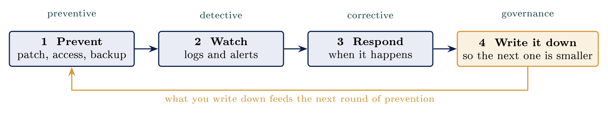
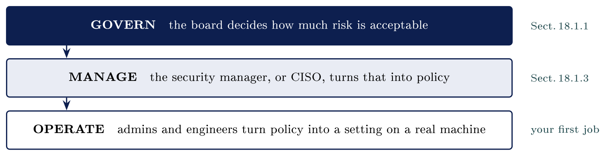
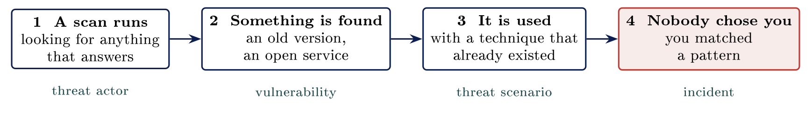

# Working in cybersecurity {#sec-01-working-in-cybersecurity}

::: {.callout-note appearance="simple" icon="false"}
**Module.** Module 1: Cybersecurity Foundations\
**Accompanies.** Lecture L01. **Reading time.** About 45 minutes.\
**Primary reading.** Jøsang, *Cybersecurity: Technology and Governance* (Springer, 2025). Core: Chapter 1, pp. 1--24. Previews: Sect. 2.1.1--2.1.2, 2.2.2, 10.8.3, 14.5, 17.5, 18.1.
:::

## Why this subject exists {#why-this-subject-exists .unnumbered}

Almost everything an organisation does now runs on computers. When those computers stop, the organisation stops with them. When information about people leaks, the people are harmed, and they cannot undo it. Cybersecurity is the work of making both of those things less likely and less damaging. It is about people at least as much as it is about machines.

You have already met this work without noticing. BankID and Feide were security decisions. Somebody decided that logging into your bank should need more than a password, and somebody decided that one login should be enough for every Norwegian school system. This course is about how such decisions get made, who makes them, and what the daily work behind them looks like.

The book puts the whole subject into one sentence, and it is worth learning by heart.

::: {.callout-note}
## Definition

Cybersecurity (and information security) is the protection of information assets from harm. [Jøsang, Sect. 1.3, p. 3]{.src}

:::

Two words in that sentence need care. **Information assets** are not only data. They are *information and resources used for the processing of information* [Jøsang, Sect. 1.3, p. 3]{.src}: data, devices, applications, networks, and even the people who use them. And **harm** is broader than theft. The book's own longer definition names three kinds of harm: unauthorised disclosure of information, corruption of data, software and hardware, and disruption of the services they provide [Jøsang, Sect. 1.3, p. 4]{.src}. Part 1 of this chapter takes those three kinds of harm, adds a fourth, and gives each one a Norwegian case.

One more thing about names. You will hear *information security*, *IT security*, *computer security*, *cybersecurity* and *digital security*. The book treats them as meaning the same thing in practice, and so does this course [Jøsang, Sect. 1.1, pp. 1--2]{.src}. Purists will tell you that information security also covers information on paper and conversations in a café. They are right, and it changes nothing about the work.

::: {.callout-warning}
## Before you read on

Name one system you depend on every week: a bank, a school platform, a bus app, a hospital portal. Now imagine it stopped working this afternoon and stayed down for a week. What would you personally lose? Write one sentence. You will need it in Part 1.

:::

[→ Part 1 asks the simplest useful question in the field: what, exactly, goes wrong?]{.bridge}

## How digital systems fail

### The firm we follow all semester

Every part of this chapter, and every lecture in Emne 1, comes back to the same small company. It is invented, but nothing about it is unusual.

::: {.callout-tip}
## Nordvik AS

Nordvik AS is a twelve-person engineering firm in Vestfold. It has one server in a cupboard, Microsoft 365 for mail and files, and two suppliers with standing remote access to the server. The most technical person in the firm also writes the quotations. Nordvik has no security staff, and nothing has ever gone wrong, which the firm quietly reads as evidence about next year.

What could fail at Nordvik? Its server could stop and halt the work. Its customer and drawing data could leak. An invoice could be quietly changed. Someone could sign in as a colleague. Those four sentences are the four failures of this part.

:::

### Four ways digital things fail

Almost every incident you will ever read about is one of four things, or a mixture of them. The book gives them formal names, confidentiality, integrity and availability, and calls the three together the **CIA triad** [Jøsang, Sect. 1.3, p. 4]{.src}. Authenticity is the fourth, and the book treats it as a goal that supports the other three [Jøsang, Sect. 1.10.1, p. 17]{.src}. In L03 you will use the formal names. Today the plain words are more useful, because they describe what a person in the building actually notices.

  **Plain words**          **What the people in the building notice**                                                                               **Norwegian case**             **Formal name (L03)**
  ------------------------ ------------------------------------------------------------------------------------------------------------------------ ------------------------------ -----------------------
  **It stops working**     Nobody can use the system. The work halts. This is the easiest failure to notice.                                        Norsk Hydro, March 2019        Availability
  **Someone reads it**     Information leaves the building. Nothing visibly breaks, so this is the hardest failure to notice.                       Amedia, December 2021          Confidentiality
  **Someone changes it**   The data is still there, and it is wrong. What is lost is trust in the data.                                             Invoice fraud, every week      Integrity
  **Someone is you**       A person signs in with your identity. This is where most incidents begin, because it is easier than breaking anything.   The parcel SMS on your phone   Authenticity

#### It stops working {#it-stops-working .unnumbered}

::: {.callout-note}
## Availability

Availability is the property of being accessible and usable on demand by an authorized entity. (ISO/IEC 27000) [Jøsang, Sect. 1.9.4, p. 17]{.src}

:::

The system is still there. It simply stops doing its job. In March 2019, ransomware locked the machines that ran production at Norsk Hydro. Around 35,000 people worked on paper, for days in most places and for weeks in some, at a cost near 800 million kroner. Almost all of that money was lost production, not damaged equipment. That is the point to hold on to: what a company loses when its computers stop is the ability to work, not the machines.

The book describes ransomware as a form of denial-of-service attack that primarily leads to a breach of availability, and names the two controls that matter most against it: regular backups stored offline from the network, and recovery routines that are tested, for example once a year, before an incident happens for real [Jøsang, Sect. 2.2.2, p. 37]{.src}. Hydro refused to pay and rebuilt instead.

#### Someone reads what they should not {#someone-reads-what-they-should-not .unnumbered}

::: {.callout-note}
## Confidentiality

Confidentiality is the property that information is not made available or disclosed to unauthorized individuals, entities, or processes. (ISO/IEC 27000) [Jøsang, Sect. 1.9.1, p. 14]{.src}

:::

In December 2021 an attack reached the systems at the media group Amedia that held subscriber data. Two failures happened at once: the systems stopped, and personal data may have been exposed. The second one is the one with no way back. What has been read or copied cannot be recalled, so there is no "back to normal" for a leak. The book makes the same point when it describes ransomware that steals data and threatens to publish it: in that kind of blackmail, backup is useless, and the only real answer is prevention [Jøsang, Sect. 2.2.2, p. 37]{.src}.

Leaks are usually discovered by somebody outside the organisation, sometimes months later. That is why they are the hardest of the four failures to notice.

#### Someone changes it {#someone-changes-it .unnumbered}

::: {.callout-note}
## Data integrity

Integrity is the property that data has not been altered or destroyed in an unauthorized manner. (X.800) [Jøsang, Sect. 1.9.2, p. 15]{.src}

:::

An account number on a supplier invoice is quietly replaced, and the payment goes to the attacker. Nothing looks broken. The invoice arrives through the normal channel, is approved through the normal process, and is paid on time. The failure is caught only when the real supplier asks to be paid, weeks later. This reaches Norwegian firms every week, and it works precisely because the money leaves through the company's own approved process.

The book notes something useful here: data integrity is in principle equivalent to data authenticity, because data that has been altered without authorisation is no longer authentic [Jøsang, Sect. 1.9.2, p. 15]{.src}. That is why the third and fourth failures so often appear together.

#### Someone is you {#someone-is-you .unnumbered}

::: {.callout-note}
## User authentication

User authentication is to verify the correctness of a claimed user ID. [Jøsang, Sect. 1.10.1, p. 18]{.src}

:::

The parcel message that has reached almost every phone in the country is an attack on authentication. Somebody wants your login, and the easiest way to get it is to ask. The book calls this **phishing**, describes it as by far the most common attack vector in 2025, and names the most dangerous vulnerability to it: a lack of awareness among users [Jøsang, Sect. 2.1.1, p. 27]{.src}. Once the login is stolen, the attacker is, as far as the system can tell, you. The book's phrase for this is that identity has become the new security perimeter [Jøsang, Sect. 2.1.2, p. 27]{.src}.

Impersonation is where most incidents begin, because it is easier than breaking anything. Notice also that one failure often causes another. Ransomware stops the work and, in its modern form, usually copies the data out first. A stolen login leads to a changed invoice. Learn the four, and learn to see the mixtures.

### Not a technology problem

There is a belief, common among people who have never worked in the field, that security is a product. You buy it once, it has a switch on the side, and the problem is solved. The Hydro attack is the general argument against that belief. Hydro had bought security products. The way in was still a person doing an ordinary job in an ordinary way.

The book says this in its own vocabulary. Vulnerabilities come in three categories: technical, process and human, where human vulnerabilities are "weaknesses in human consciousness, attitude, and behavior" [Jøsang, Sect. 1.4, pp. 5--6]{.src}. It also gives four dimensions that any security decision must cover, borrowed from ITIL: People, Product, Partner and Process [Jøsang, Sect. 1.6, pp. 10--11]{.src}. The book's example is exactly the one you should remember: an organisation buys a firewall (Product), and the purchase is a waste unless staff can operate it (People), the vendor supports it (Partner), and there is a working routine for using it (Process).

  **What people say**                                                  **What the book says**
  -------------------------------------------------------------------- --------------------------------------------------------------------------------------------------------------------------------------------------------------
  "We bought a security product, so we are covered."                   A Product without People, Partner and Process has little value [Jøsang, Sect. 1.6]{.src}.
  "Our people would never click on that."                              Human vulnerabilities are one of the three categories, next to technical and process [Jøsang, Sect. 1.4]{.src}.
  "If we protect the systems well enough, nothing will ever happen."   That was the thinking until around 2000; perfect security is unattainable, so detection and correction are needed too [Jøsang, Sect. 1.5, p. 9]{.src}.
  "We are too small to matter."                                        Threat actors scan for anything that answers; see Part 4.

::: {.callout-important}
## Key idea

Every incident has two halves. Something technical was possible, and something a person did was entirely reasonable. Security work that only looks at the machines misses half of every incident.

:::

::: {.callout-tip}
## On Nordvik AS

At Nordvik, a trusted supplier's attachment or a convincing message would open the door as easily as any software flaw, and the person who clicked would have done nothing careless. That is the ordinary shape of the human half.

:::

[→ Part 1 sorted what goes wrong. Part 2 is about the people whose job it is to deal with it.]{.bridge}

## The nature of the work

### Most of the work is prevention

The films have one answer to the question "what does a person in cybersecurity do all day?" It involves one person typing fast at night. The real answer is less dramatic and more useful. Most of the work is **prevention**: stopping failures before they happen, rather than reacting after.

The book sorts security controls into three kinds plus governance, and this sorting is the backbone of the whole job [Jøsang, Sect. 1.5, pp. 8--9]{.src}.

Preventive controls

:   stop incidents from happening, or make them less likely. Authentication and access control are the book's examples. The book calls these "likelihood-reducing controls".

Detective controls

:   reliably detect attacks and incidents. An intrusion detection system that raises alarms is the example. Usually the aim is to shorten the time between the incident and the corrective action.

Corrective controls

:   recover from attacks and restore operation. Backups and contingency plans are the examples. The book calls these "impact-reducing controls".

Governance

:   is the foundational layer that organises the other three in a rational way; the book notes that such a structure is often called an ISMS, an Information Security Management System.

In practice, prevention means three habits that appear in almost every incident report as the thing that was missing: patch before your version is exploited, grant the least access that still lets people work, and test the backup. When prevention works, nothing happens. That is the hardest thing about the job to explain to the person who pays for it. A quiet year is the result of the work, not evidence that the work was unnecessary.

::: {.callout-warning}
## The budget question

It is January. The organisation had no security incidents last year. The finance director asks why the security budget should not be cut in half. Write down the best two sentences you can offer in reply. There is no clean answer, and that is the point.

:::

### The work is a loop

Prevention alone was the thinking until around the year 2000, when the security community slowly realised that perfect security is unattainable and that organisations will experience incidents no matter how strong their defences are [Jøsang, Sect. 1.5, p. 9]{.src}. So the work does not run in a line. It goes round.

::: center
{fig-align="center"}
:::

You prevent what you can. You watch the logs and the alerts for what prevention missed. You respond when something happens. Then you write down what you learned, and what you write down is what makes the next round of prevention better. That last arrow is why incidents get written up at all. Without it, an organisation learns the same lesson twice.

The book's formal version of this loop is the incident management process, with four phases: preparation, triage, response and post-incident [Jøsang, Fig. 14.3, p. 308]{.src}. The last phase contains a "lessons-learned" meeting, which the book says should be held within a few days of the end of the incident [Jøsang, Sect. 14.5.4, p. 313]{.src}. That meeting is the arrow at the bottom of the figure. This process returns in full in Module 3.

### Watching, and when something happens

::: {.callout-note}
## Accountability

Accountability means that activities in a system or computer network can be traced to someone who can be held accountable for the activities. [Jøsang, Sect. 1.10.2, p. 20]{.src}

:::

Detection rests on two things: systems record what happens, and somebody reads the record. The record is the log. It shows who logged in, from where, and what changed. It is the raw material of every investigation, and the book puts it at the centre of accountability: "Accountability is based on logging activities in systems and networks, and maps which user or other entity is behind each logged activity" [Jøsang, Sect. 1.10.2, p. 20]{.src}. A record nobody reads finds nothing. Watching is the record plus a person who looks.

When something is found, the book calls the first step **triage**: "the process of investigating received alerts before deciding whether it is a real incident that needs to be handled, or if the alert is just a false alarm" [Jøsang, Sect. 14.5.2, p. 310]{.src}. It also says, plainly, that most alerts are false alarms [Jøsang, Sect. 14.5.2, p. 311]{.src}. Deciding quickly, and passing on what you cannot resolve, is the skill being paid for. Hesitating with an alert you cannot resolve is the common beginner mistake.

Once an incident is confirmed and stopped, the organisation is brought back in the order it needs, not in the order that is easiest for the technical staff. The book makes the same point about containment: unplugging infected systems might stop the attack, but it could by itself interrupt business processes, so judgement is needed about what to stop and what to keep running [Jøsang, Sect. 14.5.3, p. 312]{.src}.

### The ordinary day

Very little of this looks like the job the films describe, and all of it matters. Here is a day that is ordinary for a first job in this field.

  **When**          **What**
  ----------------- ------------------------------------------------------------------------------------------------------------------------------------------------
  All morning       Tickets and alerts, nearly all of them nothing. Each one still has to be looked at and closed.
  Before lunch      A patch window to schedule and document. Which servers, when, who is told, what is the rollback.
  Afternoon         One question from finance: is this supplier's new account number genuine? Nobody in the building can answer without phoning the supplier.
  Then a real one   One user account seen logging in from two countries eleven minutes apart. Distance and time together make the login impossible. Open the logs.

Only the last line was urgent. The rest of the day was the prevention and the watching from the loop above, and it is where the organisation's safety over a year is actually built.

### A Norwegian kommune

Take a Norwegian municipality with four hundred employees. One IT department serves all of them, and nobody there has security as their only job. That is entirely normal. The monitoring is bought from a supplier who watches the logs under contract. One person internally owns that contract, and takes the phone call at two in the morning. In a whole year, that person may see two incidents that genuinely matter.

The book describes exactly this spread of arrangements. Large organisations working in IT typically have a dedicated incident response team of their own staff. For medium-sized organisations it can be more economical to outsource parts of the work to a Managed Security Service Provider. For small organisations, a fully outsourced team might be the most economical [Jøsang, Sect. 14.5.1, p. 309]{.src}. Most Norwegian municipalities and most small firms, including Nordvik, sit in the last two groups.

[→ You have now seen the work. Part 3 is about the jobs where that work is done, and where they lead.]{.bridge}

## Roles and pathways

### Three jobs people actually start in

Almost nobody starts in a job with the word *security* in the title, and that is not a problem. The work splits into groups, and titles vary between organisations, so learn the groups and job adverts become readable whatever the titles say.

  **Starting job**                **A typical morning**                                                                                         **What it teaches you**
  ------------------------------- ------------------------------------------------------------------------------------------------------------- ------------------------------------------------------------------------------------------------------------------------------------------
  Service desk / IT support       Password resets, a laptop that will not connect, a printer, a user who clicked on something and is worried.   Who the users are, what they actually do, and what breaks. This is where most people begin.
  Systems or network operations   A patch window, a certificate about to expire, a firewall rule request, a backup job that failed overnight.   How the systems are built, who owns each one, and what the change process looks like.
  SOC analyst (tier 1)            A queue of alerts from the monitoring, most of them noise. Triage, escalate, document.                        The book's triage tier [Jøsang, Fig. 14.4, p. 310]{.src}. Closest to security work by title, and the one with the most repetition.

The book describes the SOC as the place where incident response starts in organisations that have one, and notes that an operations centre for a large organisation handles hundreds of alerts and several incidents every single day [Jøsang, Sect. 14.5, pp. 307--308]{.src}.

### Defending and attacking

Around nine advertised jobs in ten are defensive. That is simply where the work and the money in this field are. Attacking systems with permission is a real job, and a small, competitive part of the field. It begins with a document that names which systems may be tested, on which dates, and who to phone. Without that document, the same actions are criminal.

The book's discussion of authorisation explains why the document matters so much. Access authorisation is "the act of specifying access rights for users, roles, and processes" [Jøsang, Sect. 1.11, p. 21]{.src}, and the book is emphatic that obtaining access is not the same as being authorised: a person who logs in with a stolen password is an intruder, not an authorised user, however the login went [Jøsang, Sect. 1.11, p. 23]{.src}. A penetration tester is authorised because somebody with the authority to do so wrote it down. In L04 you spend a whole lecture on that document and the law behind it.

### Three levels of responsibility

Security work happens at three levels, and your first job sits at the bottom one. The book describes them as governance, management, and administration and operations [Jøsang, Sect. 18.1, Fig. 18.1, pp. 377--378]{.src}.

::: center
{fig-align="center"}
:::

The book says that the board of directors and senior management are responsible for defining the company's objectives and for striking the balance between them, and that this also applies to information security [Jøsang, Sect. 18.1.1, p. 378]{.src}. Governance, in the book's chosen definition, "provides strategic direction, ensures that objectives are achieved, manages risks appropriately, uses organisational resources responsibly, and monitors the success or failure of the enterprise security programme" [Jøsang, Sect. 18.1.1, p. 379]{.src}. Management is the creation, operation and maintenance of the processes and controls [Jøsang, Sect. 18.1.3, p. 381]{.src}. Administration and operations is the daily work: monitoring and configuring systems and networks, handling incidents, reporting [Jøsang, Sect. 18.1, p. 378]{.src}.

Two things follow. First, the answer to "who decides how much risk an organisation accepts?" is the board, not the technical staff, and most students expect the opposite. Second, a policy that nobody at the operating level can implement is a wish rather than a policy. Auditors find one of these in most organisations. Govern, manage, operate is the core of what the field calls GRC, governance, risk and compliance, and it returns with policies and the ISMS later in the programme.

### Where you can go after two years

None of the starting jobs is where you stay. Three roles are where most students want to end up.

-   A **penetration tester** attacks systems with written permission, and reports back on everything that worked. The report is the deliverable the customer paid for.

-   A **security engineer** builds the defences and reviews changes.

-   A **threat intelligence analyst** follows who attacks whom. The book's term is CTI, Cyber Threat Intelligence [Jøsang, Sect. 16.2]{.src}.

All three assume you already know how organisations run, and no course can teach that. It is what the first two years in operations teach you: what breaks, who owns it, and who to ask. Two years of operations makes you a better security hire than two years of certificates.

### What the adverts actually ask for

Read a real advert for any of the starting jobs and the requirement list is short and consistent. Networking. Linux. Some scripting. Those three are Modules 2, 3 and 4 of this course, which is not a coincidence. The adverts also ask that you write down what you did, and that is not a technical skill. The book asks for the same habit in incident handling: every step from first detection to closing should be documented with a timestamp and the handler's signature, ideally with one person doing the technical work while a second records [Jøsang, Sect. 14.5.2, p. 311]{.src}.

On certificates: ISC2's Certified in Cybersecurity is the entry-level one, and CompTIA Security+ is the one Norwegian adverts most often name. Neither replaces the two years.

::: {.callout-warning}
## Before L02

Find one live advert on finn.no, arbeidsplassen.nav.no or Jobbnorge for a service desk, operations or SOC role. Mark each requirement that this course covers. Most students find that it covers nearly all of them.

:::

[→ So far: what fails, and who defends. Part 4 turns to the other side. Who attacks, and why.]{.bridge}

## Threat actors

### Attacks are not weather

Attacks are not accidents and they are not weather. People carry them out, so the first question about any incident is what somebody was after, before asking how they did it. What an attacker wants predicts their behaviour far better than how skilled they are.

::: {.callout-note}
## Threat actor

A threat actor is an active entity that can trigger or execute a threat scenario. Threat actors can be intelligent entities with adversarial intent, or forces of nature that are too strong or unpredictable for effective prevention. [Jøsang, Sect. 1.4, p. 5]{.src}

:::

The book lists the threat actors normally assumed in a security risk assessment: script kids, hacktivists, organised criminals, terrorists, and adversarial state-sponsored APTs [Jøsang, Fig. 10.5, p. 237]{.src}, and adds the insider threat elsewhere [Jøsang, Sect. 1.9.1, p. 15]{.src}. Sorted by what each one wants, the list looks like this.

  **Kind**      **What they want**                            **How they behave**
  ------------- --------------------------------------------- ------------------------------------------------------------------------------------------------
  Criminals     Money                                         Automated, opportunistic, loud once inside. Most of what a Norwegian workplace will ever meet.
  States        Information, and access that lasts            Quiet, patient, well resourced. The subject of the national reports in Part 5.
  Hacktivists   Attention for a cause                         Public, short-lived, often overload attacks or defacement.
  Insiders      Varies: money, grievance, or nothing at all   Already hold a key. Usually not a spy, more often an account nobody disabled.
  Script kids   Practice, bragging                            Use tools they did not write. Still cause real incidents.

### Most of it is money

Ransomware today is a business, sold as a service, with affiliates, support desks and negotiated prices. The person running the attack rents the software and keeps a share of whatever is paid. The book describes the mechanism: encrypt the data, then demand a ransom for the key, and, increasingly, steal the data first and threaten to publish it, so that backup no longer helps [Jøsang, Sect. 2.2.2, p. 37]{.src}.

Two Norwegian companies have publicly refused to pay: Hydro in 2019 and Amedia in 2021. Both rebuilt instead, and both decisions cost real money. The argument for refusing is simple. Paying funds the next attack and does not guarantee the data comes back.

The attacker rarely chose you. You answered a scan, and the rest was automatic. The next section explains what that means.

### A state, and the one who already has a key

A state actor wants information and wants to still be there next year, so it works quietly. The book gives the example this course uses. Fancy Bear is a cyber-espionage group sponsored by Russia's military intelligence agency, the GRU, and among the attacks attributed to it is the hacking of the Norwegian Parliament in 2020 [Jøsang, Sect. 17.5, p. 367]{.src}. The same group is called APT28 by most security firms and Forest Blizzard by Microsoft. Names for the same group vary, and the book notes this [Jøsang, Sect. 17.5, p. 366]{.src}.

An insider is rarely a spy. Far more often it is someone who left in March and is still logged in, because nobody disabled the account. Both the state actor and the insider are found the same way: by knowing who has access. A list of who has access, checked against a list of who works here, finds the account of the person who left. No firewall helps with that. The book's name for this checking is access authorisation, and it belongs to the configuration phase of identity and access management, before anyone ever logs in [Jøsang, Sect. 1.11, Fig. 1.13, p. 22]{.src}.

### Why a small business gets hit

The most common shape of an incident involves no decision about the victim at all. The book's Figure 1.3 shows the general pattern: a threat actor executes a threat scenario, step by step, each step exploiting a vulnerability, until the assets are reached and an incident with negative impact occurs [Jøsang, Sect. 1.4, Fig. 1.3, p. 7]{.src}. Here is that pattern as it plays out against a firm the size of Nordvik.

::: center
{fig-align="center"}
:::

Nothing in this chain involves a decision about the victim. A scan gets an answer, a version turns out to be old, and a known technique works. Being uninteresting is not a defence against something that never looked at you in the first place. Amedia's own investigators reached exactly this conclusion: ordinary ransomware, probably not targeted.

The book puts the general rule in its risk triangle: the magnitude of a risk grows with asset value, threat strength and vulnerability severity, and since it is hard to reduce assets or threats, reducing vulnerabilities is the best option in most cases [Jøsang, Sect. 1.8, Fig. 1.9, p. 13]{.src}. The chain above is a vulnerability being found. Patching it is what prevention in Part 2 was about.

::: {.callout-important}
## Key idea

Most attackers are after money and take the easiest way in. A scan finds whoever answers, so a small firm is hit not because it was chosen, but because it matched a pattern.

:::

::: {.callout-tip}
## On Nordvik AS

Nordvik has no security staff and two suppliers with standing remote access. To an automated scan it is simply something that answers. The book's warning about supply chains applies directly: vulnerabilities in a supplier cannot be directly controlled by the organisation, and the usual answer is to write security requirements into the contract [Jøsang, Sect. 1.4, p. 6]{.src}.

:::

[→ Failures, work, jobs, attackers. Part 5 puts them together over one published report.]{.bridge}

## Reading a threat report

### This year's Norwegian assessments

Three Norwegian services describe the threat picture. All three publish every February, all three are free to download, and being able to name them and say what each one covers is interview-level knowledge in Norway.

  **Report**                      **Publisher**                        **What it covers**
  ------------------------------- ------------------------------------ ----------------------------------------------------------------------------------------------------------------------------------
  **Risiko**                      Nasjonal sikkerhetsmyndighet (NSM)   How well protection actually works in practice across Norwegian organisations. The closest of the three to the work you will do.
  **Fokus**                       Etterretningstjenesten               Looks outwards: foreign states' intentions and capabilities, including their interest in Norwegian suppliers.
  **Nasjonal trusselvurdering**   Politiets sikkerhetstjeneste (PST)   Looks inwards: threats against Norway from espionage, sabotage and extremism.

The book describes the general activity these reports support as Cyber Threat Intelligence, and notes that incident detection can rely on it [Jøsang, Sect. 14.5.2, p. 311]{.src}. National reporting is also how the picture gets built at all: the book lists notification of authorities as a step in the triage phase, with thresholds that for some sectors are a matter of hours [Jøsang, Sect. 14.5, p. 308; Sect. 14.5.2, p. 312]{.src}.

### What a finding looks like

::: {.callout-note}
## A finding

A finding states what was seen, how widely, and what it means. It is an observation to apply, not a rule to obey.

:::

Findings are written for people who run organisations, not for specialists. To turn one into work, ask three questions:

1.  Does it apply here?

2.  How would we know?

3.  What would checking cost?

The third question decides whether anything happens. For the kommune in Part 2, most findings become a small piece of work rather than a project. A finding nobody costs stays in the report, and the same finding appears again next February. The book's version of the cost question is the balance between cyber risks and the security budget [Jøsang, Sect. 1.8, Fig. 1.10, p. 14]{.src}, and its list of three sources of security requirements: standard good practice, risk assessment, and law [Jøsang, Sect. 1.7, p. 12]{.src}. A finding is input to the second of these.

### Worked example

::: {.callout-tip}
## The case

Nordvik AS again. Twelve people, one server in a cupboard, Microsoft 365 for mail and files, two suppliers with remote access, and the most technical person also writing the quotations. The firm has never had an incident, and has never looked for one. Those are two different facts, and most small firms cannot say which one describes them.

Microsoft 365 means shared responsibility. Microsoft runs the service. The firm still owns its settings, its accounts and who has access. The book's Partner dimension is exactly this [Jøsang, Sect. 1.6, p. 11]{.src}.

:::

::: {.callout-warning}
## Two minutes

Before you read the reasoning below, write down the first question you would ask this firm. Then compare.

:::

**Reasoning.** A first answer is usually wrong. Most people worry about the drawings, because they are what the firm values most. But nobody chose this firm, so the realistic failure is the one in Part 4: everything stops for some days and nobody can work. The three realistic outcomes are the server encrypted, the Microsoft 365 accounts taken over, or a supplier's remote access misused. All three stop the work.

The skill is separating what you would hate to lose from what is likely to go wrong. The two questions that get there are not technical at all: *What would stop us working?* and *Who can reach our systems?* The second question includes people who never worked at Nordvik, because the two suppliers can reach the server. The gaps usually show while the questions are still being asked.

**Result.** The first piece of work for Nordvik is a list: every account that can reach the server, including the suppliers, and whether each one still needs to. That is the book's access authorisation step [Jøsang, Sect. 1.11, p. 22]{.src}. The second is a backup that has actually been restored once, which is the book's first advice against ransomware [Jøsang, Sect. 2.2.2, p. 37]{.src}. Neither costs much, and both come straight from questions a report would have raised.

## Common misconceptions {#common-misconceptions .unnumbered}

Each of these came up somewhere in this chapter, with the correction beside it.

  **Belief**                                               **Correction**
  -------------------------------------------------------- --------------------------------------------------------------------------------------------------------------------------------------------------------------
  Hacking is the job.                                      Nine advertised jobs in ten are defensive, and most people arrive through operations.
  We are too small to matter.                              A scan does not check who you are. It checks whether you answer.
  A quiet year proves the security work was unnecessary.   A quiet year is what prevention looks like when it works.
  Security is a product you buy once.                      People, Partner and Process decide whether the Product is worth anything [Jøsang, Sect. 1.6]{.src}.
  Logging in means you were authorised.                    Authorisation is decided beforehand by someone with the authority to decide. Access obtained by fraud is not authorisation [Jøsang, Sect. 1.11]{.src}.

## Summary: five points {#summary-five-points .unnumbered}

1.  Cybersecurity protects an organisation's ability to operate, rather than protecting its equipment. The book's definition is the protection of information assets from harm.

2.  Four things go wrong. It stops, it leaks, it is quietly altered, or somebody is impersonated. Formally: availability, confidentiality, integrity, authenticity.

3.  Most of the work is prevention, and prevention is invisible precisely when it is working. The loop is prevent, watch, respond, write it down.

4.  Roughly nine advertised jobs in ten are defensive, and most people arrive through IT operations. The work is governed by the board, managed by the CISO, and operated by you.

5.  Three Norwegian services describe the threat picture every February, free, and written for practitioners: Risiko, Fokus, and PST's Nasjonal trusselvurdering.

## Self-check {#self-check .unnumbered}

You should be able to answer these without looking back. If you cannot, the section number tells you where to reread.

1.  What are the four ways digital things fail? Give a Norwegian case for two of them. (Part 1)

2.  Why is a quiet year not evidence that the security work was unnecessary? (Part 2)

3.  Name the three jobs people actually start in, and say which is closest to security work by title. (Part 3)

4.  Who decides how much risk an organisation accepts? At which of the three levels does your first job sit? (Part 3)

5.  Give the book's definition of a threat actor, and name the five kinds a risk assessment normally assumes. (Part 4)

6.  Name the three Norwegian threat assessments, who publishes each one, and what each covers. (Part 5)

7.  Explain, using the book's People, Product, Partner, Process, why a firewall purchase can be a waste of money. (Part 1)

## Before L02 {#before-l02 .unnumbered}

Download one of the three reports and read one finding from it. Note what it claims, how widely it says it applies, and what it would cost Nordvik to check. Bring that note to the afternoon session. It takes about twenty minutes.

In L02 you move from what fails to where it fails: endpoint, operating system, application, network, server and cloud. Two threads from today return later in the programme: govern, manage, operate as the frame for policies and the ISMS, and the incident loop as the frame for Module 3.

## Glossary {#glossary .unnumbered}

Information asset

:   Information and the resources used to process it: data, devices, applications, networks, users. [Jøsang, Sect. 1.3]{.src}

Threat actor / threat scenario

:   The entity that can execute an attack, and the sequence of steps it takes. [Jøsang, Sect. 1.4]{.src}

Vulnerability

:   A weakness, technical, process or human, that lets a step of a threat scenario succeed. Can be read as the absence of a control. [Jøsang, Sect. 1.4]{.src}

Incident / impact

:   A breach of confidentiality, integrity or availability with a negative effect; the loss that results. [Jøsang, Sect. 1.4]{.src}

Security control

:   A way of preventing, detecting or correcting a threat scenario. [Jøsang, Sect. 1.5]{.src}

ISMS

:   Information Security Management System: the governance structure that organises the controls. [Jøsang, Sect. 1.5]{.src}

CIA triad

:   Confidentiality, integrity, availability. [Jøsang, Sect. 1.3, 1.9]{.src}

Authentication / authorisation / access control

:   Verifying a claimed identity; specifying access rights beforehand; checking those rights at the moment of a request. [Jøsang, Sect. 1.10.1, 1.11]{.src}

Phishing

:   Deceptive messages carrying malware or links, the most common attack vector. [Jøsang, Sect. 2.1.1]{.src}

Ransomware

:   Malware that encrypts data and demands payment for the key; modern variants also steal the data first. [Jøsang, Sect. 2.2.2]{.src}

Triage

:   Investigating alerts to decide whether they are real incidents. [Jøsang, Sect. 14.5.2]{.src}

SOC

:   Security Operations Centre, where incident response starts in organisations that have one. [Jøsang, Sect. 14.5]{.src}

APT

:   Advanced Persistent Threat: a threat actor, often state-sponsored, that stays quietly present over time. [Jøsang, Sect. 16.2]{.src}

CISO

:   Chief Information Security Officer: the management-level owner of security. [Jøsang, Sect. 18.1]{.src}

## Sources {#sources .unnumbered}

-   Jøsang, A. (2025). *Cybersecurity: Technology and governance*. Springer. <https://doi.org/10.1007/978-3-031-68483-8>. Chapter 1; Sect. 2.1.1, 2.1.2, 2.2.2, 10.8.3, 14.5, 17.5, 18.1.

-   Amedia. (n.d.). *Dataangrep*. <https://www.amedia.no/dataangrep>

-   Etterretningstjenesten. (2026). *Fokus 2026*. <https://www.etterretningstjenesten.no/>

-   Nasjonal sikkerhetsmyndighet. (2026). *Risiko 2026*. <https://nsm.no/>

-   Norsk Hydro. (n.d.). *Cyber-attack on Hydro*. <https://www.hydro.com/en/global/media/on-the-agenda/cyber-attack/>

-   NRK. (2021, December 28). *Amedia utsatt for alvorlig dataangrep*. <https://www.nrk.no/norge/amedia-utsatt-for-alvorlig-dataangrep-1.15788535>

-   Politiets sikkerhetstjeneste. (2026). *Nasjonal trusselvurdering 2026*. <https://pst.no/>
