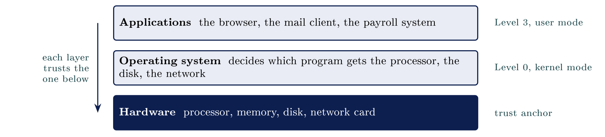

# How digital systems work {#sec-02-how-digital-systems-work}

::: {.callout-note appearance="simple" icon="false"}
**Module.** Module 1: Cybersecurity Foundations\
**Accompanies.** Lecture L02. **Reading time.** About 40 minutes.\
**Primary reading.** Jøsang, *Cybersecurity: Technology and Governance* (Springer, 2025). Core: Sect. 3.1--3.2, 3.4, 3.6.1 (the IT stack), Sect. 11.7.4--11.7.5 (cloud models and shared responsibility). Supporting: Sect. 1.9.1, 2.2.2.
:::

## The question this chapter answers {#the-question-this-chapter-answers .unnumbered}

When somebody says "the system is down", which part of the system are they talking about? That question is dull on purpose. Naming the layer where a problem sits is what a first-line analyst does all day, and it is the skill this chapter builds. L01 was about the field and the threat picture. This chapter is about the machinery the field protects.

The book describes that machinery in one paragraph worth reading twice. The IT infrastructure "consists of systems and the connections between them", and the architecture of a system is an **IT stack** that "roughly contain\[s\] the hardware layer at the bottom, operating systems in between and applications as the top layer" [Jøsang, Chap. 3 intro, p. 43]{.src}. The same paragraph adds the sentence this whole reader hangs on: "for a system to be secure, it is of course necessary that every layer is secure."

We follow one request from the inside out. Part 1 stays inside one machine. Part 2 follows the data through it. Part 3 crosses the network. Part 4 hands some of the machines to a supplier. Part 5 opens a real browser and watches one request cross all of it.

::: {.callout-tip}
## Nordvik AS, from the inside

Nordvik runs on ordinary parts: laptops on desks, one server in a cupboard, and Microsoft 365 reached over the internet. Nothing about it is special. That is the point. By the end of this chapter you should be able to open that server layer by layer, follow one request from a laptop across the network, and say what changes when Microsoft runs part of it.

:::

[→ Part 1 opens one machine on its own. Nothing crosses a network until Part 3.]{.bridge}

## The endpoint

### What is inside the machine

::: {.callout-note}
## The four working parts

A system has one or more microprocessors (CPUs) that execute software; system memory (RAM) that holds the code and data of running processes; a disk that stores programs and data when not in use; and network interfaces to the outside world. [Jøsang, Sect. 3.1, Fig. 3.1, p. 44]{.src}

:::

The processor calculates. The memory holds the current work and empties when the power goes. The disk keeps things permanently. The network card carries questions and answers in and out. The book describes the movement between them precisely: a software module "resides on a storage disk when not in use and is copied into system memory when activated, turning it into an active running process" [Jøsang, Sect. 3.1, p. 44]{.src}.

The distinction that matters for security is the one between memory and disk. Memory is emptied at power-off. Disk is not. That single difference explains why pulling the plug on a compromised machine destroys evidence of what was running, and why a stolen laptop is a disk problem, not a memory problem. It returns in Module 3 when you learn what a log is and where it lives.

```{=html}
<script type="application/json" class="qex">
{"type": "match", "title": "Try it: the four working parts", "instr": "Drag each part onto what it does inside the machine. Two terms are not among the four parts and stay on the bench.", "zones": [{"label": "Executes the software", "answer": "CPU"}, {"label": "Holds current work; empties at power-off", "answer": "Memory (RAM)"}, {"label": "Keeps programs and data permanently", "answer": "Disk"}, {"label": "Carries questions and answers in and out", "answer": "Network interface"}], "extra": ["Kernel", "Hypervisor"], "ok": "Right. And the difference between memory and disk is the one that matters most for security.", "why": "The CPU calculates, RAM holds the current work and empties at power-off, the disk keeps things permanently, and the network card carries traffic.", "ref": "Part 1; Jøsang, Sect. 3.1, Fig. 3.1, p. 44"}
</script>
```

### Software sits in layers

Those four parts are only the bottom layer. Two layers of software sit above them, and each layer trusts the one below it.

::: center
{fig-align="center"}
:::

The book draws this stack in Figure 3.8 and labels the operating system "Level 0" and the applications "Level 3" [Jøsang, Sect. 3.6.1, Fig. 3.8, p. 54]{.src}. Those numbers are privilege levels, and the next section explains them. What to remember now is the direction of trust. Security has to hold at every layer, because an attacker who owns the layer below yours owns you.

### What the operating system decides

::: {.callout-note}
## Privilege levels

The privilege level of a process limits which instructions it may execute and which code and data it may access. A process can access data and code defined with the same or lower privilege level. Applications run at level 3 (user mode); the operating system kernel runs at level 0 (Unix root, Windows Administrator). [Jøsang, Sect. 3.4, Fig. 3.4--3.5, pp. 49--50]{.src}

:::

A program never touches hardware directly. It asks the operating system, and the operating system checks whether that request is allowed before carrying it out. The book states the enforcement mechanism: if a process "tries to call a disallowed instruction, the operating system will stop the process, which means that the program crashes" [Jøsang, Sect. 3.4, p. 49]{.src}. The operating system starts and stops programs, decides which gets the processor, and decides which may open the disk, the screen or the network.

Every access control mechanism in this study programme rests on that one arrangement. The operating system stands between every program and everything the program wants.

```{=html}
<script type="application/json" class="qex">
{"type": "quiz", "title": "Check yourself", "q": "A process tries to call a disallowed instruction. What happens, according to the book?", "options": ["The operating system stops it - the program crashes", "The instruction runs at a lower privilege level", "The hardware executes it directly", "The process is promoted to level 0"], "correct": [0], "ok": "Right.", "why": "A program never touches hardware directly. The operating system checks every request, and a disallowed call means the process is stopped.", "ref": "Part 1; Jøsang, Sect. 3.4, p. 49"}
</script>
```

### Every program runs as somebody

::: {.callout-important title="Key idea"}

Every program runs as one account and can reach exactly what that account can reach, and nothing more. So the operating system's core job is deciding who may touch what, and an account with more access than it needs makes every break-in worse.

:::

Your browser opens your files because you can open them. If an attacker takes over that program, they get everything your account can reach, and not one file more. This is the logic of least privilege, without the term yet. Ransomware that arrives in an attachment encrypts exactly the files the opening account could write to. So the size of the damage is settled before the attack, by whoever decided what the account may reach.

The book makes the same point about the very top of the stack. Attacks "usually enter through one of the input channels, and will typically attempt to take control of (privileged) programs running in the microprocessor" [Jøsang, Sect. 3.1, p. 45]{.src}. A program with high privilege is worth more to an attacker than one with low privilege, which is why services should not run as an all-powerful account.

::: {.callout-tip title="On Nordvik AS"}

On Nordvik's one server, a service left running as an all-powerful account means a single break-in reaches everything the server holds: the drawings, the customer list, the backups if they sit on the same machine.

:::

### Windows and Linux, the same job

Operating systems come in families, and two of them matter for this course. Both do the same jobs under different names. You will support Windows desktops and administer Linux servers, often in the same job, and from Module 3 onwards you work in Linux.

  **Job**                    **Windows**                                    **Linux**
  -------------------------- ---------------------------------------------- -------------------------------------
  Accounts                   Users and Administrator                        Users and root
  The all-powerful account   Administrator (level 0 in the book's figure)   root (level 0 in the book's figure)
  Where programs live        `C:\Program Files`                             `/usr/bin`, `/opt`
  Where records are kept     Event Viewer                                   `/var/log`
  Where it is common         Desktops, office servers                       Servers, cloud, network devices

The book names both all-powerful accounts in the same breath: "Level 0: Kernel Mode (Unix root, Win. Adm.)" [Jøsang, Sect. 3.4, Fig. 3.4, p. 49]{.src}. The row about records explains why a whole lesson in Module 3 goes on reading Linux logs.

[→ Part 1 took the machine apart. Part 2 follows the data through it, from a user to a database and back.]{.bridge}

## Applications and data

### Client and server

Most of what you do involves two programs on two machines. One asks a question and the other answers it. The program that asks is the **client**; the program that answers is the **server**. They are roles in one exchange, not kinds of machine. The book uses the same pairing when it talks about "endpoints": host nodes with apps that exchange application data, "such as between web servers and web clients (PCs and smartphones)" [Jøsang, Sect. 3.2, p. 45]{.src}.

The common misconception is that a server is a special kind of machine. It is not. It is an ordinary computer whose job is to wait for questions and answer them, all day, for many people at once. That is exactly what makes it worth attacking: one server answers for everybody.

### What the database adds

::: {.callout-note}
## Database

A database stores data in an organised way and hands back only the parts asked for. The user never speaks to it directly; the application in front of it decides which questions are allowed.

:::

You do not need SQL today. You need two facts. A database is a separate program, with its own accounts, logs and permissions. And the application is a gatekeeper in front of it. When the gatekeeper is badly written, the user can ask the database anything, including questions the designer never intended. That failure is the subject of L26.

### Data at rest and data in motion

Data exists in two states, and each state needs a different kind of protection. The book uses this distinction in its list of controls for confidentiality: "encryption of data for protection at rest or in transit" [Jøsang, Sect. 1.9.1, p. 15]{.src}.

  **State**   **Where the data is**                          **What protects it**
  ----------- ---------------------------------------------- ----------------------------------------------------------------------------------------
  At rest     On a disk, in a database, in a backup          Disk encryption, access control on files and tables, physical security of the building
  In motion   On a cable, over Wi-Fi, between two machines   Encryption of the connection (HTTPS), so that machines on the path cannot read it

The same file needs both. One does not replace the other. Beginners mix them up constantly: encrypting a connection does nothing for a database sitting open on a server, and encrypting a disk does nothing for a password sent in the clear. The book's own illustration of this is a quotation it borrows from Gene Spafford: using encryption on the internet is like "using an armored car to deliver credit card information from someone who lives in a cardboard box to someone who lives on a park bench" [Jøsang, Sect. 3.2, Fig. 3.2, p. 45]{.src}. Strong transport security does not help if the endpoints are weak.

```{=html}
<script type="application/json" class="qex">
{"type": "buckets", "title": "Try it: at rest or in motion?", "instr": "Sort each item into the state of data it belongs to.", "buckets": ["At rest", "In motion"], "items": [["On a disk", 0], ["In a backup", 0], ["Protected by disk encryption", 0], ["Guarded by the building's locks", 0], ["On a cable", 1], ["Over Wi-Fi", 1], ["Between two machines", 1], ["Protected by HTTPS", 1]], "ok": "Sorted. The same file needs both kinds of protection, and one does not replace the other.", "why": "Data on a disk, in a database or in a backup is at rest; data on a cable or over Wi-Fi is in motion, and each state needs its own protection.", "ref": "Part 2; Jøsang, Sect. 1.9.1, p. 15"}
</script>
```

### One document, several copies

Your laptop's copy is rarely the only one. An ordinary office document is written on the laptop, saved to a shared drive, synced to a cloud service, backed up overnight somewhere else, and sent as an attachment. Five copies is not an exaggeration. Each copy is protected differently, kept for a different length of time, and reachable by different people. Deleting your copy leaves the other four.

### When the copies share a fate

Those five copies are not equally well protected, and one may sit in another country. In January 2021 ransomware hit Østre Toten kommune. The municipality ran without its systems for a long time, and Datatilsynet later fined it, in part because backups had been reachable from the same systems the attack encrypted.

Everybody already believes backups are important. Spend your attention on independence instead. A backup that can be reached and erased from the same systems it protects is not independent of them. The book's advice on ransomware is exactly this: backups "should be stored offline from the network, if possible, to shield them from being attacked", and recovery routines "must be tested regularly" [Jøsang, Sect. 2.2.2, p. 37]{.src}.

### What a file says about itself

::: {.callout-note}
## Metadata

Every file records who made it, when, and with which program. A phone photo also records the time, the phone model, and often the place it was taken.

:::

These hidden facts can reveal more than the picture. Metadata cuts both ways. It leaks information the author never meant to publish, and it is also the raw material of every investigation: the book's account of accountability rests on logging "which user or other entity is behind each logged activity" [Jøsang, Sect. 1.10.2, p. 20]{.src}, and file metadata is part of that trail.

::: {.callout-warning}
## Try it tonight

Take a photo on your phone, send it to yourself by two different routes (an attachment and a chat app), and look at what each copy still knows about where and when it was taken. One route usually strips the location; the other usually keeps it.

:::

[→ So far everything happened on one machine. Part 3 is about the path between machines.]{.bridge}

## The network path

### What a network carries

A network carries questions and answers between machines. Two ideas follow, and both matter for security more than any protocol detail.

First, **sending is copying**. Your original stays where it was. So nothing can ever be unsent, and deleting your copy is not deletion.

Second, **there is no single wire**. No cable runs from your machine to theirs. A chain of machines passes the message along, and neither end knows or controls the whole chain. Anything on the path can read what passes, unless the content is encrypted. That is why data in motion, from Part 2, needs its own protection.

### Inside the building and outside

Machines in one office can usually reach each other directly, because they sit on the same local network. To reach anything outside, the traffic goes through one machine, in the same way that a building has one front door. That machine is the boundary between the local network and everything else.

The boundary decides where a control can sit at all. Traffic can be inspected at that one point, which is why firewalls, filtering and logging go there. The book's first example of standard good practice is precisely this: "the interface between the Internet and the organization's computer network is protected with a firewall" [Jøsang, Sect. 1.7, p. 12]{.src}. Most of Module 2 is about what happens at, and inside, that boundary.

[→ Machine, data, network. Part 4: a supplier runs some of it. The layers stay, and the responsibility question changes.]{.bridge}

## Cloud services

### What the cloud is

::: {.callout-note}
## Cloud computing

Cloud computing is a model for enabling ubiquitous, convenient, on-demand network access to a shared pool of configurable computing resources (e.g., networks, servers, storage, applications, and services) that can be rapidly provisioned and released with minimal management effort or service provider interaction. (NIST SP 800-145) [Jøsang, Sect. 11.7.4, p. 265]{.src}

:::

In plain words: the cloud is somebody else's machines. You rent them instead of buying them. They stand in a hall of racks with power, cooling and locked doors, and you own none of it. You reach them over the same network path as before.

Nothing disappears. There is still a machine, still an operating system, still an application and still a network. A service can still stop, leak, be altered or be used by an impostor, the four failures from L01. What changes is who fixes each layer.

### Who runs which layer

The book draws the IT stack four times side by side, once for each way of renting, and colours in who is responsible for each layer [Jøsang, Sect. 11.7.4, Fig. 11.8, p. 265]{.src}. Read down a column to see what you still have to run yourself.

  **Layer**          **On-Prem**   **IaaS**   **PaaS**   **SaaS**
  ------------------ ------------- ---------- ---------- ----------
  Applications       you           you        you        supplier
  Platform           you           you        supplier   supplier
  Operating system   you           you        supplier   supplier
  Hardware           you           supplier   supplier   supplier
  Storage            you           supplier   supplier   supplier
  Networking         you           supplier   supplier   supplier

Notice the staircase. Each step to the right hands one more layer to the supplier, and the layers are handed over from the bottom up. On-Prem means the machines stand in your own building, or in some other location you control [Jøsang, Sect. 11.7.4, p. 265]{.src}.

### The three service models

Learn the three names. Job advertisements, audit reports and supplier contracts all use them. The book's descriptions [Jøsang, Sect. 11.7.4, p. 266]{.src}:

IaaS, Infrastructure as a Service

:   offers virtual machine and storage resources. You install and operate the operating systems and everything above them.

PaaS, Platform as a Service

:   offers a platform for developing and running applications. You run your programs; the supplier runs the systems underneath.

SaaS, Software as a Service

:   offers ready-made applications. The book's examples are Gmail, Dropbox and Office 365. The supplier manages everything, which limits how far you can tailor it.

The trade-off is simple. More supplier responsibility means less work and less control. If you need more flexibility, the book says, the alternative is PaaS or IaaS, where you can build your own applications on top [Jøsang, Sect. 11.7.4, p. 266]{.src}.

```{=html}
<script type="application/json" class="qex">
{"type": "quiz", "title": "Check yourself", "q": "In PaaS, which is the topmost layer your organisation still runs itself?", "options": ["Applications", "Platform", "Operating system", "Hardware", "Networking"], "correct": [0], "ok": "Right.", "why": "PaaS hands the platform and every layer below it to the supplier; you run your own programs on top of it.", "ref": "Part 4; Jøsang, Sect. 11.7.4, p. 266"}
</script>
```

### What you keep when you rent

Some responsibilities never move to the supplier, whichever model you choose. The book's second figure on shared responsibility lists security functions rather than layers, and three of them stay with the customer in every column, including SaaS [Jøsang, Sect. 11.7.5, Fig. 11.9, p. 267]{.src}.

  **Handed to the supplier (in SaaS)**                              **Kept by your organisation (in every model)**
  ----------------------------------------------------------------- --------------------------------------------------------
  Physical security of the halls                                    Data classification and management
  System security, including the hypervisor and operating systems   Client and endpoint security: the laptops that connect
  Network and application security of the service                   Identity and access management: who may sign in

The book also adds two responsibilities that supplier models usually leave out: protection against corruption and insider threats at the supplier, and protection against legal access by foreign states, because supplier staff "can technically access customers' data" and governments may be able to demand it [Jøsang, Sect. 11.7.5, pp. 267--268]{.src}. In Norwegian law the supplier is the *databehandler* and your organisation remains the *behandlingsansvarlig*. The contract between them is the *databehandleravtale*.

::: {.callout-important title="Key idea"}

Renting the machines hands the supplier the running, patching and physical security, but never the responsibility. You still decide who may log in, classify the data, secure the devices that connect, and answer for it in law.

:::

::: {.callout-tip title="On Nordvik AS"}

Nordvik runs Microsoft 365, so Microsoft patches the servers. Nordvik still owns who may sign in, the customer and drawing data, and answering for that data under Norwegian law. The two suppliers with remote access to the server in the cupboard are a Partner question in the book's four P's [Jøsang, Sect. 1.6, p. 11]{.src}, and nobody at Nordvik has written down what they may reach.

:::

```{=html}
<script type="application/json" class="qex">
{"type": "buckets", "title": "Try it: whose job in SaaS?", "instr": "Nordvik runs Microsoft 365, a SaaS service. Sort each responsibility onto who carries it.", "buckets": ["The supplier", "Your organisation"], "items": [["Physical security of the halls", 0], ["Hypervisor and operating systems", 0], ["Network security of the service", 0], ["Data classification and management", 1], ["The laptops that connect", 1], ["Who may sign in", 1]], "ok": "Sorted. Renting the machines never hands over the data, the endpoints or the identities.", "why": "In SaaS the supplier runs the halls, systems and service; data classification, the connecting endpoints and identity stay with the customer.", "ref": "Part 4; Jøsang, Sect. 11.7.5, Fig. 11.9, p. 267"}
</script>
```

[→ Endpoint, data, network, cloud. Part 5 watches one real request cross all of them.]{.bridge}

## Watching one request

### Opening the network view

Every browser has its own network view, in a panel called developer tools. Open it with F12 or from the browser menu, and select the Network tab. It records nothing until the page is asked for again, so it starts empty. That matters: it proves the tool records what happens and does not invent it. Reload the page and the list fills.

Part 3 followed one click through a chain of machines. This panel shows that same journey, request by request.

### What one page actually fetches

One click on one link makes dozens of separate requests, not one. The text, the pictures, the fonts and the scripts are each fetched on their own. A Norwegian news front page commonly produces well over a hundred requests, to a dozen or more different companies. Each one is a separate question and answer of the kind Part 3 described. Any single one can be slow, or fail, without the others failing.

Read three columns: the name of what was fetched, the domain it came from, and the status. A status of 200 means answered; 404 means not found; anything in the 500s means the server had a problem. Those three columns are the first things a service-desk analyst looks at when a page "does not work".

### Worked example: the call

::: {.callout-tip}
## The case

A company in Vestfold has forty people and one office. Everybody has a laptop, and a supplier runs the file system. At ten past nine somebody rings the service desk and says, in these exact words, that the system is down.

:::

::: {.callout-warning}
## One minute

Before reading on: what is the first question you would ask the caller? Write it down.

:::

**Reasoning.** The method is elimination from cheapest to most expensive, and a wrong first guess is not a wasted one when it removes a whole layer.

1.  **Start with the network**, because it is the cheapest thing to rule out. Here it is not the network: two colleagues at the next desk are online. Part 3 is eliminated.

2.  **Ask what they were doing when it stopped.** That names the program, and often the layer. "I was opening the drawings folder" points at the file system, which is the supplier's SaaS. Part 4.

3.  **Ask whether anybody else has the same problem.** One person: the endpoint, Part 1. Everybody: the service, Part 4.

4.  **Ask what the screen says.** An error text names the layer more reliably than the caller does.

**Result.** Each question points at one of this chapter's parts. "The system is down" becomes "the file service at the supplier is not answering for anybody since nine", which is something a supplier can be phoned about. Naming the layer is the whole job of the first call.

```{=html}
<script type="application/json" class="qex">
{"type": "order", "title": "Try it: the system is down", "instr": "Tap the four questions of the worked example in the order the chapter asks them, cheapest first.", "steps": ["Check the network - are colleagues online?", "Ask what they were doing when it stopped", "Ask whether anybody else has the problem", "Ask what the screen says"], "ok": "That order eliminates layer by layer, cheapest first, until the fault has a name a supplier can be phoned about.", "why": "Eliminate from cheapest to most expensive: the network first, then the program, then how many people are affected, then the error text.", "ref": "Part 5 of this chapter"}
</script>
```

## Common misconceptions {#common-misconceptions .unnumbered}

  **Belief**                                                       **Correction**
  ---------------------------------------------------------------- ---------------------------------------------------------------------------------------------------------------------------------------
  The cloud is somewhere else, so it is somebody else's problem.   The supplier runs the machines. Your organisation still answers for the data and for who may sign in [Jøsang, Fig. 11.9]{.src}.
  Deleting a file deletes it.                                      Sending is copying. Your copy was one of several.
  A server is a special kind of computer.                          It is an ordinary computer whose job is to answer questions for many people at once.
  Encrypting the connection protects the data.                     Only in motion. At rest it needs its own protection, and weak endpoints defeat both [Jøsang, Sect. 3.2]{.src}.
  A backup on the same network is a backup.                        Only if it cannot be reached from the systems it protects [Jøsang, Sect. 2.2.2]{.src}.

## Summary: five points {#summary-five-points .unnumbered}

1.  A request passes through a machine, an operating system, an application, a network, and a machine that answers. Every layer trusts the one below it, and every layer must be secure.

2.  The operating system decides which program may touch which resource, and every program runs as one account with that account's reach. Privilege is decided before the attack.

3.  Data has two states, at rest and in motion, and each needs its own protection. Strong transport with weak endpoints is an armoured car between a cardboard box and a park bench.

4.  A network copies rather than moves, and passes messages through machines you do not control. The boundary between inside and outside is where controls can sit.

5.  Renting machines hands over layers from the bottom up, in three models, but data, endpoints and identity stay with you in every model.

## Self-check {#self-check .unnumbered}

1.  Name the layers a request passes through, from the machine in front of you to the one that answers. (Parts 1--3)

2.  A program wants to open a file. Explain who decides whether it may, and what that has to do with accounts. (Part 1)

3.  What is the difference between privilege level 0 and level 3 in the book's figure, and which accounts sit at level 0 in Windows and Linux? (Part 1)

4.  Describe the path a message takes between two machines in different buildings, and say what "sending is copying" means for deletion. (Part 3)

5.  For IaaS, PaaS and SaaS, say which layers the supplier runs. Name three responsibilities that stay with the customer in all three. (Part 4)

6.  Somebody says "the system is down". Give the four questions you would ask, in order, and say which layer each one tests. (Part 5)

## Before L03 {#before-l03 .unnumbered}

Open the developer tools on any page you use daily, reload it, and count the requests and the number of different domains they go to. Write both numbers down and bring them. In L03 the question changes from how the machinery works to which parts of it matter most: assets, risk and the formal names for the four failures.

## Glossary {#glossary .unnumbered}

IT stack

:   Hardware at the bottom, operating system in between, applications on top. [Jøsang, Chap. 3 intro; Fig. 3.8]{.src}

Process

:   A program that has been copied from disk into memory and is running. [Jøsang, Sect. 3.1]{.src}

Privilege level

:   The ring a process runs in; determines what it may execute and access. [Jøsang, Sect. 3.4]{.src}

Endpoint

:   A host with applications that exchange data: a PC, a phone, a server. [Jøsang, Sect. 3.2]{.src}

Client / server

:   The program that asks and the program that answers; roles, not machines.

At rest / in transit

:   Data on a disk or in a database, versus data on a connection. [Jøsang, Sect. 1.9.1]{.src}

Hypervisor

:   Software that mimics hardware so that several operating systems can run on one machine; the basis of cloud data centres. [Jøsang, Sect. 3.6.1]{.src}

On-Prem / IaaS / PaaS / SaaS

:   Four ways of running the stack, handing layers to a supplier from the bottom up. [Jøsang, Sect. 11.7.4]{.src}

Shared responsibility

:   The split of security duties between cloud provider and customer. [Jøsang, Sect. 11.7.5]{.src}

Databehandler / behandlingsansvarlig

:   Processor and controller in Norwegian data protection law; the supplier and your organisation.

## Sources {#sources .unnumbered}

-   Jøsang, A. (2025). *Cybersecurity: Technology and governance*. Springer. <https://doi.org/10.1007/978-3-031-68483-8>. Sect. 1.6, 1.7, 1.9.1, 1.10.2, 2.2.2, 3.1, 3.2, 3.4, 3.6.1, 11.7.4, 11.7.5.

-   Datatilsynet. (n.d.). *Databehandleravtale*. <https://www.datatilsynet.no/rettigheter-og-plikter/virksomhetenes-plikter/databehandleravtale/>

-   Datatilsynet. (2022). *Municipality of Østre Toten fined*. <https://www.datatilsynet.no/>

-   Mell, P., & Grance, T. (2011). *The NIST definition of cloud computing* (NIST SP 800-145). National Institute of Standards and Technology.

-   Mozilla. (n.d.). *HTTP messages*. MDN Web Docs.
