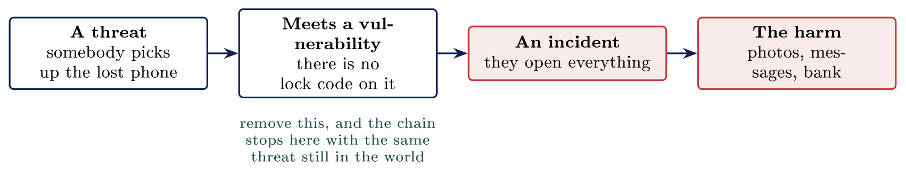
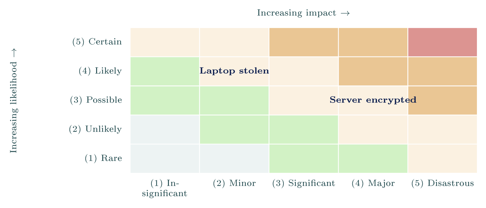

# Thinking about risk {#sec-03-thinking-about-risk}

::: {.callout-note appearance="simple" icon="false"}
**Module.** Module 1: Cybersecurity Foundations\
**Accompanies.** Lecture L03. **Reading time.** About 45 minutes.\
**Primary reading.** Jøsang, *Cybersecurity: Technology and Governance* (Springer, 2025). Core: Sect. 1.4--1.5, 1.8--1.9 (the vocabulary), Chap. 19 Sect. 19.1.1, 19.2.2--19.2.4, 19.5.1 (the method). Supporting: Sect. 18.4 (CIS Controls).
:::

## The question this chapter answers {#the-question-this-chapter-answers .unnumbered}

With far too much to protect and far too little time, what do you protect first? This is the first reader that asks you to decide rather than describe. Ordering work under a fixed budget is what a security role actually consists of, and the five words taught here exist to make that ordering defensible to somebody who was not in the room.

The method is the book's, and it is built in five steps. Part 1 introduces the vocabulary on the phone in your pocket. Part 2 breaks the vaguest of those words, *secure*, into three questions you can answer. Part 3 puts an order on the problems. Part 4 chooses what to do about them. Part 5 runs the whole thing once on one small Norwegian firm.

::: {.callout-tip}
## Nordvik AS

The same twelve-person engineering firm in Vestfold: one server in a cupboard, Microsoft 365 for mail and files, two suppliers with remote access, no security staff. In L02 you opened its machinery. Today you decide which piece of that machinery to defend first, and you write the reasoning down so the owner can read it.

:::

[→ Everything starts on the phone in your pocket. The five words learned there scale to a municipality unchanged.]{.bridge}

## Five core terms

### Start with your phone

::: {.callout-note}
## Asset

Information assets are information and resources used for the processing of information. [Jøsang, Sect. 1.3, p. 3]{.src} In plain words: anything that has value to somebody, and is therefore worth protecting.

:::

On your phone the assets are the photos, the messages, the banking app, and the phone number that other services trust to confirm it is you. The phone itself costs a few thousand kroner and is the least of it. Notice that the valuable things are almost never the hardware. They are the accounts, the pictures, and the number that other services trust. The book's list of asset categories runs the same way: data, devices, applications, networks, and even their users [Jøsang, Sect. 1.3, p. 4]{.src}.

### What could happen to those assets

::: {.callout-note}
## Threat

A threat scenario is a sequence of steps that can be triggered or controlled by a threat actor and that can harm information assets. [Jøsang, Sect. 1.4, p. 5]{.src}

:::

The phone is stolen on the bus. The parcel message from L01 arrives and you tap the link. A threat is about what could happen, not what has happened. Threats come from outside and mostly stay: you do not get to abolish theft, or fire, or people who write convincing messages. The book says as much about threat actors, which can be adversaries or "forces of nature that are too strong or unpredictable for effective prevention" [Jøsang, Sect. 1.4, p. 5]{.src}. What you can change is what happens when a threat meets your things.

### Threat and vulnerability

::: {.callout-note}
## Vulnerability

A vulnerability represents a weakness, flaw or defect that allows (a step in) a threat scenario to be executed. A vulnerability can also be interpreted as the absence of security controls. The three main categories are technical, process, and human vulnerabilities. [Jøsang, Sect. 1.4, pp. 5--6]{.src}

:::

No lock code on the phone. One password everywhere. Nothing backed up anywhere. Beginners collapse threat and vulnerability into one word, and keeping them apart is what makes an assessment possible, because every control you ever install works on the vulnerability side.

  **A threat**                            **A vulnerability**
  --------------------------------------- ------------------------------------------------------------------
  Comes from outside you                  Is a property of your own things
  Exists whether or not you do anything   Exists because of something you did, or did not do
  You mostly cannot remove it             You can remove it, and that is what a control does
  Theft, fire, phishing, ransomware       No lock code, reused password, untested backup, unpatched server

```{=html}
<script type="application/json" class="qex">
{"type": "buckets", "title": "Try it: threat or vulnerability?", "instr": "Sort each item into the column it belongs to.", "buckets": ["A threat", "A vulnerability"], "items": [["Theft", 0], ["Fire", 0], ["Phishing", 0], ["Ransomware", 0], ["No lock code", 1], ["One password everywhere", 1], ["Untested backup", 1], ["Unpatched server", 1]], "ok": "Sorted. Threats come from outside and mostly stay; vulnerabilities are yours, and removing them is what a control does."}
</script>
```

### From threat to harm

A threat becomes an event the moment it meets a vulnerability, and the event causes the harm. The book's Figure 1.3 shows the general chain: a threat actor executes a threat scenario, each step exploits a vulnerability, the assets are reached, an incident occurs, and the incident has an impact [Jøsang, Sect. 1.4, Fig. 1.3, p. 7]{.src}. On a phone:

::: center
{fig-align="center"}
:::

The chain is why the two words have to stay apart. A threat on its own produces nothing. Remove the missing lock code and the chain stops there, with the same threat still in the world.

### What is left over is risk

::: {.callout-note}
## Security control

An information security control is a way of preventing or mitigating a threat scenario so that it cannot (easily) be executed to harm assets. Implementing security controls is thus a way of removing vulnerabilities, and for reducing the impact of incidents. [Jøsang, Sect. 1.5, p. 7]{.src}

:::

You already use controls on your phone: a code or a face to unlock it, a screen that locks itself, a backup you switched on once. Each one is there to stop something before it becomes an incident, or to make the incident smaller.

::: {.callout-note}
## Risk

Information security risks can be associated with the potential that threats will exploit vulnerabilities of an information asset or group of information assets and thereby cause harm to an organization. (ISO/IEC 27005) [Jøsang, Sect. 19.1.1, p. 406]{.src}

:::

The book draws risk as a sum, *Risk = Threat + Vulnerability + Asset*, ending in an incident [Jøsang, Fig. 19.1, p. 406]{.src}, and elsewhere as a triangle whose size grows with asset value, threat strength and vulnerability severity [Jøsang, Sect. 1.8, Fig. 1.9, p. 13]{.src}. The same page draws the conclusion this whole course rests on: in practice it is hard to reduce assets or threats, "which leaves reducing vulnerabilities as the best option in most cases". Controls are the only side of the triangle you can move.

::: {.callout-important title="Key idea"}

Risk is what remains after your controls have done their work. It is specific to you, not to the threat: two firms facing the same threat can carry very different risk.

:::

::: {.callout-tip title="On Nordvik AS"}

The threat of ransomware is the same for Nordvik as for a bank. The risk is not, because the bank has tested backups, a monitored network and a security team, and Nordvik has one server in a cupboard and a backup nobody has restored. Same threat, different vulnerabilities, different risk.

:::

[→ Part 1 gave you the five words. Part 2 breaks the vaguest of them, secure, into three questions you can answer.]{.bridge}

## The CIA triad

### Secure is too vague to act on

Nobody can act on an instruction that says "make it secure". It does not say what to change, so nothing gets changed. It cannot be checked afterwards either, because no state of affairs would count as finished. The test of a security requirement is whether somebody could tell you it is finished. "Make it secure" fails that test. "Keep the case system reachable during office hours" passes it.

The book's way out of the vagueness is the classic one. Information security is "the protection of Confidentiality, Integrity and Availability of information assets", the CIA triad [Jøsang, Sect. 1.3, p. 4]{.src}. Three questions, each of which can be answered for one asset at a time.

### Can the right people use it?

::: {.callout-note}
## Availability

Availability is the property of being accessible and usable on demand by an authorized entity. (ISO/IEC 27000) [Jøsang, Sect. 1.9.4, p. 17]{.src}

:::

In June 2017 the NotPetya malware stopped the shipping company Maersk across its business. To get running again it reinstalled about 45,000 PCs and 4,000 servers. Nothing was stolen and nothing was changed; the company simply lost the use of its systems, and that alone was enough to stop it operating. Availability is the leg beginners underestimate, for exactly that reason. The book's threats to availability are denial of service, obstruction of authorised access, and delay of time-critical functions; its controls include redundancy, backups and incident response [Jøsang, Sect. 1.9.4, p. 17]{.src}.

```{=html}
<script type="application/json" class="qex">
{"type": "quiz", "title": "Check yourself", "q": "NotPetya stopped Maersk in 2017. Nothing was stolen and nothing was changed. Which property failed?", "options": ["Availability", "Integrity", "Confidentiality", "Authenticity"], "correct": [0], "ok": "Right.", "why": "The company simply lost the use of its systems - about 45,000 PCs and 4,000 servers were reinstalled - and that alone was enough to stop it operating."}
</script>
```

### Is it still correct?

::: {.callout-note}
## Integrity

Integrity is the property that data has not been altered or destroyed in an unauthorized manner. (X.800) [Jøsang, Sect. 1.9.2, p. 15]{.src}

:::

A supplier invoice has its account number quietly changed before finance pays it. The data is still there and perfectly readable, which is exactly why nothing warns anybody. Integrity failures are the quietest of the three: the system keeps working and keeps answering, and the wrong answer looks exactly like the right one. The book also names **system integrity**, meaning that systems "have the correct configuration, correct software and updated patch status" [Jøsang, Sect. 1.9.3, p. 16]{.src}. An unpatched server is an integrity problem before it is anything else.

### Is it kept from the wrong people?

::: {.callout-note}
## Confidentiality

Confidentiality is the property that information is not made available or disclosed to unauthorized individuals, entities, or processes. (ISO/IEC 27000) [Jøsang, Sect. 1.9.1, p. 14]{.src}

:::

Patient records, a customer list, an unsat exam, or what a colleague earns are all the same case. In 2017 attackers reached the credit agency Equifax through a known flaw in a web framework that had a patch available for two months. Around 147 million people's records left. Confidentiality failures are quiet in a different way: nothing breaks, so an organisation often hears about the loss from outside first. Equifax is the clean chain from asset to control, and the control was to install a patch that already existed.

### The three together

The same three questions, one size apart from L01. Somebody pretending to be you does not fit into the triad; the book counts authentication as a goal of its own that supports the other three [Jøsang, Sect. 1.10.1, p. 17]{.src}.

                    **Availability**               **Integrity**                        **Confidentiality**
  ----------------- ------------------------------ ------------------------------------ -----------------------------------
  In L01 you said   It stops working               Someone changes it                   Someone reads it
  The question      Can the right people use it?   Is it still correct?                 Is it kept from the wrong people?
  How it fails      Loudly: the work halts         Silently: wrong answers look right   Silently: you hear from outside
  Case              Maersk 2017, Hydro 2019        Invoice redirection                  Equifax 2017, Amedia 2021

Asking which of the three matters most for a given asset is what turns the triad into a decision. A bus timetable needs no confidentiality at all. A patient record puts confidentiality first. The book says this directly: "different information assets have different security needs" [Jøsang, Sect. 1.3, p. 4]{.src}.

::: {.callout-important title="Key idea"}

"Secure" is not one property but three separate questions: availability, integrity and confidentiality. A measure that improves one can weaken another, so you decide which matters most for each asset.

:::

::: {.callout-tip title="On Nordvik AS"}

For the customer and drawing data, confidentiality weighs heaviest, because information that leaves cannot be brought back. For the server, availability comes first, because a firm that cannot open its drawings cannot bill anybody.

:::

[→ You have the words and the three questions. Part 3 puts an order on them, so two people can argue in the open.]{.bridge}

## Ranking risks

### Likelihood and consequence

Every problem gets two questions. How likely is it, and how bad would it be? The book calls this **qualitative risk analysis**: "levels of likelihood and impact expressed with descriptive words, and optionally associated with ordinal numbers" [Jøsang, Sect. 19.5.1, p. 421]{.src}. Likelihood runs up the side of a grid, consequence runs across, and the cell where they meet is the ranking.

::: center
{fig-align="center"}
:::

The grid computes nothing. It forces two people to name a cell, which is the whole value of it. Something almost certain and trivial is worth no meeting, and so is something catastrophic and impossible. The book's own heat map, with its bands *negligible*, *low*, *moderate*, *high* and *extreme*, is a lookup table, and it adds that each organisation must choose its own distribution of levels [Jøsang, Sect. 19.5.1, Fig. 19.10, p. 423]{.src}.

### Five steps, not a number

Neither question is any use alone. Measure consequence in money, in hours of lost work, or in harm done to people. Nobody can compute the probability that a municipality meets ransomware next year, and a decimal probability looks precise and is invented. Five named steps are honest about how much the evidence supports. The book's likelihood scale gives each step a meaning in words, from *(5) Certain*, where an incident "may already have happened, or will occur shortly, probably within a week", down to *(1) Rare*, which "will probably never occur" [Jøsang, Fig. 19.8, p. 422]{.src}. Its impact scale runs from *(5) Disastrous*, with possible bankruptcy, to *(1) Insignificant* [Jøsang, Fig. 19.9, p. 422]{.src}. Two people who disagree then have to name a cell instead of trading adjectives.

The book is also honest about the limits: qualitative levels "have no absolute significance" and are only a basis for ranking and for comparing with a threshold [Jøsang, Sect. 19.2.2, p. 412]{.src}.

### Two risks, ranked

Frequency is not severity. Ransomware encrypting the case system is *possible*, and the consequence would be *major*. A laptop stolen from a car is *likely* in any year, and *minor* if the disk is encrypted. Say the reasoning out loud. The stolen laptop happens far more often, and the encrypted server still ranks higher, because weeks without systems costs more than one replaced laptop. Confusing how often with how bad is the commonest mistake in the room.

```{=html}
<script type="application/json" class="qex">
{"type": "quiz", "title": "Check yourself", "q": "A laptop stolen from a car happens more often than ransomware on the server, yet the encrypted server ranks higher. Why?", "options": ["Weeks without systems costs more than one laptop", "Servers meet more threats than laptops do", "Laptop theft is not a realistic threat", "The grid computes a number that proves it"], "correct": [0], "ok": "Right.", "why": "Frequency is not severity. With an encrypted disk the stolen laptop is minor, while the encrypted server would be major, and the grid computes nothing."}
</script>
```

### Who decides

The IT department does not decide this. They know how the systems work, and that is a different question from what matters most. The decision belongs to whoever carries the consequence, which means management, the governance level you met in L01. Three rules follow:

-   Write the scale down before you use it. A scale invented for each risk ranks nothing.

-   Accepting a risk is a decision somebody owns in writing, with a name and a date. The book: retaining a risk "must be justified on the business understanding the risk" [Jøsang, Sect. 19.2.3, p. 414]{.src}.

-   The output of an assessment is an agreement everybody has seen. The grid is only how that agreement was reached, and the record of why.

In L04 you meet risk decisions the law has already made for you.

[→ Ranking told you what matters most. Part 4 is about what you can actually do about it.]{.bridge}

## Responses and controls

### Four things you can do

The book names "four relevant treatments" for a priority risk: reduce, share or transfer, retain, and avoid [Jøsang, Sect. 19.2.3, p. 412]{.src}.

  **Treatment**   **What it means**                                       **From the book**
  --------------- ------------------------------------------------------- --------------------------------------------------------------------------------------------------------------------------------------------------
  Reduce          Add a control that lowers likelihood or consequence     "normally done by implementing security controls"; always entails a cost, so weigh gain against investment [Jøsang, p. 413]{.src}
  Transfer        Insurance, or a supplier who carries part of the risk   Cloud services and cyber insurance are the examples; the insurer audits you first [Jøsang, p. 414]{.src}
  Accept          Decide the fix costs more than the risk                 Justifiable only below the threshold or when treatment is disproportionate; must be justified and followed up [Jøsang, pp. 414--415]{.src}
  Avoid           Stop the activity altogether                            Rare, because "any business activity carries some risk" and stopping has its own cost [Jøsang, p. 415]{.src}

An accepted risk that nobody wrote down is something else entirely. The book's term for how much of this an organisation is willing to carry is **risk appetite** [Jøsang, Sect. 19.2.3, p. 415]{.src}.

```{=html}
<script type="application/json" class="qex">
{"type": "match", "title": "Try it: the four treatments", "instr": "Drag each treatment onto its meaning. One term is not one of the book's four and stays on the bench.", "zones": [{"label": "Add a control that lowers the risk", "answer": "Reduce"}, {"label": "Insurance, or a supplier carries part", "answer": "Transfer"}, {"label": "Decide the fix costs more than the risk", "answer": "Accept"}, {"label": "Stop the activity altogether", "answer": "Avoid"}], "extra": ["Ignore"], "ok": "Right. And ignoring a risk is not a fifth option: doing nothing is accepting it, without the signature."}
</script>
```

### Controls come in four kinds

Most real problems need a control from more than one column. The book sorts controls two ways: by function (preventive, detective, corrective, plus governance) [Jøsang, Sect. 1.5, pp. 8--9]{.src}, and by domain, following ISO/IEC 27002: organizational, people, physical and technological [Jøsang, Sect. 1.5, Fig. 1.7, p. 10]{.src}. The four columns used in this course are the domain view with one addition.

  **Technical**                                                                       **Administrative**                                                                                 **Physical**                                      **Environmental**
  ----------------------------------------------------------------------------------- -------------------------------------------------------------------------------------------------- ------------------------------------------------- ---------------------------------------------------------------------------
  Built into the systems: patching, multi-factor login, encryption, backup software   Written and followed by people: policies, training, a call-back rule for changed account numbers   Doors, locks, the cupboard the server stands in   Power, cooling, flooding: a UPS keeps a room running when the power fails
  Book: technological                                                                 Book: organizational and people                                                                    Book: physical                                    Book: physical

The four kinds exist so that nobody solves a people problem with a product. Invoice redirection is an administrative problem, and no firewall rule fixes it. A flooded cupboard is environmental, and no password helps.

```{=html}
<script type="application/json" class="qex">
{"type": "buckets", "title": "Try it: four kinds of control", "instr": "Sort each control into the kind it belongs to.", "buckets": ["Technical", "Administrative", "Physical", "Environmental"], "items": [["Multi-factor login", 0], ["Patching", 0], ["A call-back rule for changed numbers", 1], ["A written password policy", 1], ["Doors and locks", 2], ["The cupboard the server stands in", 2], ["A UPS for when the power fails", 3], ["Cooling for the server room", 3]], "ok": "Sorted. The four kinds exist so that nobody solves a people problem with a product."}
</script>
```

### One layer is never enough

One control is never enough on its own. The mail filter stops most phishing before it arrives, and the person behind it was trained. Multi-factor login sits behind both, so a stolen password is not enough on its own. A single defence is a castle with only a moat: anyone who crosses the water finds nothing else in the way. The book's reason is historical: until around 2000 the focus was almost entirely on prevention, "the security community slowly realised that this was a flawed approach", and organisations now need preventive, detective and corrective controls together [Jøsang, Sect. 1.5, p. 9]{.src}.

### The control that only exists on paper

A control nobody follows is not a control at all. A policy saying staff must not reuse passwords changes nothing if nobody has read it. A real control needs the book's four P's behind it: people who know it, a product that supports it, a partner who maintains it, and a process for using it [Jøsang, Sect. 1.6, pp. 10--11]{.src}. A weak control still does something. A control that exists only on paper does nothing, and it is worse than nothing, because it makes the list look finished.

### You do not have to invent the list

Somebody has already written the list for you. The book describes the CIS Critical Security Controls as 18 controls across operational domains, each broken into safeguards, and groups the safeguards into three Implementation Groups [Jøsang, Sect. 18.4, pp. 390--391]{.src}. IG1 is written for exactly the kind of organisation Nordvik is: "small to medium-sized with limited IT and cybersecurity expertise", whose principal concern "is to keep the business operational", with safeguards "aimed to thwart general, non-targeted attacks" [Jøsang, Sect. 18.4, p. 391]{.src}. CIS calls IG1 *essential cyber hygiene*. In Norway, NSM's *Grunnprinsipper for IKT-sikkerhet* plays the same role and is drawn as a loop, because mapping what you have comes round again at the end.

Neither list tells you what matters in your organisation. Both tell you what to do once you have decided what matters.

[→ Words, questions, ranking, responses. Part 5 runs the whole method once, on one small firm.]{.bridge}

## A complete assessment

### Filling in the grid

::: {.callout-tip}
## The case

Nordvik AS: twelve people, one server in a cupboard, Microsoft 365, two suppliers with remote access, no security staff. Four steps fill the grid, and they are the book's three risk-assessment steps plus the list of assets that precedes them [Jøsang, Sect. 19.2.2, p. 412]{.src}.

:::

1.  **List what is worth something.** The drawings and customer data, the server, the Microsoft 365 accounts, the ability to bill. Include the things that are not objects and appear in no inventory.

2.  **List what could happen.** Ransomware on the server, an account taken over through a phishing message, a supplier's remote access misused, a laptop stolen with drawings on it, the cupboard flooding.

3.  **Work out how it would happen.** Each threat meets a vulnerability: an unpatched server, no multi-factor login, supplier accounts nobody reviews, an unencrypted disk, a cupboard under a water pipe.

4.  **Order them.** Each risk sits in one cell. Expect at least two placements to move once somebody argues.

  **Risk**                           **Likelihood**   **Impact**        **Cell, and why**
  ---------------------------------- ---------------- ----------------- ------------------------------------------------------------
  Server encrypted by ransomware     Possible (3)     Major (4)         High. Weeks without drawings; nobody can bill.
  Microsoft 365 account taken over   Likely (4)       Significant (3)   High. Phishing reaches every firm; mail and files exposed.
  Supplier remote access misused     Possible (3)     Major (4)         High. Same outcome as ransomware, different door.
  Laptop stolen from a car           Likely (4)       Minor (2)         Moderate, if the disk is encrypted. High if it is not.
  Cupboard floods                    Unlikely (2)     Major (4)         Moderate. Rare, but the only server is in there.

::: {.callout-warning}
## Argue with the grid

Pick one placement you disagree with and move it one cell. Say what evidence would settle the argument. That sentence is the part of an assessment that gets read.

:::

### The whole method

Four steps run the whole method, and they work on a phone, a school, a municipality, or anything else.

1.  Start from the top of the grid. For Nordvik that is the encrypted server.

2.  Search the IG1 list for a safeguard that matches that risk. The book reproduces one: safeguard 11.1, *Establish and Maintain a Data Recovery Process*, which covers "the scope of data recovery activities, recovery prioritization, and the security of backup data" [Jøsang, Sect. 18.4, Fig. 18.7, p. 391]{.src}.

3.  Choose the treatment. Here: reduce, with a backup that is stored where ransomware on the server cannot reach it and that has been restored at least once, the book's own advice against ransomware [Jøsang, Sect. 2.2.2, p. 37]{.src}. Cost: a few thousand kroner and one afternoon.

4.  Write down what remains, who accepted it, and when it will be looked at again.

Then take the next cell down. For the account takeover, the safeguard is multi-factor login, which is the control the book names for strengthening authentication [Jøsang, Sect. 1.10.1, p. 18]{.src}. For the suppliers, it is a list of who may reach the server, reviewed on a date. None of these is expensive. All of them are things Nordvik could tell you were finished.

```{=html}
<script type="application/json" class="qex">
{"type": "order", "title": "Try it: the whole method", "instr": "Tap the four steps of the method from Part 5 in order.", "steps": ["Start from the top of the grid", "Find a matching IG1 safeguard", "Choose the treatment", "Write down what remains and who accepted it"], "ok": "That is the method, and it works on a phone, a school or a municipality unchanged."}
</script>
```

## Common misconceptions {#common-misconceptions .unnumbered}

  **Belief**                                     **Correction**
  ---------------------------------------------- ----------------------------------------------------------------------------------------------------------------------------------------
  Risk means the same thing as threat.           A threat exists whatever you do. Risk is what is left after your controls, and it is yours.
  A vulnerability is a software bug.             Bugs are one of three kinds. Process and human weaknesses are the other two [Jøsang, Sect. 1.4]{.src}.
  A new alarm removes the risk of burglary.      It changes likelihood or consequence. The threat is unchanged, and some risk remains.
  If we ignore a risk it is not accepted.        Doing nothing is accepting it, without the signature. The book requires acceptance to be justified [Jøsang, Sect. 19.2.3]{.src}.
  The IT department decides what matters most.   Management does, because management carries the consequence. IT knows how, not what matters.

## Summary: five points {#summary-five-points .unnumbered}

1.  An asset is anything worth protecting, and listing the assets is where every assessment starts.

2.  A threat comes from outside and you cannot remove it. A vulnerability is yours, and you can. Risk is what remains after your controls.

3.  "Secure" breaks into three answerable questions: can the right people use it, is it still correct, is it kept from the wrong people.

4.  Rank by likelihood and impact in named steps on a written scale, and let the people who carry the consequence decide.

5.  Reduce, transfer, accept or avoid; choose controls from more than one kind; and use a written list such as CIS IG1 rather than inventing one.

## Self-check {#self-check .unnumbered}

1.  Your neighbour says a new alarm has removed the risk of burglary. Say what the alarm actually changed. (Part 1)

2.  Give one example of a vulnerability that is not a software bug, and name the threat it lets through. (Part 1)

3.  A vaccine register and a bus timetable: for each, which of the three CIA questions matters most, and why? (Part 2)

4.  Place "laptop stolen from a car" and "server encrypted" on the grid, and explain why the less frequent one ranks higher. (Part 3)

5.  Name the book's four risk treatments and say when accepting a risk is justified. (Part 4)

6.  Why is a policy nobody has read worse than no policy at all? (Part 4)

7.  For Nordvik's top risk, name one IG1 safeguard and one treatment, and say how the owner would know it is finished. (Part 5)

## Before L04 {#before-l04 .unnumbered}

Take your own phone and fill in one line of the grid: one asset, one threat, one vulnerability, one cell, one control. Bring it. In L04 the question becomes what you are allowed to do, and what the law has already decided for you: ethics, permission, and scope.

## Glossary {#glossary .unnumbered}

Asset

:   Information and the resources that process it; anything worth protecting. [Jøsang, Sect. 1.3]{.src}

Threat actor / threat scenario

:   The entity that can cause harm, and the steps it takes. [Jøsang, Sect. 1.4]{.src}

Vulnerability

:   A technical, process or human weakness that lets a threat step succeed; the absence of a control. [Jøsang, Sect. 1.4]{.src}

Incident / impact

:   The event when a threat meets a vulnerability, and the loss that follows. [Jøsang, Sect. 1.4]{.src}

Risk

:   The potential that a threat exploits a vulnerability and harms an asset; what remains after controls. [Jøsang, Sect. 19.1.1]{.src}

CIA triad

:   Confidentiality, integrity, availability. [Jøsang, Sect. 1.3, 1.9]{.src}

Qualitative risk analysis

:   Likelihood and impact in named levels on a heat map. [Jøsang, Sect. 19.5.1]{.src}

Risk treatment

:   Reduce, transfer, retain (accept), avoid. [Jøsang, Sect. 19.2.3]{.src}

Risk appetite

:   How much risk an organisation is willing to carry rather than pay to reduce. [Jøsang, Sect. 19.2.3]{.src}

Defence in depth

:   More than one control in the path of a threat; preventive, detective and corrective together. [Jøsang, Sect. 1.5]{.src}

CIS Controls / IG1

:   Eighteen controls with safeguards; IG1 is the set for small organisations. [Jøsang, Sect. 18.4]{.src}

## Sources {#sources .unnumbered}

-   Jøsang, A. (2025). *Cybersecurity: Technology and governance*. Springer. <https://doi.org/10.1007/978-3-031-68483-8>. Sect. 1.3--1.6, 1.8--1.10, 2.2.2, 18.4, 19.1.1, 19.2.2--19.2.4, 19.5.1.

-   Center for Internet Security. (n.d.). *CIS Critical Security Controls, Implementation Group 1*. <https://www.cisecurity.org/controls/implementation-groups/ig1>

-   Nasjonal sikkerhetsmyndighet. (n.d.). *Grunnprinsipper for IKT-sikkerhet*. <https://nsm.no/>

-   The Apache Software Foundation. (2017). *Media alert* (Equifax and Apache Struts).

-   Cimpanu, C. (2018). *Maersk reinstalled 45,000 PCs and 4,000 servers to recover from NotPetya attack*. BleepingComputer.
