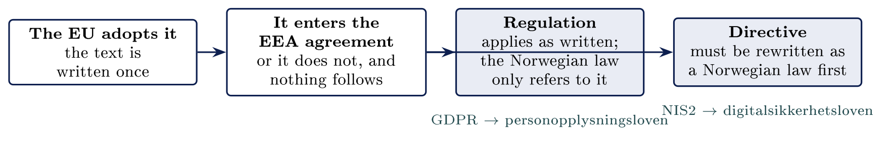
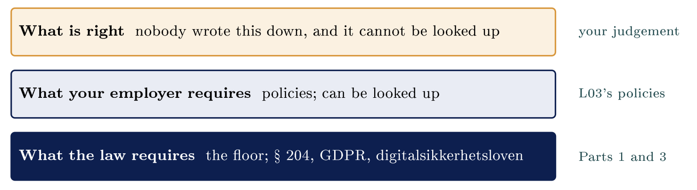

# What you may and may not do {#sec-04-what-you-may-and-may-not-do}

::: {.callout-note appearance="simple" icon="false"}
**Module.** Module 1: Cybersecurity Foundations\
**Accompanies.** Lecture L04. **Reading time.** About 40 minutes.\
**Primary reading.** Jøsang, *Cybersecurity: Technology and Governance* (Springer, 2025). Core: Sect. 1.11 (authorization), 17.1.2, 17.3.1, 17.4.1--17.4.2 (regulation), 10.5--10.6 (GDPR). Supporting: Sect. 14.5.2, 14.7.1.
:::

## The question this chapter answers {#the-question-this-chapter-answers .unnumbered}

What may you touch, and who says so? This chapter closes Module 1 and makes the rest of the term lawful. You already hold a Kali Linux virtual machine. From Module 2 onward you learn techniques that are criminal offences without permission. The line between a job and a crime is a single test, and this chapter names it.

The five parts move from the hard line outward. Part 1 is the criminal law. Part 2 is the document that makes the work lawful. Part 3 is the security the law requires of organisations. Part 4 is conduct above the law, where nobody stands beside you. Part 5 shows how much is already public before anything is broken.

::: {.callout-tip}
## The rules, on a real job at Nordvik

Imagine Nordvik hires you to review its security. What you may touch is decided by the law, by a written authorisation, and by an agreed scope. All three have to say yes. Two of them saying yes is not enough.

:::

[→ Everything this term is lawful or unlawful on one test. Part 1 names the test.]{.bridge}

## The legal boundary

### Straffeloven § 204

::: {.callout-note title="Straffeloven § 204"}

Getting access to a system you had no right to reach is the offence in itself. Lovdata publishes the code free of charge. The paragraph is about permission, not damage.

:::

Read it in Norwegian on Lovdata; it is short, and students are always surprised by how little it asks for. Access without permission is the whole offence, and nothing else has to be shown.

The book does not quote Norwegian law, but it explains why every such law is written this way. Its discussion of the American equivalent, the Computer Fraud and Abuse Act, lists the first provision as *unauthorized access*: "It is illegal to access a computer without authorization or exceeding authorized access" [Jøsang, Sect. 17.3.1, p. 360]{.src}, and then notes "the prominence of the term 'authorization' in the provisions above, which reflects the importance of correct interpretation of authorization". That interpretation is in Sect. 1.11, and it is the hinge of this chapter.

### What the offence is not

Beginners assume the law cares about harm. It does not. Causing damage is a separate paragraph; theft is another; a good motive is not a defence. Damage, theft and intent change the sentence a court gives, not whether a crime happened. The only question § 204 asks is whether you were authorised.

The book's authorisation section explains the logic with a scene from a courtroom. Suppose you obtained somebody's password by fraud and used it. You are prosecuted for unauthorised access. In your defence you produce a textbook that says "after logging in, the system authorizes the user". You argue that you logged in, so you were authorised. The book's verdict: "Based on explanations of authorization in such textbooks you are logically right in your line of argument. However, it would probably not be good enough to win the case" [Jøsang, Sect. 1.11, p. 23]{.src}. Obtaining access is not the same as being authorised.

### Not a grey area

Each excuse in the left column has been tried before. The moment you have to argue that something was probably allowed, you already know the answer.

  **The excuse**                               **What the law actually says**
  -------------------------------------------- -------------------------------------------------------------------------------------------
  It was open, so it was allowed.              The port answered. Nobody authorised you. Reachable is not permission.
  I did not change anything.                   Damage is a separate question. Access was the offence.
  I was only testing whether I could get in.   Testing is the offence unless somebody with authority asked you to.
  A colleague said it was fine.                Did the colleague hold authority over that system? Usually not.
  I found the password in a document.          Finding a key is not being given one. Using it is access without right.
  It was my own account on their system.       Your account may reach what you were given. Going further is exceeding authorised access.

The rule underneath every row is the same. The book's definition: "Access authorization is the act of specifying access rights for users, roles, and processes" [Jøsang, Sect. 1.11, p. 21]{.src}, and authorising is something "authorities in an organization are responsible for" [Jøsang, Sect. 1.11, p. 22]{.src}. Authorisation is given by somebody. It is not something you find.

::: {.callout-important title="Key idea"}

Under straffeloven § 204, getting access to a system you had no right to reach is the offence in itself. Damage, theft, motive and skill change the sentence a court gives, not whether a crime happened. The only question is whether you were authorised.

:::

::: {.callout-tip title="On Nordvik AS"}

If you probed Nordvik's server without Nordvik's written permission, you would be on the wrong side of § 204 even if you touched nothing and meant well.

:::

```{=html}
<script type="application/json" class="qex">
{"type": "quiz", "title": "Check yourself", "q": "Under straffeloven § 204, what alone is the offence?", "options": ["Getting access you had no right to", "Causing damage to data or systems", "Stealing or copying information", "Acting with a harmful motive"], "correct": [0], "ok": "Right.", "why": "Damage, theft and motive change the sentence a court gives, not whether a crime happened. The only question is whether you were authorised.", "ref": "Part 1; Jøsang, Sect. 1.11, p. 23"}
</script>
```

[→ Part 1 drew the line. Part 2 is the document that lets you cross it lawfully.]{.bridge}

## Authorization and scope

### What authorization is

A spoken yes does not survive a disagreement. A colleague who says "go ahead" may not hold authority over the systems you would touch. Three weeks later nobody remembers the conversation, and the person who said it may have had no right to say it.

::: {.callout-note}
## Authorization, in practice

A named person with authority over the systems, agreeing in writing before any work starts, naming which systems, on which dates, and who to call when something breaks.

:::

The book's description of a penetration test has the same anchor: it is "a simulated attack against an organization, *authorized by management* and carried out to evaluate the security of the organization's networks, applications and systems" [Jøsang, Sect. 14.7.1, p. 316]{.src}. Authorised by management, in writing, before. The book also notes the usual practice that "the system owner and IT operations are informed that the pentest is being carried out".

### What a scope puts in and leaves out

Scope is the list of what may be touched, and when. Everything else is out, including the next machine on the same rack. Writing the scope is how you find out what the client actually meant: a client's first brief is always too wide to be useful, and very often the client does not yet know what they want. Every public bug bounty programme publishes a scope for the same reason.

  **In scope, written down**                 **Out of scope, however interesting**
  ------------------------------------------ ---------------------------------------
  The systems, by name and address           The next machine on the same rack
  The dates and hours                        Anything after the end date
  The methods allowed                        Methods the document does not name
  The people who may be contacted            Staff who were not told
  What to do with personal data if reached   Reading it "to confirm the finding"

```{=html}
<script type="application/json" class="qex">
{"type": "buckets", "title": "Try it: in or out of scope?", "instr": "A signed test document exists. Sort each item.", "buckets": ["In scope", "Out of scope"], "items": [["Systems named in the document", 0], ["The agreed dates and hours", 0], ["Methods the document names", 0], ["The next machine on the same rack", 1], ["Anything after the end date", 1], ["Staff who were not told", 1], ["Reading personal data to confirm a find", 1]], "ok": "Sorted. Everything the document does not name is out, however interesting.", "why": "Scope is the written list of what may be touched and when; everything the document does not name is out, including the next machine on the rack.", "ref": "Part 2 of this chapter"}
</script>
```

### Stopping conditions and refusals

The document says what happens when something breaks, and it says so beforehand. You stop, you telephone the named person, and you do not repair what you interrupted. You also stop when you reach real personal data: the book notes that "security and penetration testing can cause privacy risk in itself" [Jøsang, Sect. 11.3.5.2, p. 247]{.src}. Clients can refuse parts of a test, and a refusal is a scope decision, not an insult.

### A test that ended in an arrest

In September 2019 two testers from the firm Coalfire were arrested in Iowa for doing the job they were hired to do. The state's judicial branch had hired them to test courthouse security, and their contract allowed them to follow staff through doors and to pick locks. The county owned the courthouse and had agreed to nothing. The paper was real, it named the buildings, and it was signed by somebody who did not own them. Charges were later dropped, and in 2026 the county paid a settlement.

This is the clearest case of an authorisation failing on ownership. Everything you learn to do this term is lawful only because of a document like this, and the document is what anybody reads first when something goes wrong.

::: {.callout-important title="Key idea"}

Authorization is what turns the same action from a § 204 offence into a job: a named person with authority, agreeing in writing before any work starts, naming which systems, on which dates, and who to call when something breaks.

:::

::: {.callout-tip title="On Nordvik AS"}

A signed engagement could put Nordvik's own server in scope, but never its two suppliers' systems, because Nordvik cannot authorise access to another company. The suppliers would each have to sign for their own.

:::

[→ So far, what is forbidden. Part 3 is about the security the law requires of organisations.]{.bridge}

## Legal obligations

### Some security is required by law

Some security is not a choice, because a law requires it. The book lists "legal, regulatory, and contractual cybersecurity requirements" as the third of its three sources of security requirements, beside good practice and risk assessment [Jøsang, Sect. 1.7, p. 12]{.src}, and it adds a warning: "It is each organization's duty to have an overview of which legal requirements for cybersecurity must be complied with."

Law, regulation, standard and policy bind in that order of force. The book draws this as a hierarchy: "regulations further up in the hierarchy are more general than regulations further down" and "override regulations further down if they were to somehow contradict each other" [Jøsang, Sect. 17.1.2, Fig. 17.1, p. 357]{.src}. At the top sit the constitution and formal laws; below them administrative regulations and agency decisions; below those, standards and contracts; and at the bottom, your employer's own policies. The risk assessment from L03 decides what happens in the space the law left open.

### How an EU rule reaches Norway

Norway is in the EEA and not in the EU, so no EU rule applies here on its own. The book explains the mechanism: "The EEA countries Iceland, Lichtenstein and Norway decide together whether an EU act shall apply in the EEA countries; hence they can perfectly well decide to not implement an EU act. However, they must decide together, all or none" [Jøsang, Sect. 17.4.1, p. 364]{.src}.

::: center
{fig-align="center"}
:::

The two kinds of act differ in what Norway has to do next. A **regulation** "is a binding legislative act which must be applied without modification", only translated; the national law is then a referral law [Jøsang, Sect. 17.4.1, p. 364]{.src}. A **directive** "defines a regulatory goal that each EU member state must achieve", and each state writes its own law to reach it [Jøsang, Sect. 17.4.1, p. 364]{.src}. GDPR is the book's example of the first; NIS2 is its example of the second.

NIS2 came into force in the EU in 2022, with implementation into national law due by 24 October 2024. Its elements include harmonised security requirements and reporting obligations, and national strategies covering supply chain security, vulnerability management and cyber hygiene [Jøsang, Sect. 17.4.2, p. 364]{.src}. In Norway the corresponding law is digitalsikkerhetsloven. NIS2 does not apply here as written; the Norwegian law does.

```{=html}
<script type="application/json" class="qex">
{"type": "buckets", "title": "Try it: regulation or directive?", "instr": "Sort each fact onto the kind of EU act it describes.", "buckets": ["Regulation", "Directive"], "items": [["Applied without modification", 0], ["Only translated; a referral law", 0], ["GDPR", 0], ["Defines a goal each state must reach", 1], ["Each state writes its own law", 1], ["NIS2", 1]], "ok": "Sorted. That is why digitalsikkerhetsloven applies in Norway, and NIS2 as written does not.", "why": "A regulation is applied without modification and only translated; a directive sets a goal that each state reaches with a law of its own.", "ref": "Part 3; Jøsang, Sect. 17.4.1, p. 364"}
</script>
```

### Who is who under GDPR

Personal data is anything at all that says something about a person. The book quotes GDPR's own definition, "any information relating to an identified or identifiable natural person", and the Irish Data Protection Commission's plain version: "any information about a living person, where that person either is identified or could be identified" [Jøsang, Sect. 10.6.1, p. 226]{.src}. GDPR reaches Norway through personopplysningsloven; the book notes that the EEA incorporated it a few months after the EU, on 20 July 2018 [Jøsang, Sect. 10.5, p. 225]{.src}.

Four roles carry the whole regulation, and a fifth is appointed inside some organisations [Jøsang, Sect. 10.6, Fig. 10.3, p. 225]{.src}.

  **Role**                    **Norwegian term**     **What it means**
  --------------------------- ---------------------- --------------------------------------------------------------------------------------------------------------
  Data subject                den registrerte        The living person the data is about.
  Data controller             behandlingsansvarlig   Decides why and how personal data is processed. Answers to Datatilsynet. Your employer, in almost every job.
  Data processor              databehandler          Processes data on the controller's behalf under a data processing agreement. Microsoft, for Nordvik's mail.
  Data Protection Authority   Datatilsynet           Audits, advises, fines.
  Data Protection Officer     personvernombud        Appointed inside larger or riskier organisations; advises both controller and processor.

You will hold the controller or the processor role in every job you take, because your employer holds one of them.

```{=html}
<script type="application/json" class="qex">
{"type": "match", "title": "Try it: who is who under GDPR", "instr": "Drag each Norwegian term onto the role it names. One term is a fifth role and stays on the bench.", "zones": [{"label": "The living person the data is about", "answer": "den registrerte"}, {"label": "Decides why and how data is processed", "answer": "behandlingsansvarlig"}, {"label": "Processes on the controller's behalf", "answer": "databehandler"}, {"label": "Audits, advises and fines", "answer": "Datatilsynet"}], "extra": ["personvernombud"], "ok": "Right. The personvernombud is appointed inside larger or riskier organisations and advises both controller and processor.", "why": "Den registrerte is the person, behandlingsansvarlig decides, databehandler processes on its behalf, and Datatilsynet audits, advises and fines.", "ref": "Part 3; Jøsang, Sect. 10.6, Fig. 10.3, p. 225"}
</script>
```

### The duties, and what a breach costs

::: {.callout-note}
## GDPR duties, in brief

A lawful reason to hold the data before you collect it; security appropriate to the risk; the least data for the shortest time; and reporting a serious breach to Datatilsynet.

:::

Two duties matter most for a beginner. You need a lawful reason before you collect anything, and you keep the least you can for the shortest time you can. Consent is a weak reason at work, because an employee cannot really refuse.

The breach duty has a clock. The book: "In the EU, the national Data Protection Authority shall be informed within 72 h of an incident with a data protection impact" [Jøsang, Sect. 14.5.2, p. 312]{.src}. The book also records what Norway did with the penalty rules GDPR left to member states: "Norway, through section 48 of the Personal Data Act, has set the maximum penalty to fines and/or imprisonment of up to 1 year (3 years in particularly aggravating circumstances)" [Jøsang, Sect. 10.5, p. 225]{.src}. Corporate fines under GDPR itself run to four percent of global turnover. Østre Toten kommune, from L02, was fined by Datatilsynet after its ransomware incident.

[→ The law is a floor. Part 4 is about the decisions above it, where nobody stands beside you.]{.bridge}

## Professional judgement

### The law sets a floor

Parts 1 and 3 were the bottom level, the conduct the law forbids and the security the law requires. Being legal and being right are different questions.

::: center
{fig-align="center"}
:::

The law is a floor and not a target. Meeting the floor and being secure are not the same thing, which is why the book says that following good practice alone leaves an organisation at "low maturity" if it does not also run its own risk assessments [Jøsang, Sect. 1.7, p. 12]{.src}.

### Three questions before you look

Ask three questions before you type anything. If any of them cannot be answered out loud, the answer is to stop.

1.  Was this information meant to be public, or is it public because somebody made a mistake?

2.  Am I looking for a responsible reason, or to find out whether I can get in?

3.  Could this harm somebody if I am wrong about the first two?

### Finding something by accident

Some of this will happen to you in your first year. A shared folder open to everyone holds something that should never be in it. A colleague's password sits in a document. A forgotten system is still running and reachable. Four steps are the whole procedure:

1.  **Stop.** Curiosity argues for one more click, and one more click is the offence.

2.  **Write down** what you saw, when, and how you came to see it.

3.  **Tell one named person** who can act.

4.  **Do not touch it again** until that person says what happens next.

```{=html}
<script type="application/json" class="qex">
{"type": "order", "title": "Try it: you found something by accident", "instr": "Tap the four steps of the procedure in order.", "steps": ["Stop", "Write down what you saw, when and how", "Tell one named person who can act", "Do not touch it again"], "ok": "That is the whole procedure. Curiosity argues for one more click, and one more click is the offence.", "why": "Stop before curiosity clicks again, record what you saw and when, tell one named person who can act, and leave it alone until that person answers.", "ref": "Part 4 of this chapter"}
</script>
```

### How to report it

::: {.callout-note}
## Reporting

Tell one named person who can act, not the group chat. Write down what you saw, when, and how, and then stop touching it.

:::

How you report decides whether the report helps at all. A group chat spreads the exposure. A screenshot copies it. Telling the person the finding is about usually reaches somebody who cannot fix anything. The book's incident-handling advice is the same habit at organisation scale: every step "should be documented with a timestamp and signature from the incident handler", because every piece of evidence "can be used as evidence in a court of law" [Jøsang, Sect. 14.5.2, p. 311]{.src}. A finding reported the right way protects both the data and you.

### A finding that was called an intrusion

In October 2021 a reporter found teachers' social security numbers sitting in the HTML source of a Missouri state web page, which any browser can show. He told the education department before publishing anything, and waited. The state's governor still called it hacking and threatened prosecution. The written record of what the reporter did, and when, is what settled it: no charges were brought, and a later report placed responsibility with the governor's office. He did everything correctly. The record is why that was enough.

[→ Line, document, duties, judgement. Part 5 shows how much is already public before anything is broken.]{.bridge}

## Public information

### Who owns a domain

Whois is the public lookup of who holds a domain name. Run one for a `.no` domain beside a `.com` one. The `.no` record for a private registrant shows almost nothing, and that is the data protection rules from Part 3 working: the register is a controller, and it publishes only what it has a lawful reason to publish.

### A photograph says more

A phone photograph carries the time it was taken, the make and model of the phone, and the coordinates if location was on. Send the same picture through a chat app and read the fields again; most messaging apps strip the location, and some do not. You met this in L02 as metadata. Here it is a public-information question: what did you publish without meaning to?

### Has this address leaked

Have I Been Pwned lists email addresses found in published breaches, with the date of each breach and what was taken. Use your own address, never anybody else's: looking up a colleague is the first of the three questions from Part 4 answered wrongly. And never type a real password into anything at all, including that site. The book's phrase for what these lists represent is that stolen credential databases "are being offered for sale or are being published on the dark web" [Jøsang, Sect. 2.1.2, p. 28]{.src}.

### Worked example: a service on the guest network

::: {.callout-tip}
## The case

A student connects a laptop to the school's guest network. A service answers on an address that should not be reachable from there. Its login page says "grade system". Nothing was broken to find it.

:::

::: {.callout-warning}
## One minute

What does the student do next? Decide before reading on.

:::

**Reasoning.** Almost everybody wants to try the login, because confirming the finding would make the report better. That confirmation is the offence: the port answered, but nobody authorised the student, and typing a password into a system you have no right to reach is access without right whether or not it works. Finding a service is not an offence. Trying the door is.

**Result.** The student writes down the address, the time, the network they were on and what the page said; sends that to one named person at the school's IT department; and does not open the page again. That report is worth more than a confirmed login, because it can be read out in front of anybody.

```{=html}
<script type="application/json" class="qex">
{"type": "quiz", "title": "Check yourself", "q": "A service marked 'grade system' answers on the guest network. Where exactly is the line to an offence?", "options": ["Trying the login", "Finding the service at all", "Writing down the address and time", "Reporting it to the IT department"], "correct": [0], "ok": "Right.", "why": "Finding a service is not an offence. Typing a password into a system you have no right to reach is access without right, whether or not it works.", "ref": "Part 5 of this chapter"}
</script>
```

## Common misconceptions {#common-misconceptions .unnumbered}

  **Belief**                                           **Correction**
  ---------------------------------------------------- ---------------------------------------------------------------------------------------------
  If it was not protected, looking at it is allowed.   § 204 asks whether you were authorised, not whether it was protected.
  I did not damage anything, so it was not a crime.    Damage is a separate offence. Access was the crime.
  A colleague's permission is enough.                  Only somebody with authority over that system can authorise. Ownership decides, as in Iowa.
  NIS2 applies in Norway.                              NIS2 is a directive. Digitalsikkerhetsloven applies; NIS2 is what it was written to reach.
  GDPR is about big tech companies.                    Every organisation holding data about people is a controller or a processor, however small.

## Summary: five points {#summary-five-points .unnumbered}

1.  Straffeloven § 204 makes unauthorised access the offence. Damage, theft and intent are separate questions, and "I was only testing" is not a defence.

2.  Authorization is a named person with authority, in writing, before the work, with scope and stopping conditions. Ownership decides who can authorise.

3.  Law, regulation, standard and policy bind in that order. An EU regulation applies as written once the EEA takes it in; a directive must be rewritten as a Norwegian law.

4.  GDPR reaches Norway as personopplysningsloven; every organisation is a controller or a processor; a serious breach is reported within 72 hours.

5.  The law is a floor. Above it: three questions before you look, and stop, write, report, do not touch when you find something by accident.

## Self-check {#self-check .unnumbered}

1.  What makes access to a computer system unlawful in Norway, and which paragraph says so? (Part 1)

2.  Name two things a written authorization must contain before any testing starts, and say why a spoken yes is not one of them. (Part 2)

3.  Why were the Coalfire testers arrested although they held a signed contract? (Part 2)

4.  Explain, using the book's definitions, why NIS2 does not apply in Norway as written but GDPR does. (Part 3)

5.  Nordvik uses Microsoft 365 for mail. Which GDPR role is Nordvik, which is Microsoft, and which document connects them? (Part 3)

6.  You find an open file share by accident on a customer's network. Give the four steps, in order. (Part 4)

7.  Why is trying the login on the grade system an offence when finding the page was not? (Part 5)

## Before L05 {#before-l05 .unnumbered}

Run a whois lookup on one `.no` domain and one `.com` domain and note what each one shows about the holder. Then read straffeloven § 204 on Lovdata, in Norwegian, and write down in one sentence what it requires. Bring both. In L05 Module 2 begins, and the first thing you do is watch machines talk to each other on one network, under an authorization that Session 5 will hand you.

## Glossary {#glossary .unnumbered}

Access authorization

:   The act of specifying access rights for users, roles and processes; given by an authority, not obtained by logging in. [Jøsang, Sect. 1.11]{.src}

Access control

:   Checking an entity's rights at the moment of a request; distinct from authorization. [Jøsang, Sect. 1.11]{.src}

Straffeloven § 204

:   The Norwegian provision that makes access without right an offence in itself.

Scope

:   The written list of what may be touched, when, and how; everything else is out.

Penetration test

:   A simulated attack authorised by management to evaluate security; reported to the system owner. [Jøsang, Sect. 14.7.1]{.src}

Regulation / directive

:   An EU act applied as written, versus a goal each state legislates for itself. [Jøsang, Sect. 17.4.1]{.src}

EEA

:   Iceland, Liechtenstein and Norway decide together, all or none, whether an EU act applies. [Jøsang, Sect. 17.4.1]{.src}

NIS2

:   The EU network and information security directive; in Norway, digitalsikkerhetsloven. [Jøsang, Sect. 17.4.2]{.src}

GDPR

:   The EU data protection regulation; in Norway, personopplysningsloven. [Jøsang, Sect. 10.5]{.src}

Controller / processor

:   Behandlingsansvarlig decides; databehandler processes on its behalf under a data processing agreement. [Jøsang, Sect. 10.6]{.src}

72 hours

:   The deadline for notifying the data protection authority of a breach with a data protection impact. [Jøsang, Sect. 14.5.2]{.src}

## Sources {#sources .unnumbered}

-   Jøsang, A. (2025). *Cybersecurity: Technology and governance*. Springer. <https://doi.org/10.1007/978-3-031-68483-8>. Sect. 1.7, 1.11, 2.1.2, 10.5--10.6, 11.3.5.2, 14.5.2, 14.7.1, 17.1.2, 17.3.1, 17.4.1--17.4.2.

-   Lovdata. (n.d.). *Lov om straff (straffeloven)*, § 204. <https://lovdata.no/>

-   Lovdata. (n.d.). *Lov om behandling av personopplysninger (personopplysningsloven)*. <https://lovdata.no/>

-   Nasjonal sikkerhetsmyndighet. (n.d.). *Digitalsikkerhetsloven*. <https://nsm.no/>

-   Datatilsynet. (n.d.). *Virksomhetenes plikter*. <https://www.datatilsynet.no/>

-   CNBC. (2019, November 12). *Iowa paid Coalfire to pen test courthouse, then arrested employees*.

-   Dark Reading. (2026, February 2). *County pays \$600K to wrongfully jailed pen testers*.

-   Krebs, B. (2022, February 23). *Report: Missouri governor's office responsible for teacher data leak*. Krebs on Security.

-   Scarfone, K., Souppaya, M., Cody, A., & Orebaugh, A. (2008). *Technical guide to information security testing and assessment* (NIST SP 800-115).
