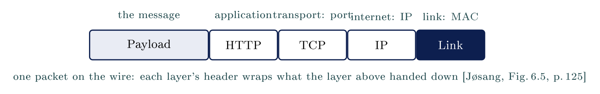
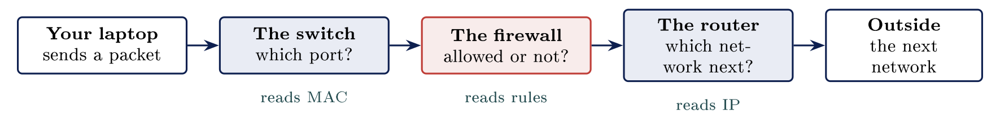

# What a network is {#sec-05-what-a-network-is}

::: {.callout-note appearance="simple" icon="false"}
**Module.** Module 2: Networking Essentials\
**Accompanies.** Lecture L05. **Reading time.** About 45 minutes.\
**Primary reading.** Jøsang, *Cybersecurity: Technology and Governance* (Springer, 2025). Core: Sect. 6.1 (networks, the Internet stack, MAC and IP addresses, ports, LAN and WAN), pp. 117--126. Supporting: Sect. 6.3--6.4, 6.6 (firewalls and segments). Cisco Networking Academy, *Networking Basics*, modules 7 and 13.
:::

## The question this chapter answers {#the-question-this-chapter-answers .unnumbered}

What actually happens between two machines when one of them asks the other a question? Module 2 begins here, and it is the first technical hour of the term. Every idea in this chapter is physical and countable: a machine, a cable, a piece of a message, an address, a box that reads one field of that address. L04 was about permission. This chapter is about mechanism, and nothing in it is a matter of opinion.

The book opens its network chapter with the same plainness. "Computer networks are infrastructures that allow systems to send and receive data, i.e. for data communication. Systems that communicate through a computer network are called nodes or hosts" [Jøsang, Sect. 6.1, p. 117]{.src}. The five parts build outward from those hosts: the parts of a network, the packet, the two addresses every packet carries, the three middle devices, and finally real traffic on a screen.

::: {.callout-tip}
## Nordvik's network

Nordvik's laptops and its one server are the hosts. The office cabling and Wi-Fi are the shared medium that carries between them. One small box on the wall does the three middle jobs, switch, router and firewall, and one line to the internet provider is the way out. Everything in this chapter happens somewhere on that picture.

:::

[→ Four parts make a network, and every later section names one of them.]{.bridge}

## What a network is made of

### Two machines and an agreement

A network is two or more machines with some way of reaching each other. The machines also agree on how to reach each other, and that agreement is what makes it a network. So a radio link counts, and a cable with no agreed rules does not.

The book states the same two conditions. Nodes need "some form of network connection", and they need "a set of rules for how the data is formatted in packets and how the data packets are sent in sequence" [Jøsang, Sect. 6.1, pp. 117--118]{.src}. It also gives the name the whole module will use for that set of rules: "The set of rules for transferring data packets is called a network protocol."

Nothing physically moves between the machines. Information is copied from one to the other, which is why, as L02 said, nothing can ever be unsent.

### Copper, fibre and radio

Copper cable carries the message as electricity. Fibre carries it as light through glass, and reaches much further. Radio carries it through the open air. The book calls all three **physical media**: "radio signals through air, electronic signals through metal cables, or optical signals through glass fiber cables" [Jøsang, Sect. 6.1, p. 118]{.src}.

Two things follow. The three carriers are interchangeable to everything above them: a packet does not know or care whether it crossed copper, glass or air, and that is why the rest of the module can ignore the question. And whatever carries the signal is shared. Anything on it can hear anything else, unless something prevents it. The book says this outright for Wi-Fi: "In a Wi-Fi network, everyone listens to everyone, but only receives link packets with the correct MAC address" [Jøsang, Sect. 6.1.2, p. 125]{.src}. Only receives. Everyone still listens.

### Clients and servers

In every exchange, one machine asks a question and another machine answers it. The machine that asks is the **client**; the machine that answers is the **server**. The book: "Apps that communicate with each other are called clients and servers, where the client typically sends a request to a responding server" [Jøsang, Sect. 6.1.2, p. 122]{.src}. They are roles for one exchange, not kinds of machine. A server is any computer that has been given the job of waiting for questions and answering them, and the same laptop can be a client to one machine and a server to another.

### Local and wide area networks

The machines in one building usually reach each other directly. That is a **LAN**, a local area network, and it still works with the internet connection closed. The book: "A LAN (Local Area Network) is a local computer network that connects nodes within a limited area, such as a residence, an open-plan office, an entire office building", and "Communication within a LAN does not require IP routing because the MAC address is sufficient to locate hosts within the same LAN" [Jøsang, Sect. 6.1.2, p. 126]{.src}.

Everything outside is reached through one way out, which is the router, and beyond it lies the **WAN**, "a computer network over long distances", typically fibre point-to-point [Jøsang, Sect. 6.1.2, p. 126]{.src}. The boundary is the point of this section. Inside it you control the machines and the rules. Outside it you are a guest on equipment that somebody else owns and configures.

### The same terms in Norwegian

The slides, the coursebook and the NetAcad exams are in English. The Norwegian words are the ones used on NDLA and in the Arbeidsdag sessions, and you will meet both in the same week.

  **English**   **Norsk**   **One line**
  ------------- ----------- --------------------------------------------------------
  switch        svitsj      the box of ports inside the building
  router        ruter       the one way out to other networks
  firewall      brannmur    the checkpoint that allows or refuses
  packet        pakke       one piece of a message, with a header
  host part     vertsdel    the part of an IP address that names the machine (L06)

### A program that spread by itself, 1988

In November 1988 a program began copying itself from machine to machine. Robert Tappan Morris, a graduate student at Cornell, released it. It reached roughly 6,000 machines in about a day, about ten per cent of the internet of the time, and much of the network stopped under the load. The case is here for one reason. A network is machines that can reach each other, and reaching works in both directions. Whatever can reach a machine can also spread to it.

::: {.callout-important}
## Key idea

A network is just hosts, a shared medium, middle devices and agreed rules. Because the medium is shared, anything on it can hear anything else unless something prevents it, and your own network ends at a boundary where most security controls sit.

:::

::: {.callout-tip}
## On Nordvik AS

Nordvik's office runs over one shared medium. Without separation, its server, the laptops and a guest on the Wi-Fi are all on the same wire. L08 is about putting them on different ones.

:::

[→ You have the parts. Part 2 is about how a message actually travels between them, in pieces.]{.bridge}

## Packets

### Why a message travels in pieces

::: {.callout-note}
## Packet

A data packet is simply a chunk of bits grouped together in a structure. [Jøsang, Sect. 6.1, p. 118]{.src} Nothing travels as one stream; a message is split into pieces, and each piece travels on its own.

:::

Two separate reasons sit behind this, and a student who learns only one loses half the answer. The medium is shared, and one machine sending a huge file in one piece would make everyone else wait. And a single error means you re-send one small piece rather than the whole file. Fair sharing of the carrier, and cheap repair of damage.

### Protocols: rules agreed in advance

Dividing a message and putting it back together works only because both ends agree on how. A set of rules agreed in advance is called a **protocol**. These are the rules from Part 1, now with their proper name. The book adds why protocols are standardised: "so that manufacturers can develop products for data communication that can communicate with each other" [Jøsang, Sect. 6.2, p. 127]{.src}. A protocol is an agreement written down in advance by people who never meet. Two machines from different makers, built years apart, exchange packets because both followed the same document.

### The packet header

Every packet states where it came from and where it is going. It also states which piece of the message it is. Those fields together are called the **header**, and the header travels with the piece. The book: "The data packets transmitted between host nodes consist of payload data and headers. Each layer in the protocol stack adds its own packet header that contains information about what to do with the data, and where to send it" [Jøsang, Sect. 6.1.2, p. 124]{.src}. The header is not mysterious. It is a short list of labelled fields at the front of every packet, and the two address fields are the largest of them. The piece number is what lets the far end put the message back in order, and ask for one piece again if it never arrived.

### Why networks are built in layers

The header is not one block, because each layer of the network adds its own. The book calls the arrangement the **Internet stack**: "a stack of different protocols that represent different abstraction layers of communication" [Jøsang, Sect. 6.1.2, p. 121]{.src}, and it names the layers link, internet, transport and application, with the physical medium underneath.

  **Layer**     **Solves**                **Addresses it by**                 **Example**
  ------------- ------------------------- ----------------------------------- -------------------------------------
  Application   What the message means    A name and a service                Fetching a web page (HTTP)
  Transport     Getting all of it there   A number for the service (port)     Asking for a lost piece again (TCP)
  Internet      Finding the far network   The address the network gave (IP)   Choosing the next network
  Link          Crossing one cable        The address on the card (MAC)       Reaching the switch

Each layer solves one problem and knows nothing about how the others solve theirs. The book walks one packet down the stack: the browser hands data to the application layer, which hands it to TCP with a header, which hands it to IP with another header, which hands it to the link layer with a third, and "the first router on the way will receive and unwrap the data packet up to the IP layer, before deciding where to forward the packet" [Jøsang, Sect. 6.1.2, p. 122]{.src}. Only the matching layer at the far end reads a wrapper. That is why a packet can cross copper, glass and air on one journey without anything above the link layer noticing.

::: center
{fig-align="center"}
:::

You will hear people say "layer 7" or "layer 4". Those numbers come from the older OSI model, which has seven layers; the book maps them for you: application is OSI 7 (with 6 and 5), transport is 4, internet is 3, link is 2 and physical is 1 [Jøsang, Sect. 6.1.2, Fig. 6.4, p. 124]{.src}. This course uses the book's four names.

### A real packet in Wireshark

Wireshark is a free program that records traffic and shows what every packet contained. One row on screen is one packet. Expanding that row shows one wrapper per layer, with the outermost wrapper first and the message last. The wrappers in the figure above are visible in a real program on a real recording. Part 5 opens one.

[→ Every packet carries two addresses at once. Part 3 is about why one machine needs both.]{.bridge}

## Two addresses

### The MAC address: fixed to the card

Every network card is manufactured with an address already inside it. That is the **MAC address**, for Media Access Control. The book: "The MAC address consists of 48 bits, where the first three octets (24 bits) identify the manufacturer of the equipment, and the next three (24 bits) are the manufacturer's own unique identification of the device" [Jøsang, Sect. 6.1.2, p. 125]{.src}. It is written as six pairs of characters, like `3C:52:82:B1:4F:0A`. The MAC address belongs to the card and not to the computer. A machine with two cards has two of them, and replacing a card replaces the address.

### The IP address: given by the network

A machine joining a network receives a second address from that network. That is the **IP address**, for Internet Protocol. In its common form it is written as four numbers between 0 and 255 separated by dots, such as `192.168.10.14`. The book explains why two kinds exist: "IP addresses can be easily changed and are used by nodes for routing traffic across the Internet" [Jøsang, Sect. 6.1.1, p. 118]{.src}, and it notes that a device "receives the IP address of the closest DNS server through the DHCP (Dynamic Host Configuration Protocol) when connecting to a local network" [Jøsang, Sect. 6.1.1, p. 120]{.src}, the same mechanism that hands out the IP address itself. Where you are, not what you are. The IP address is a current location that the network hands out, and it is taken back when the machine leaves. L06 goes into how the numbers are built.

### Why one machine needs both

Every packet carries both addresses at once, and each device reads only the one it was built to read. Post is addressed to a person and delivered to a house. Neither address replaces the other.

  **Question**   **The address on the card (MAC)**          **The address from the network (IP)**
  -------------- ------------------------------------------ ----------------------------------------------
  Given by       The manufacturer, when the card was made   The network, when the machine joined it
  States         Which device this is                       Where on the network it is
  Valid on       This cable only                            The whole internet
  Changes        Never                                      Every time the machine joins another network
  Read by        The switch                                 The router

The book: "At the link layer, all addressing takes place with MAC addresses, therefore network equipment such as switches and routers must translate IP addresses into MAC addresses" [Jøsang, Sect. 6.1.2, p. 125]{.src}. Two questions, two answers: which device is this, and where on the network is it.

[→ Two addresses, three devices. Each device reads one of them, and one decides whether traffic passes at all.]{.bridge}

## Switch, router and firewall

### Three devices, three questions

Each middle device from Part 1 asks one question about every packet that arrives. One device can do all three jobs, and the box on the wall at home does all three.

              **A switch**                      **A router**                            **A firewall**
  ----------- --------------------------------- --------------------------------------- -----------------------------------
  Asks        Which port does this go out of?   Which network is this handed to next?   Is this allowed at all?
  Reads       The address on the card           The address from the network            Addresses, services and direction
  Set up by   Nobody. It learns by watching     A table of networks                     Rules that a person wrote down

### The switch

::: {.callout-note}
## Switch

A box of ports. It decides which single port each packet leaves by, reading only the card address (MAC), and never needs an IP address. Traffic between two machines on the same switch never leaves it.

:::

The learning behaviour surprises students. Nobody types anything into a switch. It watches which card address arrives on which port and builds its own table from that.

#### Checking the coursebook's claim {#checking-the-coursebooks-claim .unnumbered}

A switch reads the address on the card and never an IP address. Cisco's *Networking Basics* states the same thing, in modules 7 and 13. The coursebook, in the sentence quoted above, says that "switches and routers must translate IP addresses into MAC addresses" [Jøsang, Sect. 6.1.2, p. 125]{.src}. For routers that is right. For switches it is imprecise: the sending machine does the translating, using a protocol called ARP, and the switch only reads the result. A book can be authoritative and still be imprecise on one line. Two sources disagreeing is normal, and a student can settle it by looking at a real packet, which Part 5 does. That habit of checking a claim is one of the objectives of this module.

### The router

A router joins two networks together. Its question is which network this packet is handed to next. It reads the address the network handed out, never the address on the card, and looks that address up in a table of networks. The book: "Routers are network nodes that ensure that data packets find their way from host node A to host node B through the Internet", and "Dedicated protocols are used by the router nodes to keep up-to-date on the most optimal routes" [Jøsang, Sect. 6.1.2, pp. 123, 125]{.src}. A router knows only the next step. Nobody anywhere plans a packet's journey from end to end. The router is the one way out from Part 1; machines on your own network are reached directly.

#### An outage where nothing was switched off {#an-outage-where-nothing-was-switched-off .unnumbered}

On 4 October 2021 Facebook disappeared from the internet for about six hours. Its servers were running throughout. What had happened was that Facebook's routers stopped announcing the routes to its own DNS servers, so nothing anywhere could find out where facebook.com was. A machine can be powered on, healthy and completely unreachable, because a network is also an agreement about where things are. L09 returns to how routes are announced.

### The firewall

::: {.callout-note}
## Firewall

The task of the firewall is to control traffic between computer networks. There is always a firewall between the Internet and a private/corporate computer network. [Jøsang, Sect. 6.4, p. 135]{.src}

:::

A firewall decides whether traffic is allowed at all. No other device on the network asks that question. It reads addresses, services and direction, and, in its basic form, never the message inside. The book's own comment on the name: the term "is a rather bad metaphor because a physical firewall is a barrier where nothing gets through, while a digital firewall is a busy hub where lots of traffic passes through all the time. A better name would therefore be 'checkpoint' " [Jøsang, Sect. 6.4, p. 135]{.src}.

Two further points from the same page. "The standard basic rule for firewalls is default-deny, i.e. any type of traffic is rejected unless otherwise specified." And "A small misconfiguration can allow the firewall to let malicious traffic pass through." A person writes the rules, so a rule that allows something records a decision to allow it. A firewall decides only about traffic that passes through it; two machines on one switch never go near it.

### The three devices together

Three decisions happen in a row, and at home all three live in one small box. The decisions matter more than the number of devices.

::: center
{fig-align="center"}
:::

::: {.callout-important}
## Key idea

Three devices each read one thing about a packet: the switch picks the port, the router picks the next network, and only the firewall asks whether the traffic is allowed at all. Its rules are written by a person, so every rule records a decision.

:::

::: {.callout-tip}
## On Nordvik AS

Nordvik's one firewall on the boundary is where a written rule decides whether a supplier's remote connection is allowed in at all. If nobody at Nordvik can say what that rule says, nobody at Nordvik has decided.

:::

[→ Parts, packets, addresses, devices. Part 5 shows all of it in one recording, on one screen.]{.bridge}

## Reading real traffic

### Opening a capture

The Wireshark window has three panes. The top pane is the packets, one per row. The middle pane is the layers of the row you select, one wrapper per layer. The bottom pane is the raw bytes. Most pairs of rows are a question and its answer, because most traffic is a client asking and a server replying.

### Finding the four addresses

Four address fields sit inside one single packet. One field is the card address it came from, and another is the card address it is going to. Two more fields hold the same pair of machines, this time with the addresses from the network. Two card addresses in the link wrapper, two network addresses in the internet wrapper, all inside one packet. Finding them yourself settles the coursebook question from Part 4 in thirty seconds: the switch never needed the two inner ones.

### Worked example: a laptop that reaches nothing

::: {.callout-tip}
## The case

A laptop in the office reaches nothing at all. No web pages, no shared drive, no printer. It is plugged in, the card light is lit, and the machine reports an address. The colleague at the next desk works normally.

:::

::: {.callout-warning}
## One minute

The fault could sit in any of four layers. Which do you check first, and why?

:::

**Reasoning.** Work outward one layer at a time, cheapest first. Checking the cable costs nothing, and here the cable is fine, which rules out a whole layer. The card light is lit, so the link layer is alive. The machine reports an address, and this is where almost everybody stops looking, and almost nobody asks where the address came from.

**Result.** The address turned out to be one the machine invented for itself, because nothing answered when it asked the network for one. A machine that gets no answer from DHCP gives itself an address in a reserved range, and that address reaches nothing. The internet layer was the fault, and the symptom was a number that looked like an address and was not one the network had given. L06 explains the ranges; today the lesson is the method.

## Common misconceptions {#common-misconceptions .unnumbered}

  **Belief**                                                **Correction**
  --------------------------------------------------------- ---------------------------------------------------------------------------------------------------------------------------------------------------
  A packet is private because it is addressed to someone.   Addressing decides delivery, not secrecy. Every machine on the path can read it unless it is encrypted [Jøsang, Sect. 6.1.2, p. 125]{.src}.
  The IP address is the computer's real address.            The network the machine joined handed it out. It changes the moment the machine joins another network.
  A switch reads the IP address.                            A switch reads the address on the card and nothing else. The coursebook is imprecise about this on p. 125.
  A firewall protects everything on the network.            It decides only about traffic that passes through it. Two machines on one switch never go near it.

## Summary: five points {#summary-five-points .unnumbered}

1.  A network is machines that can reach each other, something to carry the signal, and rules both ends follow. The carrier is shared.

2.  Messages are divided into packets, and every packet's header states where from, where to and which piece. Each layer adds its own header.

3.  Each machine has two addresses: one fixed to the card and read by the switch, one given by the network and read by the router.

4.  A switch picks the port, a router picks the next network, and only a firewall asks whether traffic is allowed. Its rules are a person's decisions.

5.  A capture shows all of it: one packet, four addresses, one wrapper per layer.

## Self-check {#self-check .unnumbered}

1.  Why is a message divided into packets rather than sent in one piece? Give two separate reasons. (Part 2)

2.  Your machine has a MAC address and an IP address. Which device reads which, and why does neither replace the other? (Parts 3--4)

3.  A packet arrives at the box on the wall at home. Name the three decisions made about it, in order. (Part 4)

4.  Why does the book prefer "checkpoint" to "firewall", and what is the standard basic rule of a firewall? (Part 4)

5.  Facebook's servers were running on 4 October 2021. Why could nobody reach them? (Part 4)

6.  Name the four layers of the Internet stack and say which address or number each one uses. (Part 2)

## Before L06 {#before-l06 .unnumbered}

On your own machine, find your IP address and your MAC address (`ipconfig /all` on Windows, `ip a` on Linux). Write both down, then join a different network, a phone hotspot will do, and check which of the two changed. In L06 the IP address gets taken apart: which part names the network, which part names the machine, and how a name becomes a number.

## Glossary {#glossary .unnumbered}

Host / node

:   A system that sends and receives data on a network. [Jøsang, Sect. 6.1]{.src}

Physical medium

:   Copper, fibre or air; interchangeable to everything above the link layer. [Jøsang, Sect. 6.1]{.src}

Protocol

:   The set of rules for formatting and sequencing packets, agreed in advance. [Jøsang, Sect. 6.1]{.src}

Packet / header / payload

:   A chunk of bits; the labelled fields at the front; the message itself. [Jøsang, Sect. 6.1.2]{.src}

Internet stack

:   Link, internet, transport, application, over the physical medium. [Jøsang, Sect. 6.1.2]{.src}

MAC address

:   48-bit address fixed to the network card; valid on one cable; read by the switch. [Jøsang, Sect. 6.1.2]{.src}

IP address

:   Address handed out by the network; valid across the internet; read by the router. [Jøsang, Sect. 6.1.1]{.src}

Port

:   16-bit number in the TCP or UDP header naming the service on a host. [Jøsang, Sect. 6.1.2]{.src}

LAN / WAN

:   Local network reachable without routing; long-distance network between pairs of nodes. [Jøsang, Sect. 6.1.2]{.src}

Switch / router / firewall

:   Picks the port; picks the next network; decides whether traffic passes. [Jøsang, Sect. 6.4]{.src}

Default-deny

:   The standard firewall rule: reject everything unless a rule allows it. [Jøsang, Sect. 6.4]{.src}

## Sources {#sources .unnumbered}

-   Jøsang, A. (2025). *Cybersecurity: Technology and governance*. Springer. <https://doi.org/10.1007/978-3-031-68483-8>. Sect. 6.1--6.2, 6.4, 6.6.

-   Cisco Networking Academy. (n.d.). *Networking basics*. <https://www.netacad.com/courses/networking-basics>

-   Cloudflare. (2021, October 4). *Understanding how Facebook disappeared from the Internet*. <https://blog.cloudflare.com/october-2021-facebook-outage/>

-   Federal Bureau of Investigation. (n.d.). *Morris worm*.

-   NDLA. (n.d.). *Driftsstøtte (IM-ITK vg2)*. Nasjonal digital læringsarena.

-   Postel, J. (1981). *Internet Protocol* (RFC 791). Internet Engineering Task Force.

-   Wireshark Foundation. (n.d.). *Wireshark*. <https://www.wireshark.org/>
