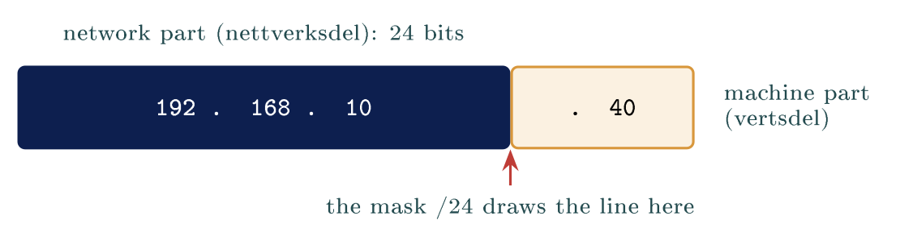
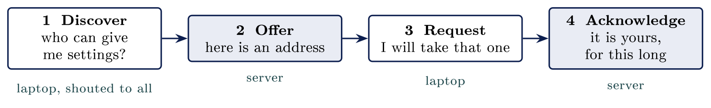

# Addresses, subnets and names {#sec-06-addresses-subnets-and-names}

::: {.callout-note appearance="simple" icon="false"}
**Module.** Module 2: Networking Essentials\
**Accompanies.** Lecture L06. **Reading time.** About 45 minutes.\
**Primary reading.** Jøsang, *Cybersecurity: Technology and Governance* (Springer, 2025). Core: Sect. 6.1.1 (IP addresses, the Domain Name System, DHCP), pp. 118--121; Sect. 6.1.2 (LAN, ports), pp. 125--126. Supporting: Sect. 6.6. RFC 2131 (DHCP), RFC 1035 (DNS).
:::

## The question this chapter answers {#the-question-this-chapter-answers .unnumbered}

Four fields sit on every network settings screen: an address, a subnet mask, a default gateway and a name server. Most people have read them out to somebody on the telephone without knowing what any of them does. This chapter takes the handed-out address from L05 apart, explains what each of the four fields answers, shows how a machine gets all four without anybody typing anything, and follows a name until it becomes a number.

A student who can read a mask can answer most of the questions the rest of Module 2 asks. Part 2 is the one that needs practice.

::: {.callout-tip}
## Nordvik's addresses and names

Every machine at Nordvik carries four settings: its own address, a subnet mask, the gateway to the router, and a name server to ask about names. Nordvik uses private `192.168` addresses inside the building and one public address on the outside of its router. It depends on a name service it does not run.

:::

[→ Four fields on one screen. Each one answers a different question, and Part 1 gives you all four.]{.bridge}

## The four settings

### Four settings, four questions

A machine missing any one of the four reaches less than you expect. Each field answers a different question.

  **The setting**       **The question it answers**
  --------------------- -------------------------------------------
  The IP address        Which machine am I, and on which network?
  The subnet mask       Where does my own network end?
  The default gateway   Where do I send everything else?
  The name server       Who do I ask about names?

### The IP address

::: {.callout-note}
## IP address

On the Internet, virtual locations have numeric IP addresses (Internet Protocol addresses), as well as names, called domain names. An IPv4 address is a 32-bit integer, while an IPv6 address is a 128-bit integer. [Jøsang, Sect. 6.1.1, p. 118]{.src}

:::

An IPv4 address is four numbers separated by dots, each between 0 and 255. So `10.0.4.300` is nobody's address; the last number is over the limit. An address has to be unique on the network it is used on, and a machine with two network cards therefore holds two addresses. One address answers two questions at once: which network is this machine on, and which machine on that network is it? Part 2 is about where the line between those two answers falls.

### Too few addresses, so some are private

Thirty-two bits is "only about $2^{32} = 4.3 \cdot 10^{9}$ (i.e. billion) IPv4 addresses", which the book notes "was probably considered a huge address space in 1983, but as the Internet spread to every corner of the globe, it turned out to be too small" [Jøsang, Sect. 6.1.1, p. 118]{.src}. IPv6, with 128 bits, is the replacement; the book puts its size at $2^{128} = 340 \cdot 10^{36}$, and notes the two "can be used interchangeably on the Internet".

Because IPv4 ran out, some ranges were reserved for use inside an organisation: `10.0.0.0/8`, `172.16.0.0/12` and `192.168.0.0/16`. A private address is not a secret address. It is one that no router on the internet will carry. Nordvik's `192.168` addresses are of this kind, and L09 explains how they still reach the outside.

### The default gateway

The default gateway is the address of the router on your own network. That router is the one machine on your network that leads anywhere else. A machine sends directly to anything on its own network; everything else goes to the gateway, and everything coming back arrives through it too. The book's one line: "Communication within a LAN does not require IP routing because the MAC address is sufficient to locate hosts within the same LAN" [Jøsang, Sect. 6.1.2, p. 126]{.src}. Beyond the LAN, routing begins, and it begins at the gateway.

### The name server

::: {.callout-note}
## Name server

The DNS (Domain Name System) consists of special servers on the Internet, called name servers, that translate domain names into the corresponding IP addresses. [Jøsang, Sect. 6.1.1, p. 118]{.src}

:::

People remember names; machines need numbers. This is the field students have least feeling for. A machine with an address, a mask and a gateway reaches everything by number and nothing by name, which looks exactly like the whole internet being down. The book explains where the setting comes from: "A computer device receives the IP address of the closest DNS server through the DHCP (Dynamic Host Configuration Protocol) when connecting to a local network" [Jøsang, Sect. 6.1.1, p. 120]{.src}.

::: {.callout-important}
## Key idea

A machine needs four settings to reach the world: its own address, a mask that says where its network ends, a gateway for everything beyond it, and a name server to turn names into numbers. Missing any one, it reaches less than you expect.

:::

::: {.callout-tip}
## On Nordvik AS

If Nordvik's name-server setting is wrong, its staff reach everything by number and nothing by name, which looks like the whole internet is down. The first question on the phone is not "is the internet down" but "does `ping 1.1.1.1` answer".

:::

[→ You can name the four settings. Part 2 is the one that needs practice: reading where the address splits.]{.bridge}

## Where the address splits

### An address has two parts

::: {.callout-note}
## Two parts

A front that says which network, and a back that says which machine. In Norwegian, the nettverksdel and the vertsdel. The subnet mask marks where the network part ends and the machine part begins.

:::

The mask is written either as four numbers, `255.255.255.0`, or as a count of network bits after a slash, `/24`. Both say the same thing. With a `/24` mask the line falls after the third number: in `192.168.10.40` the network part is `192.168.10` and the machine part is `40`.

::: center
{fig-align="center"}
:::

### Reading four address pairs

Cover the last number of both addresses and compare what is left. Say the mask out loud first, because a different mask answers the same pair differently.

  **The pair**                        **Mask**   **Cover the last number**   **What happens**
  ----------------------------------- ---------- --------------------------- -------------------------------
  `192.168.1.20` and `192.168.1.90`   /24        192.168.1 and 192.168.1     Same network, straight there
  `192.168.1.20` and `192.168.2.20`   /24        192.168.1 and 192.168.2     Two networks, via the gateway
  `10.0.4.7` and `10.0.4.212`         /24        10.0.4 and 10.0.4           Same network, straight there
  `10.10.1.5` and `10.10.2.5`         /24        10.10.1 and 10.10.2         Two networks, via the gateway

If the network parts match, the two machines reach each other directly. If they do not, everything goes to the gateway instead.

### What the machine does with the answer

A machine works out whether the destination is on its own network or somewhere else, and it does this before every packet it sends. If the destination is local, the packet goes straight across the switch from L05: the machine asks the network who holds that address (the protocol is ARP), gets a card address back, and sends. If the destination is not local, the packet goes to the gateway's card address instead, with the far machine's IP address still inside. One comparison, two behaviours. The mask is not a setting the machine reads once.

### What a /24 network holds

`192.168.1.0` with a `/24` mask holds 256 addresses, and 254 of them are usable. Every network loses the same two addresses, whatever its size: the first, which names the network itself, and the last, which is the broadcast address that reaches every machine on it. A bigger number after the slash means a longer network part and fewer machines: a `/25` holds 128 addresses, a `/26` holds 64. A smaller number goes the other way; a `/16` makes one very large network of 65,536 addresses. The line simply moves.

### Why anyone splits a network

Every machine on one network reaches every other machine on it, and nothing in between can say no to any of that traffic. Splitting the network forces the traffic past a router, which is somewhere a rule can sit. This is where the mask stops being arithmetic and starts being security. The book's architecture section says the same: "A computer network is usually divided into segments that are separated by internal firewalls" [Jøsang, Sect. 6.6, p. 138]{.src}. A boundary is a place where somebody can say no, and a flat network has no such place. L08 is about drawing those boundaries.

::: {.callout-warning}
## Practice

Your machine is `192.168.1.20/24`. Which of these does it reach without the gateway: `192.168.1.254`, `192.168.0.20`, `192.168.1.1`, `10.0.0.1`? Cover the last number and compare.

:::

[→ You can read the settings. Part 3 is about who fills them in, four messages at a time.]{.bridge}

## Handing out the settings

### Four hundred machines to set up

A school with four hundred machines needs four settings typed into every one of them, and kept right for years. Visitors arrive with laptops nobody has ever seen, and those laptops need addresses too. Four hundred machines and four settings each is sixteen hundred numbers, every one of which can be typed wrong. The job is impossible by hand, and that is the point.

### Asking the network for settings

::: {.callout-note}
## DHCP

The Dynamic Host Configuration Protocol. A machine joining a network asks who can give it settings, one server offers, the machine accepts, and the server confirms. [Jøsang, Sect. 6.1.1, p. 120; RFC 2131]{.src}

:::

::: center
{fig-align="center"}
:::

Four messages and a second of time, every time a machine joins a network.

### What the offer contains, and how long it lasts

The offer is not only an address. It carries all four of the settings from Part 1 at once: an address, the mask that goes with it, the gateway to use, and a name server to ask. An address handed out this way is a **lease**. It has a length, hours or days, and the machine must renew it or lose it. The same address goes to somebody else later. This is why a laptop works within seconds of joining a network it has never seen before, and why your address at school and at home were different.

### Watching it happen

In a capture the exchange is four rows in order: Discover, Offer, Request, Acknowledge. All four are sent before the machine has any address of its own. The Discover message therefore has to be shouted at everybody on the network, to the broadcast address from Part 2, because the machine cannot yet address anybody in particular.

### Nothing checks who answered

::: {.callout-note}
## Nothing checks who answered

A machine takes the first offer, and nothing proves who sent it.

:::

A machine that answers faster than the real server wins. That is how a **rogue DHCP server** hands out its own settings: a wrong gateway, so all traffic passes through the attacker's machine; or a wrong name server, so every name resolves to an address the attacker chose. This is not a flaw somebody forgot. DHCP was written for networks where every machine was assumed to belong there, and nothing in it identifies the answering server. The book's general comment on the Internet stack applies: "security was completely overlooked during the development of the Internet stack ... Internet security had to be added afterwards" [Jøsang, Sect. 6.1.2, p. 123]{.src}. The defence is on the switch, which can be told which port the real server is on, and that returns in L08.

[→ Settings handled. Part 4 is the service everything else leans on: names into numbers.]{.bridge}

## Names into numbers

### Nobody remembers numbers

Nobody types four numbers into a browser and remembers them afterwards. A name sits between the person and the number, and the service is DNS. The book gives the second reason for names: "IP addresses can be easily changed and are used by nodes for routing traffic across the Internet, while domain names are stable and generally more easily remembered" [Jøsang, Sect. 6.1.1, p. 118]{.src}. A service can move to a new address and keep its name. The lookup happens before any connection is made; a person checks the name in the address bar, and nobody watches the number that comes back.

### A name is read from the right

The book draws the naming system as "an inverted tree" with the root at the top, top-level domains such as `.com`, `.org` and country codes below it, then domains, then subdomains [Jøsang, Sect. 6.1.1, Fig. 6.1, p. 119]{.src}. Read `www.uio.no` from the right, one part at a time.

  **Part**   **Read**                    **Who answers for it**         **So it names**
  ---------- --------------------------- ------------------------------ ---------------------------------
  `no`       First, the rightmost part   Norid, on behalf of Norway     The top of the tree
  `uio`      Second, the next along      The university, as its owner   One organisation under it
  `www`      Third, the leftmost part    The university again           One machine or service they run

Nobody holds the whole list of names, and no single machine anywhere could. The book: "Each domain has at least one authoritative DNS server that provides information about that domain and other name servers of domains subordinate to it" [Jøsang, Sect. 6.1.1, p. 120]{.src}. Every country has a national registrar for its country-code domain, and Norid is Norway's. The book adds that domain names other than country codes "are largely borderless and out of reach for national jurisdictions", overseen by ICANN [Jøsang, Sect. 6.1.1, p. 119]{.src}.

### What comes back, and how long it lasts

The usual answer to a lookup is one address, and that address is the number the machine then connects to. The book's example is `en.wikipedia.org` resolving to `185.15.59.224`, and it notes that "the same IP address serves multiple hostnames", because the browser sends the hostname as part of its request [Jøsang, Sect. 6.1.1, Fig. 6.2, p. 120]{.src}. A name can have several addresses behind it, and other record types exist for mail delivery and for aliases.

The answer also carries its own expiry, a time to live. Every machine and every name server on the way keeps a copy until it expires. Caching is why lookups are fast and why a correction takes time to spread.

### Watching it in the capture

One row asks for a name, and the row after it carries the answer back. Both rows are readable, and neither is protected in any way. Anyone on the path therefore sees which names you asked for. The padlock on a website protects the connection to the site; it does not protect the lookup that found it. The book names the fix, DNSSEC, and its limit: it "provides cryptographic authentication and integrity of data, but not confidentiality" [Jøsang, Sect. 6.1.1, p. 121]{.src}.

### The attack on Dyn, 21 October 2016

Twitter, Spotify and Reddit were unreachable for many users on 21 October 2016. None of those companies had been attacked. The company Dyn ran the name service for many large sites, and a botnet called Mirai, made of infected cameras and home routers, flooded Dyn with traffic until its name servers could not answer. Name resolution is a service like any other. When it fails, everything that depends on a name fails with it, however healthy the servers behind the name are. The book's warning is the general form: "it is essential that DNS information is correct, otherwise data may be routed to the wrong IP address. DNS hijacking and DNS poisoning are attacks aimed at spoofing IP addresses" [Jøsang, Sect. 6.1.1, p. 121]{.src}.

::: {.callout-important}
## Key idea

DNS turns a name into a number, but the lookup happens in the open: nothing proves who answered, and a wrong answer is remembered as well as a right one. A name nobody can resolve is a site nobody reaches.

:::

::: {.callout-tip}
## On Nordvik AS

Nordvik depends on DNS it does not control. A poisoned answer would send its staff to the wrong address without anything visibly breaking, and the padlock on the wrong site would be perfectly valid.

:::

[→ Settings, mask, DHCP, DNS. Part 5 reads all of it off your own machine.]{.bridge}

## On a real machine

### Reading your own settings

Two commands put all four settings on the screen. On Linux, `ip a` shows the address with the mask written as `/24` at the end, and `ip route` shows the gateway on the line that begins with `default`; the name server sits in the resolver configuration, `/etc/resolv.conf`. On Windows, `ipconfig /all` prints all four together. The book itself suggests `ipconfig` for finding your own address and `nslookup` for names [Jøsang, Sect. 6.1.1, p. 120]{.src}.

```{.bash}
$ ip a
2: eth0: <BROADCAST,MULTICAST,UP,LOWER_UP> ...
    inet 192.168.10.40/24 brd 192.168.10.255 scope global dynamic eth0
$ ip route
default via 192.168.10.1 dev eth0
192.168.10.0/24 dev eth0 proto kernel scope link src 192.168.10.40
```

Three of the four settings are on those lines: the address and mask, the broadcast address, the gateway after `default via`. The word `dynamic` says the address came from DHCP.

### Same network or not

Take two addresses from machines in the room and write them down with the mask. Say the mask out loud, because without it the question has no answer at all. Cover the machine part of both addresses and compare what is left. This is the thing the rest of Module 2 keeps asking you to do.

### Turning a name into a number

On Windows the command is `nslookup nrk.no`; on Linux it is `dig nrk.no`. Ask once, and one address comes back. Ask for exactly the same name again, straight afterwards: the answer arrives noticeably faster, because it is answered from a copy rather than from the chain. The address on each student's screen depends on where they ask from and when.

### Worked example: a laptop that got no answer

::: {.callout-tip}
## The case

A laptop in the office reaches nothing at all, and its address begins `169.254`. The cable is in, the switch light is on, and another laptop works on that same port.

:::

::: {.callout-warning}
## One minute

What is the machine reporting, and which service never answered it?

:::

**Reasoning.** The cable is the cheapest thing to check, so it goes first; here it is already ruled out, because the link is up and another laptop works on that port. An address beginning `169.254` is one the machine gave itself, from a range reserved for exactly that purpose, because no DHCP server answered its Discover. So the laptop has an address, but no mask that matches the office, no gateway and no name server.

**Result.** The fault is not on the laptop. Either the DHCP server did not hear the Discover, or it had no addresses left to lease, or something on the path dropped the broadcast. Ask the machine again (`ipconfig /renew`, or unplug and replug), watch whether an Offer arrives, and if not, the DHCP server is the next thing to look at. The number that looked like an address was the whole diagnosis.

## Common misconceptions {#common-misconceptions .unnumbered}

  **Belief**                                                            **Correction**
  --------------------------------------------------------------------- ----------------------------------------------------------------------------------------------------------------------------------------
  The subnet mask is a security setting.                                It draws a line through the address saying which part is the network. It protects nothing and stops nobody.
  Your IP address identifies your computer, permanently and uniquely.   It is a lease from whichever network the machine joined, and the same address goes to somebody else later.
  DHCP is a service run by someone in charge.                           Any machine on the network can answer, and the first answer wins. Nothing proves who sent it.
  DNS is a single list kept somewhere.                                  It is a chain of servers, each responsible for one part of a name. No machine holds the whole thing [Jøsang, Sect. 6.1.1]{.src}.

## Summary: five points {#summary-five-points .unnumbered}

1.  A machine needs four settings: an address, a mask, a gateway, and a name server to ask.

2.  The mask marks where an address splits into which network and which machine on it. Cover the machine part and compare.

3.  Two addresses whose network parts match reach each other directly; everything else goes to the gateway.

4.  DHCP hands out all four settings in four messages, as a lease, and nothing checks who answered.

5.  DNS turns a name into a number through a chain of servers read from the right; the lookup is in the open and the answer is cached.

## Self-check {#self-check .unnumbered}

1.  Your machine holds `192.168.1.20` with a `/24` mask. Which destinations does it reach without the gateway? (Part 2)

2.  A laptop's address begins `169.254`. What is the machine reporting, and which service never answered it? (Parts 3, 5)

3.  Why can any machine on a network hand out DHCP settings, and what would a rogue server change? (Part 3)

4.  Read `www.nrk.no` from the right and say who answers for each part. (Part 4)

5.  Why did the attack on Dyn take Twitter offline without touching Twitter's servers? (Part 4)

6.  Why is a second lookup of the same name faster, and why does that make a wrong answer harder to remove? (Parts 4--5)

## Before L07 {#before-l07 .unnumbered}

Run `ip a` and `ip route` (or `ipconfig /all`) on your exercise machine and write the four settings down. Then run `dig nrk.no` twice and note the time each answer took. In L07 the address gets a second number after it: the port, which names the service on the machine, and the question becomes which services a machine is offering to the world.

## Glossary {#glossary .unnumbered}

IPv4 / IPv6

:   32-bit and 128-bit addresses; the second exists because the first ran out. [Jøsang, Sect. 6.1.1]{.src}

Private address

:   A range no internet router carries; used inside organisations.

Subnet mask / prefix

:   Marks where the network part ends; written `255.255.255.0` or `/24`.

Nettverksdel / vertsdel

:   Network part and machine (host) part of an address.

Default gateway

:   The router on your own network; the way to everything else.

Broadcast address

:   The last address in a network; reaches every machine on it.

DHCP

:   Discover, Offer, Request, Acknowledge; hands out all four settings as a lease. [Jøsang, Sect. 6.1.1; RFC 2131]{.src}

Lease

:   An address held for a set time, then renewed or given to somebody else.

DNS

:   The Domain Name System: name servers that translate names into addresses. [Jøsang, Sect. 6.1.1]{.src}

Authoritative name server

:   The server that answers for one domain. [Jøsang, Sect. 6.1.1]{.src}

Time to live / cache

:   How long an answer may be kept; why lookups are fast and corrections slow.

DNSSEC

:   Signed DNS answers: authentication and integrity, not confidentiality. [Jøsang, Sect. 6.1.1]{.src}

## Sources {#sources .unnumbered}

-   Jøsang, A. (2025). *Cybersecurity: Technology and governance*. Springer. <https://doi.org/10.1007/978-3-031-68483-8>. Sect. 6.1.1--6.1.2, 6.6.

-   Cisco Networking Academy. (n.d.). *Networking basics*. <https://www.netacad.com/courses/networking-basics>

-   Droms, R. (1997). *Dynamic Host Configuration Protocol* (RFC 2131). Internet Engineering Task Force.

-   Mockapetris, P. (1987). *Domain names: Implementation and specification* (RFC 1035). Internet Engineering Task Force.

-   Krebs, B. (2016, October 21). *DDoS on Dyn impacts Twitter, Spotify, Reddit*. Krebs on Security.

-   NDLA. (n.d.). *Driftsstøtte (IM-ITK vg2)*. Nasjonal digital læringsarena.

-   Wireshark Foundation. (n.d.). *Wireshark*.
