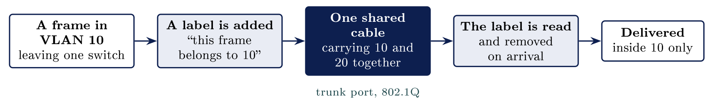

# Dividing the network {#sec-08-dividing-the-network}

::: {.callout-note appearance="simple" icon="false"}
**Module.** Module 2: Networking Essentials\
**Accompanies.** Lecture L08. **Reading time.** About 45 minutes.\
**Primary reading.** Jøsang, *Cybersecurity: Technology and Governance* (Springer, 2025). Core: Sect. 6.3 (network security, the castle, perimeter and zero trust), pp. 134--135; Sect. 6.6 (network architecture, DMZ, segments), pp. 138--139. Supporting: Sect. 6.1.2, 6.4, 6.5. NSM Grunnprinsipper 2.2 and 2.5; NIST SP 800-207.
:::

## The question this chapter answers {#the-question-this-chapter-answers .unnumbered}

In L07 you listed what one machine runs. This chapter asks who may reach it, which is a question about the network rather than the machine. Everything reaches everything until somebody divides it. Part 1 shows what that costs. Part 2 divides one switch by a single line of configuration. Part 3 decides which groups exist and what each may reach. Part 4 is the honesty check: the quiet ways a division stops being real. Part 5 builds two groups, and the refused ping is the proof.

The book's chapter on network security opens with the picture this chapter ends on, a medieval castle, and with the principle behind it: "A computer network is always exposed to threats, both from within and from outside" [Jøsang, Sect. 6.3, p. 134]{.src}. Both from within. That phrase is the reason a network has to divide.

::: {.callout-tip}
## Nordvik, all on one network

At Nordvik the server, the laptops, the two suppliers' remote sessions and a guest on the Wi-Fi all sit on one undivided network. Nothing on the path refuses to carry traffic, so anything can reach the server that holds the customer and drawing data. Nobody decided that. It is simply what one switch does.

:::

[→ Everything reaches everything until somebody divides it. Part 1 shows what that costs.]{.bridge}

## The undivided network

### What an undivided network allows

Two things you already know meet here. In L05, two machines on one network reached each other with nothing able to say no. In L07, every service on a machine answered anybody who bothered to ask it. Neither sentence was about security when you first met it. Put them together and a guest laptop in the canteen can open a connection to the payroll server's file service, and nothing on the path even notices.

### How far one machine can reach

::: {.callout-note}
## Reach

On a flat network, how far an incident spreads is decided before it happens. Nothing on the path says no, so a guest laptop can reach the payroll server, and a firewall at the edge never sees internal traffic at all.

:::

Both Norwegian cases from L01 fit this. At Hydro, ransomware that started on one machine reached production systems across the company. At Østre Toten, it reached the backups. What is new here is the reason the damage reached that far: nothing on the path was built to refuse it.

### Target, 2013: a contractor's account reached the tills

In late 2013 attackers stole credentials from Fazio Mechanical Services, a heating and refrigeration contractor with remote access to the retailer Target's network for billing and monitoring. From that vendor portal they reached the payment systems in the shops and copied about forty million card numbers over three weeks. A contractor's account reached the tills because nothing between the vendor portal and the payment network said no. The book's sentence for this kind of access is its supply-chain warning: vulnerabilities in the supply chain "cannot be directly controlled by the organization" [Jøsang, Sect. 1.4, p. 6]{.src}. What the organisation *can* control is how far the supplier's connection reaches once it is inside.

### The obvious fix, and what we want instead

One obvious fix is a separate switch for each group, with its own cables and sockets. Nothing is shared, so there is nothing to configure and nothing to get wrong. Physical separation is genuine separation. It is also expensive, and almost nobody wires a building twice. What everybody does instead is divide the switches already sitting in the walls, which is Part 2.

### Not a firewall problem

A firewall at the edge is worth having, and it never sees traffic that stays inside the building. You met the point in L05 among the misconceptions. Here it becomes the reason the network has to divide.

  **What people assume**                **What is actually true**
  ------------------------------------- ------------------------------------------------
  The firewall protects the network.    It protects the edge of the network.
  Everything passes through it.         Traffic inside never reaches it.
  So it can refuse anything it likes.   It cannot refuse what it never sees.
  One box, one place, one decision.     A control that traffic avoids decides nothing.

The book's own design rule already contains the answer: "A computer network always has an external firewall" and "is usually divided into segments that are separated by internal firewalls" [Jøsang, Sect. 6.6, p. 138]{.src}. Usually divided. Nordvik is not.

::: {.callout-important title="Key idea"}

On an undivided network, nothing on the path says no, so how far an incident spreads is decided long before it happens. A firewall at the edge protects only the edge; it cannot refuse traffic that never reaches it.

:::

::: {.callout-tip title="On Nordvik AS"}

On Nordvik's flat network, a supplier's remote session or a guest on the Wi-Fi can open a connection straight to the server holding the customer and drawing data. The edge firewall from L05 has no say in it.

:::

[→ The problem is one shared space. Part 2 divides one switch by a single line of configuration.]{.bridge}

```{=html}
<script type="application/json" class="qex">
{"type": "quiz", "title": "Check yourself", "q": "Why can the edge firewall not stop a guest laptop reaching the payroll server on a flat network?", "options": ["Traffic that stays inside never reaches the edge", "Firewalls cannot read internal addresses", "Guests are trusted once they are inside", "The switch refuses to forward to the firewall"], "correct": [0], "ok": "Right.", "why": "A firewall at the edge protects the edge of the network; it cannot refuse what it never sees.", "ref": "Part 1; Jøsang, Sect. 6.6, p. 138"}
</script>
```

## One switch, several networks

### What the switch knows, and what it does not

The switch keeps one table, and it builds that table by watching traffic go past. Each line holds one card address and the port that address arrived on. Nobody configures any of it, as you saw in L05. What matters today is what the switch does when the table has no answer for an address: it sends the frame out of every port, to everybody, and waits to see who answers. On one undivided switch, everybody means everybody.

### Dividing the switch by configuration

::: {.callout-note}
## VLAN

A virtual LAN: a managed switch told that some of its ports are one network and the rest are another. It splits one switch into separate networks without new cables. A VLAN says who shares a network, not what may pass between networks; a rule for that still has to be written.

:::

A VLAN is a grouping of ports, decided in the switch settings and nowhere else. Machines in VLAN 10 see each other's broadcasts and reach each other directly, as in L05. Machines in VLAN 20 do the same among themselves. Between the two groups, nothing passes, because to the switch they are two separate networks that happen to share a box.

### One cable, several groups

Two switches in two rooms each carry both groups, and one cable joins them. A port that carries labelled traffic for several VLANs is a **trunk port**, and the labelling standard is IEEE 802.1Q.

::: center
{fig-align="center"}
:::

One cable between two switches carries every group at once. A label on each frame says which group that frame belongs to, and the far switch delivers it only inside that group.

### Crossing between VLANs on purpose

Two VLANs cannot reach each other at all, which is the whole point of them. Yet staff genuinely need the server sometimes, so a crossing has to exist. Two VLANs are two networks, and in L05 the device that joins two networks was the router. So the crossing needs a router, or a switch that can route, and somebody has to build it on purpose. Once it exists, the crossing is where a rule can sit, and Part 4 is about what happens when nobody writes one.

### Separation is a line of text

One command creates the VLAN, and one more puts a port into it. A third prints the table, so you can see which ports are in which group. The separation is text in a configuration and nothing more. Type one of those commands wrongly and the port sits in the wrong group, with no error and no warning. That is why reading the table back matters as much as typing the commands.

[→ The switch can divide. Part 3 decides which groups exist, and what each may reach.]{.bridge}

```{=html}
<script type="application/json" class="qex">
{"type": "buckets", "title": "Try it: by itself, or configured?", "instr": "Sort each behaviour: does the switch do it on its own, or did somebody have to set it up?", "buckets": ["The switch does it by itself", "Somebody configured it"], "items": [["Learning card addresses by watching", 0], ["Flooding unknown addresses to every port", 0], ["Grouping ports into VLAN 10 and VLAN 20", 1], ["A trunk carrying labelled frames", 1], ["A crossing between two VLANs", 1]], "ok": "Separation is text in a configuration - and so is every crossing.", "why": "The switch learns and floods on its own; VLANs, trunks and crossings exist only because somebody typed them into the configuration.", "ref": "Part 2 of this chapter"}
</script>
```

## Deciding the zones

### Group by what they must reach

A zone answers one question about access. The tempting way to divide a network is by department, because the organisation is drawn that way. The useful way is by what each group legitimately needs to reach. Two teachers in different departments need the same servers; a teacher and a door controller in the same building do not. The organisation chart is the wrong drawing to start from.

### The zones a school actually has

Read across a row to see where that group may go. Every cell that allows something is a decision somebody made.

  **From**          **Internet**   **Server zone**   **Staff zone**   **Admin zone**   **Guest zone**
  ----------------- -------------- ----------------- ---------------- ---------------- ----------------
  Guest Wi-Fi       Yes            No                No               No               Yes
  Student devices   Yes            Named servers     No               No               No
  Staff devices     Yes            Yes               Yes              No               No
  Admin systems     Yes            To manage them    Yes              Yes              No
  Servers           Updates only   Yes               No               No               No

Read the table one row at a time. Each row is one group, and each cell is a crossing that somebody had to decide about. Every "Yes" is an authorisation in the L04 sense, an access right specified in advance by somebody with the authority to specify it [Jøsang, Sect. 1.11, p. 21]{.src}, and it should have a name on it.

### The guest zone and the server zone

The guest network gives visitors a way to the internet and nothing else. It reaches no file server and no student record, and you have been inside it since this morning. Guest devices are not trusted, and that is not an insult; it is a statement about what is known of them, which is nothing. The server zone is the opposite: it reaches almost nothing itself, and is reached by almost everybody, through rules.

### The admin zone

Every organisation has machines and accounts used to configure everything else. The switches from Part 2 are configured from machines in that zone. The admin zone should be reachable from almost nowhere, and used from dedicated machines. It is never used from the laptop that reads email. Attacks aim here on purpose: taking the management network turns every other zone into a formality. The book's privilege-level logic from L02 applies at network scale. Whoever controls the switch configuration controls where every VLAN boundary sits.

### The zone that faces outward

::: {.callout-note}
## DMZ

The first segment is between the external and internal firewalls and is called the DMZ (Demilitarized Zone), which is a metaphor for the outer segment that has strong exposure to the "enemy" (threats from the Internet). Systems in the DMZ are typically web, email and DNS servers. [Jøsang, Sect. 6.6, p. 139]{.src}

:::

Some services are meant to be reached by the whole world, and the DMZ holds exactly those and nothing else. An outer firewall faces the internet; an inner firewall faces the building. If the web server in the DMZ is taken, the attacker is in the outer court, not the keep. The book adds that intrusion detection belongs "in both DMZ and internal segments" so that observations can be correlated [Jøsang, Sect. 6.6, p. 139]{.src}.

### The castle, and where it stops

The book draws the network as a castle, and the picture is genuinely useful [Jøsang, Sect. 6.3, Fig. 6.12, p. 134]{.src}.

  **In the castle**             **On the network**               **Where it stops helping**
  ----------------------------- -------------------------------- ---------------------------------
  The gate and the drawbridge   The gateway and its firewall     Walls do not stop email
  The inner gate                The internal firewall            Nobody checks who is already in
  The lookout tower             The intrusion detection system   It watches; it stops nothing
  The outer court               The DMZ, facing outward          Guests stay in the outer court
  The inner court               The internal segment             One key opens the whole keep

The book's own pairings are gatekeeper, drawbridge and moat for the external firewall; inner gate for the internal firewall; lookout tower for the IDS; outer and inner court for the outer and inner segments [Jøsang, Sect. 6.3, p. 134]{.src}. A castle assumes everybody inside belongs there. That assumption comes back at the end of Part 4.

[→ The design is drawn. Part 4 is the honesty check: the quiet ways a division stops being real.]{.bridge}

```{=html}
<script type="application/json" class="qex">
{"type": "match", "title": "Try it: the castle on the network", "instr": "Drag each network item onto its castle pairing. Two are distractors.", "zones": [{"label": "The gate and the drawbridge", "answer": "The gateway and its firewall"}, {"label": "The inner gate", "answer": "The internal firewall"}, {"label": "The lookout tower", "answer": "The intrusion detection system"}, {"label": "The outer court", "answer": "The DMZ, facing outward"}], "extra": ["The trunk port", "The routing table"], "ok": "And a castle assumes everybody inside belongs there.", "why": "The book pairs the external firewall, internal firewall, IDS and DMZ with the drawbridge, inner gate, lookout tower and outer court.", "ref": "Part 3; Jøsang, Sect. 6.3, p. 134"}
</script>
```

## Where the division fails

### Dividing is not filtering

A VLAN decides who shares a network. It does not decide what may pass between one network and another. The moment a router joins two VLANs, everything is reachable again, in both directions, unless a firewall rule says which addresses may pass and to which ports. This is the most common mistake about VLANs. Dividing a network creates a place for a rule, and it does not create the rule. The book's default-deny principle is what the rule should start from: "any type of traffic is rejected unless otherwise specified" [Jøsang, Sect. 6.4, p. 135]{.src}.

### Where the division quietly stops

Three quiet failures, and not one of them shows an error.

-   **The native VLAN.** One VLAN crosses a trunk with no label at all. Both switches have to agree which VLAN that is. If they disagree, traffic sent in one group arrives in another, and nothing complains.

-   **A port in the wrong group.** One typo in Part 2's commands, and a guest socket is in the staff VLAN. The table would show it; nobody read the table.

-   **A device with a foot in two zones.** A laptop with a cable in one VLAN and Wi-Fi in another is a bridge nobody built.

### Colonial Pipeline, 2021

In May 2021 ransomware hit Colonial Pipeline, which carries fuel up the east coast of the United States. The attack reached the company's business and billing systems. The company shut down the pipeline itself as a precaution, for six days, because nobody there could be certain that the two sides were properly separated. State the case conservatively: the pipeline was not attacked; it was stopped because separation could not be proven. When you cannot prove two zones are separate, you have to treat them as one.

### What NSM asks for, and testing it

NSM's *Grunnprinsipper* principles 2.2 and 2.5 ask for four things about a divided network: separate the network by function and by exposure, control the traffic between the zones, protect the management network, and test that the separation holds. Testing is how anybody finds out whether the design is real. The book's phrase for such tests is red-teaming: a "simulated attack" by a team "performing pentesting toward a target", against a blue team that defends [Jøsang, Sect. 14.7.2, p. 317]{.src}. A ping from the guest zone that reaches the server zone is the cheapest red-team result there is.

### Why some stop trusting zones

Every zone design assumes that being inside a zone says something real about a machine. That assumption weakens as laptops go home and suppliers connect in. The book: "ZTA (Zero-Trust Architecture) has become a complementary approach to perimeter security. In the ZTA approach it is assumed that attackers have already infiltrated internal segments" [Jøsang, Sect. 6.3, p. 135]{.src}, and "no parts of the network 'trust' each other, so that they are always segmented with firewalls or with mutual authentication" [Jøsang, Sect. 6.6, p. 139]{.src}. Zero Trust is a name for an answer and not a product anybody can buy. The book also names the cost: "greater complexity in configuring networks and applications to support legitimate traffic between segments". You only need to recognise the phrase and know what it answers.

::: {.callout-important title="Key idea"}

Dividing a network only creates the places where a decision can be applied; it is not the decision. A VLAN says who shares a network, a firewall rule says what may pass between them, and when you cannot prove two zones are separate you have to treat them as one.

:::

::: {.callout-tip title="On Nordvik AS"}

Nordvik could put its server, the office and the suppliers in separate zones, but the separation is real only when somebody has written the rule between them and tested that a supplier's session cannot reach anything but the two ports it needs.

:::

[→ Flat, divided, zoned, tested. Part 5 builds two groups, and the refused ping is the proof.]{.bridge}

```{=html}
<script type="application/json" class="qex">
{"type": "quiz", "title": "Check yourself", "q": "A router now joins the staff VLAN and the guest VLAN. What decides what may pass between them?", "options": ["A firewall rule somebody wrote, starting from default-deny", "The 802.1Q label on each frame", "The switch's table of card addresses", "Nothing is needed - VLANs block unwanted traffic"], "correct": [0], "ok": "Right.", "why": "Dividing creates a place for a rule, not the rule; without one, everything is reachable again in both directions.", "ref": "Part 4; Jøsang, Sect. 6.4, p. 135"}
</script>
```

## Building the division

### Two groups in the simulator

Packet Tracer is Cisco's free network simulator, and it runs on your own machine. One switch carries four machines, with two of them in each VLAN. Every machine shares one address range, so the addressing is not what separates them. Before the VLANs, a ping from any machine to any other succeeds. After them, a ping across the groups fails, and nothing was unplugged to make that happen. The failure is the demonstration.

### The same five commands on real equipment

In Arbeidsdag 6 you type these five lines yourself, on the switches in Oslo. The last line prints the table from Part 2, and reading it is how you check the other four.

```{.bash}
Switch(config)# vlan 10
Switch(config-vlan)# name Ansatte
Switch(config)# interface FastEthernet0/3
Switch(config-if)# switchport mode access
Switch(config-if)# switchport access vlan 10
Switch# show vlan brief
```

  **Command**                   **What it does**
  ----------------------------- -----------------------------------------------------
  `vlan 10`                     Creates VLAN 10 on this switch
  `name Ansatte`                Names it; Ansatte is the Norwegian word for staff
  `switchport mode access`      Puts this port into access mode, for one group only
  `switchport access vlan 10`   Places this port in VLAN 10
  `show vlan brief`             Lists every VLAN and the ports that belong to it

```{=html}
<script type="application/json" class="qex">
{"type": "order", "title": "Try it: five commands", "instr": "Tap the commands in the order the chapter gives them (tap a step, then a slot - or just tap steps in order).", "steps": ["vlan 10", "name Ansatte", "switchport mode access", "switchport access vlan 10", "show vlan brief"], "ok": "And reading the table back is how you check the other four.", "why": "Create the VLAN, name it, put the port in access mode, place it in the VLAN, then read the table back to check the rest.", "ref": "Part 5 of this chapter"}
</script>
```

### Worked example: one flat municipality

::: {.callout-tip}
## The case

A municipality of four hundred employees runs one flat network. The printers, the door controllers, the payroll server and the laptops share one address range. They have never had an incident, and they have never tested any of this.

:::

::: {.callout-warning}
## One minute

How would you divide it? Start drawing before you read on.

:::

**Reasoning.** Almost everybody starts from the organisation chart, and the printers break it immediately, because the printers belong to every department. Grouping by what each thing must reach works better, and three questions produce the zones: What must reach this server? What would stop working if it were separated? Who can be asked about it?

**Result.** Five zones: servers, staff laptops, printers, door controllers, and a management zone for the switches. The door controllers reach one server and nothing else. The printers are reached by staff and reach nothing. The payroll server is reached by four named machines. Every "Yes" in the table has a name beside it, and the first test is a ping from the printer zone to the payroll server, which must fail. Then a rule between each pair, starting from default-deny.

## Common misconceptions {#common-misconceptions .unnumbered}

  **Belief**                                        **Correction**
  ------------------------------------------------- -----------------------------------------------------------------------------------------------------------------------------------
  A VLAN stops unwanted traffic.                    It decides who shares a network. What may pass between two networks is a firewall rule somebody wrote.
  VLANs are separate physical networks.             One switch and one cable carry them all, and each frame is labelled with the group it belongs to.
  Being inside the network means you are trusted.   Inside is a location, not a credential. A guest laptop and a payroll server can share one switch [Jøsang, Sect. 6.3]{.src}.
  Once the zones are designed, the job is done.     Every new device, supplier and service asks the design a question it has not been asked before.

## Summary: five points {#summary-five-points .unnumbered}

1.  A switch with nothing dividing it is one shared space, and everything on it can reach everything else. The edge firewall never sees that traffic.

2.  A VLAN divides one switch into separate networks by configuration, on equipment the building already owns; a trunk carries them all, labelled.

3.  Zones are decided by what each group must reach, not by the organisation chart; every allowed crossing is a decision with a name.

4.  Dividing creates a place for a rule and is not the rule; native VLANs, typos and dual-homed devices undo a division silently.

5.  Five commands build a VLAN; the refused ping is the proof, and when separation cannot be proven, treat the zones as one.

## Self-check {#self-check .unnumbered}

1.  A guest laptop and the payroll server sit on one flat network. Explain what the network will and will not do about that. (Part 1)

2.  One switch carries a staff VLAN and a guest VLAN. Explain how it keeps them apart, and what a trunk port carries. (Part 2)

3.  Why is the organisation chart the wrong drawing to start a zone design from? What question replaces it? (Part 3)

4.  Name the book's castle pairings for the external firewall, the internal firewall and the IDS, and say what the castle picture assumes. (Part 3)

5.  A router now joins two VLANs. What has changed, and what still has to be written? (Part 4)

6.  Why did Colonial Pipeline stop the pipeline when the pipeline systems were not attacked? (Part 4)

7.  What does Zero Trust assume that a zone design does not? (Part 4)

## Before L09 {#before-l09 .unnumbered}

In Packet Tracer, build one switch with four PCs, put two in VLAN 10 and two in VLAN 20, and confirm with `show vlan brief` and with a ping that fails across the groups. Bring the output. In L09 the crossing between networks gets its own reader: routing, and how a private address reaches the world.

## Glossary {#glossary .unnumbered}

Flat network

:   One switch, one broadcast domain, nothing on the path that can refuse.

Perimeter security

:   Protecting against threats outside a boundary; the traditional approach. [Jøsang, Sect. 6.3]{.src}

VLAN

:   A grouping of switch ports into a separate network by configuration.

Trunk port / 802.1Q

:   A port carrying frames for several VLANs, each labelled with its group.

Native VLAN

:   The one VLAN that crosses a trunk unlabelled; both ends must agree which.

Zone

:   A group of machines defined by what they must reach; separated by a place where a rule can sit.

DMZ

:   The segment between external and internal firewalls, holding services the world must reach. [Jøsang, Sect. 6.6]{.src}

Internal firewall

:   Separates segments inside the network; the castle's inner gate. [Jøsang, Sect. 6.3, 6.6]{.src}

IDS

:   Intrusion detection system; the lookout tower; watches, does not stop. [Jøsang, Sect. 6.5, 6.6]{.src}

Admin / management zone

:   The machines and accounts that configure everything else; reachable from almost nowhere.

Zero Trust

:   Assumes attackers are already inside; every crossing checked with authentication and rules. [Jøsang, Sect. 6.3, 6.6]{.src}

## Sources {#sources .unnumbered}

-   Jøsang, A. (2025). *Cybersecurity: Technology and governance*. Springer. <https://doi.org/10.1007/978-3-031-68483-8>. Sect. 1.4, 6.1.2, 6.3--6.6, 14.7.2.

-   Chandramouli, R. (2022). *Guide to a secure enterprise network landscape* (NIST SP 800-215).

-   Cisco Networking Academy. (n.d.). *Networking basics*.

-   Cybersecurity and Infrastructure Security Agency. (2021). *DarkSide ransomware: Best practices for preventing business disruption from ransomware attacks* (AA21-131A).

-   Nasjonal sikkerhetsmyndighet. (n.d.). *Grunnprinsipper for IKT-sikkerhet 2.1*, principles 2.2 and 2.5.

-   Rose, S., Borchert, O., Mitchell, S., & Connelly, S. (2020). *Zero trust architecture* (NIST SP 800-207).
