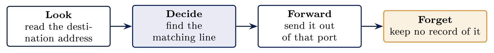
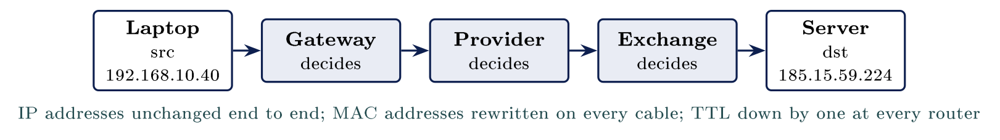

# Routing and NAT {#sec-09-routing-and-nat}

::: {.callout-note appearance="simple" icon="false"}
**Module.** Module 2: Networking Essentials\
**Accompanies.** Lecture L09. **Reading time.** About 40 minutes.\
**Primary reading.** Jøsang, *Cybersecurity: Technology and Governance* (Springer, 2025). Core: Sect. 6.1.1--6.1.2 (routers, the IP header, how packets find their way), pp. 118--126. Supporting: Sect. 6.4 (what a firewall decides that a router does not). The book does not cover NAT or traceroute; for those, RFC 3022 and Cisco *Networking Basics*.
:::

## The question this chapter answers {#the-question-this-chapter-answers .unnumbered}

In L08 you divided one network. This chapter crosses between two networks, which is a different machine doing a different job. One machine carries a packet between networks, and it asks exactly one question about it. Part 1 is that question. Part 2 is the table the answer comes from, and the one rule that decides which line wins. Part 3 follows one packet the whole way, hop by hop. Part 4 is the arithmetic that many people mistake for a security control. Part 5 reads all of it off the machine in front of you.

::: {.callout-tip}
## Getting Nordvik's traffic across

When a laptop at Nordvik opens a supplier's site, the request is forwarded router by router, each one deciding only the next step. Nordvik's dozen machines share a single public address on the way out, rewritten as traffic leaves the building and rewritten back as answers return. Nobody at Nordvik knows either of those facts, and both matter when something stops working.

:::

[→ One machine carries a packet between networks, and it asks exactly one question about it.]{.bridge}

## The router's decision

### The question a router asks

A router asks one question about every packet it receives: which of my own ports leads towards the destination address? The answer comes from a table, and the packet goes out of that port. The book: "The IP header contains the IP addresses of the sending and receiving host nodes, which allows each router node in the path to determine which link the packet should be forwarded through on its way to the receiving host node" [Jøsang, Sect. 6.1.2, p. 125]{.src}. That is the whole job.

A router never asks who sent the packet, whether the sender is allowed, or what the packet contains. The book's stack figure shows why: a router "will receive and unwrap the data packet up to the IP layer, before deciding where to forward the packet" [Jøsang, Sect. 6.1.2, p. 122]{.src}. Up to the IP layer and no further. Everything above it, the port, the application, the payload, stays wrapped.

### Look, decide, forward, forget

::: center
{fig-align="center"}
:::

Forgetting is the step people leave out. A router keeps nothing about a packet once it has gone. The next packet from the same machine to the same place gets the same four steps, freshly. This is what makes routers fast, and it is also why a router cannot tell you afterwards what passed through it. The book's contrast is the stateful firewall, which "keeps track of the state of each connection or session" [Jøsang, Sect. 6.4.2, p. 136]{.src}. A router keeps no state at all.

### Nobody knows the whole path

::: {.callout-note}
## Router

A router decides only which port leads towards the destination, then forgets the packet. No machine holds the whole path; each knows only the next step. A router never asks who sent a packet or whether it is allowed.

:::

Every router sees only its own neighbours. A path exists, but it is produced one local decision at a time, and nobody planned it in advance. The book describes the result as "the data packet continues its journey through the Internet until it arrives at host node B" [Jøsang, Sect. 6.1.2, p. 122]{.src}: a journey, not a route somebody drew.

### Switch and router, side by side

You met this distinction in L05 and L08. Today you add the routing detail.

  **A switch**                    **A router**
  ------------------------------- -----------------------------------------
  Works inside one network        Joins different networks together
  Reads the address on the card   Reads the address the network gave
  Chooses a port on this switch   Chooses which network comes next
  Learns by watching traffic      Uses a table of known networks
  Never changes the packet        Reduces the hop counter by one (Part 3)

### The router in your home

One socket on the back faces your provider and the rest of the world. The other four face your own machines. Routing is what happens between those two sides of the box. As L05 said, the box on the wall is a router, a switch, a firewall and a wireless access point in one shell, and the router part is the only one that crosses between the two sides.

::: {.callout-important title="Key idea"}

A router only decides which port leads towards the destination, then forgets the packet. No machine anywhere holds the whole path, and a router never asks who sent a packet or whether it is allowed. That is the firewall's job.

:::

::: {.callout-tip title="On Nordvik AS"}

When a Nordvik laptop reaches a supplier's site, no single router knows the whole path; each one only forwards towards the next. If the supplier's site is unreachable, the fault can be at any hop, and Part 5 shows how to find which.

:::

[→ The decision comes from a table. Part 2 reads it, and one rule decides which line wins.]{.bridge}

## The routing table

### Reading a routing table

The table a router looks in is the **routing table**. It holds one line for each destination the router knows about. A line names a network rather than one machine, which is why the table is smaller than students expect: a school's router may hold a handful of lines and still reach every address on the internet. The line also says which port, or which neighbour, leads towards that network.

### The most specific line wins

Three lines come from one table, and one destination address, `10.2.5.7`, is tested against each of them.

  **The line**    **It covers**                    **Does 10.2.5.7 match?**        **So the router**
  --------------- -------------------------------- ------------------------------- -------------------
  `10.0.0.0/8`    Every address starting with 10   Yes, along with millions more   Passes over it
  `10.2.5.0/24`   One network of 254 machines      Yes, and nothing wider          Uses this one
  `0.0.0.0/0`     Every address there is           Yes, like everything else       Passes over it

The narrowest matching line wins. One rule explains almost every routing decision, and it is L06's subnet mask doing its job: a longer prefix is a more specific claim, and the most specific claim is believed.

### The default route

Nearly every table has a line written `0.0.0.0/0`. The mask on that line covers nothing, so the line matches every address there is. It is the widest line possible, so it loses to every other line and gets used last. That line is the **default route**: where a packet goes when the router knows nothing more specific about its destination. It usually points at the provider.

### The default gateway

Your own machine needs a way out too. The default gateway is an address on your own network, and your machine hands non-local traffic to it. The default route in the router and the default gateway in the machine are one idea with two names: the default route sits in the router's table, and the default gateway sits in the settings of the machine in front of you, the third of L06's four settings.

### The YouTube outage of February 2008

Routing runs on announcements, and a network believes what its neighbours announce. On 24 February 2008, Pakistan Telecom announced a route for YouTube's address range, more specific than YouTube's own. The aim was to block YouTube inside Pakistan. The announcement leaked to the provider upstream, and from there across the world, and for about two hours much of the internet sent its YouTube traffic to Pakistan, where it was dropped. Routers learn about distant networks from announcements, and an announcement is believed because nothing checks it. A wrong announcement looks exactly like a right one, and the most-specific rule from above is exactly what made the wrong one win.

The book's one sentence on the mechanism is precise about the trust: "Dedicated protocols are used by the router nodes to keep up-to-date on the most optimal routes through the Internet" [Jøsang, Sect. 6.1.2, p. 125]{.src}. Up to date, from each other. The book's broader remark applies: "security was completely overlooked during the development of the Internet stack" [Jøsang, Sect. 6.1.2, p. 123]{.src}.

### Static routes: typed in or learned

A static route is a line an administrator typed. It stays exactly as typed until somebody goes and changes it. Small networks are usually typed in by hand, and large ones almost never are: routers on a large network tell each other what they reach, which is what went wrong in 2008. Nordvik's router has perhaps three lines, all typed.

[→ You can read the table. Part 3 follows one packet the whole way, hop by hop.]{.bridge}

## The journey hop by hop

### Hop by hop, and what changes

Your laptop sends the packet to a far address. Your gateway decides first, and every router after it makes the same decision. No router on the path knows anything about the routers after it. The two network addresses, source and destination, stay the same from end to end. The two card addresses change at every hop, because each hop is one cable, and a card address is valid on one cable only, as L05 said. The book's Figure 6.3 shows exactly this: the IP layer runs end to end, the link layer is rebuilt at every router [Jøsang, Sect. 6.1.2, Fig. 6.3, p. 122]{.src}.

::: center
{fig-align="center"}
:::

### How each hop finds the next

A machine asks the local network out loud who is holding this address. The machine holding that address answers with the address on its own card. This is ARP, the Address Resolution Protocol, and the asker keeps that answer for a few minutes. The book describes the need: "network equipment such as switches and routers must translate IP addresses into MAC addresses, which are placed in the link header before the packet is sent" [Jøsang, Sect. 6.1.2, p. 125]{.src}. ARP is how the translation is done, and, like DHCP in L06, it believes the reply that arrives first. Nothing checks it.

### The counter that stops loops

Every packet carries a small number, sixty-four on many machines. Every router it passes reduces that number by one. At zero the router throws the packet away and tells the sender so, which stops packets circling forever when two routers each think the other leads somewhere. The counter is the Time To Live, or TTL. Despite the name it limits hops rather than seconds.

### A real trace, line by line

The counter is also how `traceroute` works. It sends a packet with TTL one, and the first router throws it away and says so; then TTL two, and the second router says so; and so on until the destination answers. One line appears for each hop along the way that answered, with the time that answer took beside it. The times often show where the packet left Norway. A row of asterisks usually means that router was told not to reply, which is a policy at that hop, not a fault.

[→ The journey works. Part 4 is the arithmetic many people mistake for a security control.]{.bridge}

## Network Address Translation

### There were not enough addresses

::: {.callout-note}
## Private addresses

There were not enough public addresses, so machines share. A home or office uses private addresses inside and one public address out. [Jøsang, RFC 3022; see also Sect. 6.1.1, p. 118]{.src}

:::

The book gives the arithmetic: 32 bits is about 4.3 billion addresses, "probably considered a huge address space in 1983" and "too small" once the internet reached every corner of the globe [Jøsang, Sect. 6.1.1, p. 118]{.src}. IPv6 is the long-term answer. NAT is the one that was cheaper to deploy, and it is on almost every router in the world.

### Rewriting on the way out

The router rewrites the address as the packet leaves the building. This is Network Address Translation, NAT. The router writes down the original inside address and port, and the replacement it chose for them: its own public address and a port it picked. When an answer comes back to that public address and port, the router looks the pair up and swaps them back. The book's description of the port makes clear what NAT is juggling: the port "represent\[s\] specific network applications or process in a specific host node" [Jøsang, Sect. 6.1.2, p. 126]{.src}. NAT borrows that field to tell four hundred machines apart behind one address.

### What the far end sees

The website you visited saw one address. Behind that single address there may be four hundred separate people. The website's log records that one address and a time, and nothing else. Working out which machine inside the building sent the traffic needs records that only the building holds: the NAT table at that moment, or a log of it. This is why the book's accountability principle, that activities "can be traced to someone who can be held accountable" [Jøsang, Sect. 1.10.2, p. 20]{.src}, depends on logs kept inside the organisation. The outside world cannot see past the router.

### Protection by accident

Nothing on the internet can start a conversation with a machine inside. A packet arriving unasked matches no entry in the NAT table, so the router does not know where to send it, and drops it. That effect is genuinely useful, and it is the true half of a common belief. The other half is taken apart in the next section.

### NAT and a firewall, side by side

NAT does arithmetic on addresses, and a firewall makes a decision somebody wrote down. You can ask a firewall to explain itself, and you cannot ask NAT anything.

  **What NAT does**              **What a firewall does**           **What people think NAT does**
  ------------------------------ ---------------------------------- ---------------------------------
  Rewrites addresses and ports   Compares traffic against rules     Hides the machines behind it
  Keeps a table of who asked     Allows or refuses deliberately     Blocks incoming attacks
  Lets many share one address    Records what it refused, and why   Makes a home network private
  Was built to save addresses    Was built to make decisions        Removes the need for a firewall
  Inspects nothing at all        Can be asked to explain itself     

Every line of the third column is wrong, and the last one is the dangerous one. The book's firewall is "a checkpoint" where "a security guard controls what can pass" [Jøsang, Sect. 6.4, p. 135]{.src}. NAT has no guard. And the accidental protection ends the moment somebody forwards a port, which is what every camera, game server and remote-access tool asks you to do.

::: {.callout-important title="Key idea"}

NAT is arithmetic on addresses so many machines can share one, not a security control: it inspects nothing, records nothing useful, and one forwarded port removes its accidental protection. A firewall, unlike NAT, makes a decision someone wrote down and can be asked to explain.

:::

::: {.callout-tip title="On Nordvik AS"}

Nordvik's whole office shares one public address, so a supplier's log shows one address for all twelve people, and Nordvik can tell them apart only if its own router keeps a record. And the remote access for the two suppliers is exactly one forwarded port each, which means NAT's accidental protection does not apply to the server at all.

:::

[→ Decision, table, journey, NAT. Part 5 reads all of it off the machine in front of you.]{.bridge}

## Reading routes and traces

### This machine's routing table

One command shows the table: `ip route` on Linux, `route print` on Windows.

```{.bash}
$ ip route
default via 192.168.10.1 dev eth0
192.168.10.0/24 dev eth0 proto kernel scope link src 192.168.10.40
```

Find the line whose mask covers everything. That line is the default route from Part 2, and every other line is a narrower exception to it. Take a destination on this machine's own network, `192.168.10.90`, and the second line matches, so the table sends it out directly on `eth0`. Take a destination anywhere else and only the first line matches, so the packet goes to `192.168.10.1`, the gateway. Two lines, and every address in the world is covered.

### The path to somewhere real

```{.bash}
$ traceroute -n nrk.no
 1  192.168.10.1     1.2 ms
 2  10.20.0.1        4.8 ms
 3  193.75.14.129   11.3 ms
 4  * * *
 5  185.35.184.8    14.7 ms
```

Every hop that answered is listed, in the order the packet met them, and the opening line is your own gateway. The times grow as the distance grows. Line four was told not to reply. Nobody anywhere planned this path, and no machine on it holds a copy. Run it twice and the hops may differ.

### Worked example: two offices

::: {.callout-tip}
## The case

An organisation has two offices, one in Sandefjord and one in Tønsberg, and a link between their routers joins them. A new address range was added in Tønsberg this week, and it works locally. Sandefjord reaches everything in Tønsberg except that new range.

:::

::: {.callout-warning}
## One minute

Where do you look first, and what are you looking for?

:::

**Reasoning.** The first instinct is to blame the link between the offices. Nobody is familiar with that link, and it carries everything else perfectly, which is the evidence against it. A router makes one decision per packet from a table, so read both tables. Sandefjord's has no line for the new range. Its default route sends those packets to the provider, not across the link, and the provider drops private addresses. Or, the other common shape: the packets do arrive in Tønsberg, and Tønsberg's router has no line back, so the answers have nowhere to go.

**Result.** One static route on the Sandefjord router, naming the new range and pointing at the link, and a matching check on the Tønsberg side. Then a traceroute from Sandefjord that shows the link as hop two. The fix is one typed line, and finding it was reading two tables.

## Common misconceptions {#common-misconceptions .unnumbered}

  **Belief**                                             **Correction**
  ------------------------------------------------------ --------------------------------------------------------------------------------------------------------------------------------------
  NAT protects the machines behind it.                   An empty table stops unasked traffic as bookkeeping, not as a decision. One forwarded port removes it.
  A router decides what traffic is allowed.              It reads a destination address and picks a port. Allowing and refusing is a firewall's job entirely [Jøsang, Sect. 6.4]{.src}.
  Traffic takes the same path back that it took out.     The return path is chosen independently, hop by hop, and it is often not the same path at all.
  The router knows the whole route to the destination.   It knows the next step only. The path exists, but no single machine anywhere holds a copy of it.

## Summary: five points {#summary-five-points .unnumbered}

1.  A router makes one decision, where to send this packet next, and it makes it freshly every time; it never asks who or whether.

2.  The narrowest matching line in the table wins, and the default route matches everything as a last resort.

3.  The network addresses stay the same from end to end; the card addresses change at every hop; the TTL counts hops down.

4.  Routing runs on announcements that nothing checks, which is how YouTube went to Pakistan in 2008.

5.  NAT lets many machines share one address by rewriting; it is arithmetic, not a security control, and a firewall is a decision someone wrote down.

## Self-check {#self-check .unnumbered}

1.  A destination matches both `10.0.0.0/8` and `10.2.5.0/24` in the same table. Which line is used, and why? (Part 2)

2.  Your machine's default gateway is set wrongly. Exactly which traffic still works, and which does not? (Part 2)

3.  The far end of a NAT connection sees one address for four hundred machines. What record would identify the sender, and who holds it? (Part 4)

4.  Which two addresses on a packet stay the same across the whole path, and which two change at every hop? (Part 3)

5.  Why does forwarding one port to a camera remove NAT's accidental protection for that camera? (Part 4)

6.  A traceroute shows `* * *` at hop four and answers at hop five. Is hop four broken? (Part 5)

## Before L10 {#before-l10 .unnumbered}

Run `ip route` and `traceroute -n nrk.no` on your exercise machine. Mark the default route, count the hops, and note the first hop that is not a private address; that is where you left the building. In L10 the cable disappears: radio changes the rules, because on Wi-Fi the shared medium from L05 is the open air.

## Glossary {#glossary .unnumbered}

Router

:   The node that forwards packets between networks by reading the IP header. [Jøsang, Sect. 6.1.2]{.src}

Routing table

:   One line per known network, with the port or neighbour that leads towards it.

Longest-prefix match

:   The narrowest matching line wins.

Default route / default gateway

:   `0.0.0.0/0` in the router; the way out in the machine's settings.

Static route

:   A line typed by an administrator; stays as typed.

Route announcement

:   How large networks tell each other what they reach; believed unchecked.

ARP

:   Asks the local network who holds an IP address; believes the first reply. [Jøsang, Sect. 6.1.2]{.src}

TTL

:   A per-packet hop counter; reaching zero drops the packet; traceroute uses it.

NAT

:   Rewriting inside address and port to one public address on the way out, and back on return. [Jøsang, RFC 3022]{.src}

Port forwarding

:   A standing NAT entry that lets outside traffic reach one inside service.

## Sources {#sources .unnumbered}

-   Jøsang, A. (2025). *Cybersecurity: Technology and governance*. Springer. <https://doi.org/10.1007/978-3-031-68483-8>. Sect. 1.10.2, 6.1.1--6.1.2, 6.4.

-   Cisco Networking Academy. (n.d.). *Networking basics*.

-   Nasjonal digital læringsarena. (n.d.). *Driftsstøtte*.

-   RIPE NCC. (2008). *YouTube hijacking: A RIPE NCC RIS case study*.

-   Srisuresh, P., & Egevang, K. (2001). *Traditional IP network address translator (Traditional NAT)* (RFC 3022). Internet Engineering Task Force.
