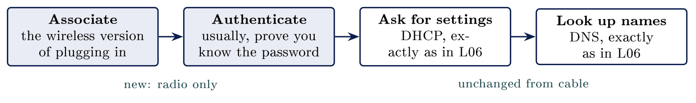
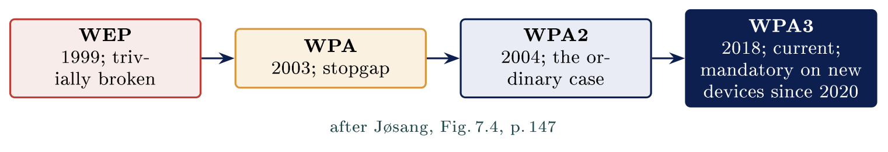
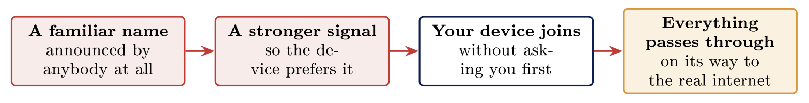

# Wireless: why radio changes the rules {#sec-10-wireless-why-radio-changes-the-rules}

::: {.callout-note appearance="simple" icon="false"}
**Module.** Module 2: Networking Essentials\
**Accompanies.** Lecture L10. **Reading time.** About 40 minutes.\
**Primary reading.** Jøsang, *Cybersecurity: Technology and Governance* (Springer, 2025). Core: Sect. 7.1 (radio communications), pp. 143--146; Sect. 7.2 (security in Wi-Fi: WEP to WPA3, Personal and Enterprise, OWE, SAE, spoofed networks), pp. 146--150. Supporting: Sect. 6.1.2 (link layer), 6.6 (zones). RFC 8110; Vanhoef & Piessens (2017).
:::

## The question this chapter answers {#the-question-this-chapter-answers .unnumbered}

In L09 the packet crossed networks on cable. This chapter takes the cable away. The question is what rebuilds the boundary that the walls used to provide. Part 1 is what changes when the medium is air. Part 2 is the history of where the key comes from. Part 3 decides who gets in, and where the guests belong. Part 4 is the attack that survives every generation of encryption. Part 5 reads the air in the room without joining anything.

The book states the whole problem in one sentence: "The challenge for security in Wi-Fi is mainly that radio signals from Wi-Fi typically cover open areas, so that radio signals within coverage areas of Wi-Fi antennas can be sent and received by everyone" [Jøsang, Sect. 7.2, p. 146]{.src}.

::: {.callout-tip}
## Nordvik on the air

Nordvik runs one office Wi-Fi and a guest network, both announced several times a second for anyone nearby to hear. The signal does not stop at the walls: the car park and the flats next door are inside its range, and everyone there receives every frame. What keeps them out is the key, and Part 2 is about where that key comes from.

:::

[→ The cable goes, and every assumption that depended on walls goes with it.]{.bridge}

## Radio instead of cable

### The boundary stopped being physical

::: {.callout-note}
## No physical boundary

On radio, being on the network means being in range. The signal reaches the car park and the pavement; everyone in range receives every frame. Privacy has to be added on top with encryption.

:::

A cable network keeps people out with a locked door. You cannot plug into a socket in a room you cannot enter. Radio has no door to lock. The book: radio signals "can be picked up by receivers that are within the range the radio signals can reach" [Jøsang, Sect. 7.1, p. 143]{.src}, and Wi-Fi's range is "up to approx. 100 meters" [Jøsang, Sect. 7.2, p. 146]{.src}. A hundred metres is the car park, the pavement, and the flats next door.

### Radio as the medium

A wireless network uses the radio medium you met in L05, beside copper and fibre. Everything above the carrier stays exactly the same: the same packets, the same two addresses, the same ports. Information is carried by making small changes to the signal. Radio is divided into bands so that users do not drown each other; the book explains that the spectrum "is a limited natural resource because only one radio transmitter should transmit with a given frequency within the same geographical area to avoid interference" [Jøsang, Sect. 7.1.2, p. 146]{.src}. Wi-Fi uses "the license-free 2.4 GHz and 5 GHz bands" [Jøsang, Sect. 7.2, p. 146]{.src}; the higher band carries more and is stopped by more walls, because "the increase in frequency and shorter wavelengths also reduces the penetration depth of the wave" [Jøsang, Sect. 7.1.2, p. 146]{.src}. Nasjonal kommunikasjonsmyndighet regulates the spectrum in Norway.

### Everyone in range receives it

A wireless card hears every frame in range and throws most of them away. In L05 the book said the same of Wi-Fi: "everyone listens to everyone, but only receives link packets with the correct MAC address" [Jøsang, Sect. 6.1.2, p. 125]{.src}. Throwing them away is a choice the card makes, a politeness rather than a protection, and that choice can be switched off. A card in monitor mode keeps everything. Nothing about the medium is private, and whatever privacy exists was deliberately added on top of it.

### Finding a network

The access point announces itself several times every second, out loud. The name it announces is the **SSID**, the Service Set Identifier. That announcement is called a **beacon**, and everybody nearby hears it. The book's terms for the two sides are **STA**, the mobile station, and **AP**, the access point, in "infrastructure mode", the common case in offices and homes [Jøsang, Sect. 7.2.1, Fig. 7.3, p. 147]{.src}.

### Joining a wireless network

Four steps, and only two of them are about radio.

::: center
{fig-align="center"}
:::

Only associating and authenticating are new. Above those two steps, wireless is not a subject with separate rules. The book agrees: "Wi-Fi security focuses on authentication between Wi-Fi devices and the Wi-Fi network, as well as encryption of data sent as radio signals between these. End-to-end security through the Internet is not supported by Wi-Fi" [Jøsang, Sect. 7.2, p. 146]{.src}.

### Two settings that do not protect

Two settings are widely believed to secure a wireless network, and neither one does. A **hidden network** stops announcing its name. Every device that saved it then asks for it by name wherever it goes, so the announcement moved from the ceiling into every pocket that saved it. **MAC filtering** allows only listed card addresses. But the card address travels in every frame in the clear, so anybody in range can read a permitted one and use it. Both just move a readable identifier into the open.

::: {.callout-important title="Key idea"}

On radio there is no physical boundary: range reaches the car park and the pavement, and everyone in range receives every frame. Privacy has to be added on top with encryption, so hiding the SSID and MAC filtering protect nothing, because both just move a readable identifier into the open.

:::

::: {.callout-tip title="On Nordvik AS"}

Nordvik's Wi-Fi reaches the car park and the flats next door. A hidden name and a MAC list would change nothing there. What keeps the neighbours out is the encryption generation and the key, and those are Part 2.

:::

[→ The boundary is rebuilt out of encryption. Part 2 is the history of where the key comes from.]{.bridge}

## Wireless encryption generations

### Four generations, and the question behind them

Part 1 ended with everyone in range receiving every frame. That is not a flaw in wireless; it is how radio works, and it is why encryption is not optional here. Each frame is encrypted before it leaves the device. Every generation of Wi-Fi security answers the same question: how is the key agreed, and who can read what the key protects? The book lists the four in one paragraph: WEP "turned out to have so many vulnerabilities that it was trivial for attackers to break into Wi-Fi networks"; WPA "also had serious weaknesses" and was "quickly replaced with WPA2 in 2004"; "As WPA2 still had some weaknesses, WPA3 was introduced in 2018" [Jøsang, Sect. 7.2.2, p. 148]{.src}.

::: center
{fig-align="center"}
:::

### TJX: in through the wireless edge

WEP was already known to be breakable when, in 2005, attackers cracked the WEP encryption used at a Marshalls store in Minnesota, reportedly from the car park. Marshalls belongs to TJX, which also owns TK Maxx and T.J. Maxx. From that one store's wireless network the attackers reached the company's central systems and, over eighteen months, copied more than forty million card numbers. The wireless edge was the way in; everything after it was the flat network from L08.

### WPA2: the ordinary case

WPA2 arrived in 2004 and most networks in Norway still run it today. Everybody who joins uses the same shared password, and it genuinely protects the traffic from an outsider. The book describes the mechanism: "access authentication and session key creation were based on the PSK (Pre-Shared Key) protocol" [Jøsang, Sect. 7.2.3, p. 149]{.src}. That single choice creates both of its weaknesses. Somebody nearby who records the moment you join can take the recording home and guess passwords against it offline, as long as they like. And somebody who knows the password can read the traffic of everybody else who joined with it. The book's comment: access with WPA-Personal "is not really based on user authentication because all users/devices enter the same key".

### WPA3: the current generation

WPA3 arrived in 2018 and fixes both weaknesses without changing how joining a network feels. The book names the protocol, SAE, Simultaneous Authentication of Equals, and says what it adds: "In contrast to PSK in WPA2, SAE in WPA3 provides mutual authentication between STA and AP, preventing e.g. man-in-the-middle attacks" [Jøsang, Sect. 7.2.3, p. 149]{.src}. The session key is agreed by a Diffie-Hellman exchange on an elliptic curve, seeded with the password [Jøsang, Sect. 7.2.4, Fig. 7.6, p. 150]{.src}. Two consequences: guessing offline stops working, so a recording of somebody joining is no longer worth taking home; and each session gets its own keys, so the password alone no longer reads the neighbour's traffic. The book adds that "As of 2020, WPA3 certification is mandatory for all new Wi-Fi devices" [Jøsang, Sect. 7.2.3, p. 148]{.src}.

### Networks with no password

A café or an airport offers a network with no password at all. With no password there is no key, so on an older open network every frame is readable nearby, including which sites you visited. L07's padlock still protects what is inside each HTTPS connection, but not the names you looked up or the sites you went to. The book's fix arrived with WPA3: OWE, "Opportunistic Wireless Encryption", which "allows wireless devices to establish encrypted connections to open/public Wi-Fi hotspots ... even without access authentication" [Jøsang, Sect. 7.2.3, p. 149]{.src}; the Wi-Fi Alliance calls it Enhanced Open. Open and encrypted are not opposites.

### Not all encrypted the same

All three encrypt what you send. They differ in what somebody gains from a recording of you joining.

                     **WPA2**                              **WPA3**                        **Enhanced Open**
  ------------------ ------------------------------------- ------------------------------- ----------------------------------
  The password       One password for everybody            One password, or a login each   No password at all
  Offline guessing   Works against a recording             Does not work                   Nothing to guess
  Session keys       Others with the password read yours   Each session has its own keys   Each session has its own keys
  Standing           Still the ordinary case               The current generation          Proves nothing about the network

[→ The traffic is protected. Part 3 decides who gets in, and where the guests belong.]{.bridge}

## Access and the guest network

### Personal and Enterprise mode

The book draws two architectures side by side [Jøsang, Sect. 7.2.3, Fig. 7.5, p. 148]{.src}. **WPA-Personal**: "the router/access point has a password or authentication key that all users must know and enter", designed "for home and small office networks" and needing no authentication server. **WPA-Enterprise**: "designed for corporate networks with an authentication server (AS)", where "users provide their own password/authenticator". Personal and Enterprise are two answers to the question of who is asking. Neither is a strength level.

At home, one password is exactly right. In an organisation, revoking one person's access means changing it for everybody, so nobody ever changes it. A password from four years ago still works, and everybody who ever had it still has it.

### Why that matters beyond ease

                            **Personal mode**                            **Enterprise mode**
  ------------------------- -------------------------------------------- --------------------------------------------------
  Everybody types           The same password as everybody else          Their own username and password
  When somebody leaves      You change it for all three hundred people   You disable one account, and nobody else notices
  When a laptop is stolen   Somebody has to visit every access point     The account is shut off in a minute, from a desk
  The logs record           That some device was on the network          Which person was on the network

Revocation is the whole argument for Enterprise mode. Everything else it gives you is a convenience sitting on top of that. The last row is the book's accountability principle from L01 applied to the air: activities "can be traced to someone who can be held accountable" only if the log names a person [Jøsang, Sect. 1.10.2, p. 20]{.src}. NSM's *Grunnprinsipper* ask the same, that people be identified as themselves rather than devices being identified.

### The guest network, properly

A guest wireless network should reach the internet and nothing else in the building. It should be a separate network in the design, not the same network with a different password. A guest network that reaches internal systems is not a guest network, whatever it is called. The book's OWE section says what to expect of such a network: encryption without authentication, so that the connection is private but the network proves nothing about itself [Jøsang, Sect. 7.2.3, p. 149]{.src}.

### Same zones, different medium

The zone grid from L08 does not change because the medium changed. Guest wireless lands in the guest row: internet, yes; server zone, no; staff zone, no; admin zone, no. Staff wireless lands in the staff row. A wireless network is one more entrance to the zones you already designed, and it lands in one of them. The book's segmentation rule from L08 applies unchanged: segments "separated by internal firewalls" [Jøsang, Sect. 6.6, p. 138]{.src}, and the access point's uplink belongs in exactly one of them.

[→ Encryption survived four generations. Part 4 is the attack that survives all of them.]{.bridge}

## Attacks that remain

### A name proves nothing

Any device at all can announce any network name it likes. Announcing a name is not a privilege anybody grants. A laptop in the car park can announce itself as the school's network and be believed. The book says so directly of open networks: "an attacker can spoof a Wi-Fi network by giving it the name of a genuine Wi-Fi network nearby, which can trick users to believe that they are getting Internet access through a legitimate network" [Jøsang, Sect. 7.2.3, p. 149]{.src}. These protocols were built for a world where nobody would do that.

### The evil twin

::: center
{fig-align="center"}
:::

Nothing was broken into. The device was offered something it already trusted, and it accepted. A phone silently rejoins by name alone, because that is what saving a network means.

### What actually defends against it

A longer password does not help at all, because the fake network never needed to know the password: an open twin of an open network, or a twin that simply lets the handshake fail and offers a captive portal, gets the device anyway. What helps is the device checking the network's identity against something the organisation configured in advance. The book's Enterprise arrow 2.b is that check: "mutual authentication between the wireless device STA and the authentication server AS based on certificates" [Jøsang, Sect. 7.2.3, p. 149]{.src}. And WPA3's SAE gives Personal mode mutual authentication too. The defence is the device verifying the network, and it is the L07 padlock question again with no address bar to look at. The book's fallback is the same as for any untrusted path: "it is again essential that Internet connections are encrypted with HTTPS or VPN at the application layer" [Jøsang, Sect. 7.2.3, p. 149]{.src}.

### The weakness that sat in the standard itself

WPA2 agrees a session key in four messages, the four-way handshake. In 2017 Mathy Vanhoef showed that a device could be made to reinstall a key it had already used, which made the encryption breakable for that session; the attack is called KRACK. Nothing was wrong with the password or the hardware. The weakness sat in the protocol standard, and the book's warning is general: "It is surprisingly difficult, even for experts, to specify security protocols without weaknesses" [Jøsang, Sect. 7.2.2, p. 148]{.src}. Patches fixed it; the lesson is that a generation can be wrong in its text.

### What gets left switched on, and what to check

A network can offer both WPA2 and WPA3 at once, so that older devices can still join. Every device then picks whichever it prefers, so the network is a WPA2 network for anybody who asks for WPA2. Compatibility settings are security settings. On any access point you are handed, check: which generations are offered, whether Enterprise or Personal, whether the guest network has its own VLAN, and whether the management interface is reachable from the guest side.

::: {.callout-important title="Key idea"}

A network calling itself by a familiar name proves nothing: any device can announce any name, and a phone silently rejoins by name alone. What defends is the device verifying the network, not a longer password, because the fake network never needed the password.

:::

::: {.callout-tip title="On Nordvik AS"}

A laptop in Nordvik's car park could announce the office network's name with a stronger signal, and every phone that ever saved that name would join it on the way in from the car. Nordvik runs Personal mode, so nothing on those phones checks who the network is.

:::

[→ Medium, generations, access, the fake name. Part 5 reads the air in this room.]{.bridge}

## Observing nearby networks

### The networks this room sees

One line on the screen for each wireless network within range. Each line gives the network's name, how strong its signal is, and how it is protected. Nothing on this screen required joining a single one of them. Listing what is announced is listening, not access; the beacon was sent to everybody, and L04's § 204 is about access, not about hearing.

```{.bash}
$ nmcli dev wifi list
SSID            MODE   CHAN  SIGNAL  SECURITY
Nordvik-Kontor  Infra  36    82      WPA2
Nordvik-Gjest   Infra  1     79      WPA2
Telenor_A41F    Infra  6     44      WPA2 WPA3
Kafe Nord       Infra  11    31      --
```

### Reading the security column

Read down the security column and sort each network into open, WPA2 or WPA3. In a Norwegian town centre most of what you see is still WPA2. The one or two open ones are usually a shop or a forgotten device. A line showing both WPA2 and WPA3 is the compatibility setting from Part 4. The list is a small survey of the neighbourhood's security, taken from a chair.

### Worked example: the guest network nobody changed

::: {.callout-tip}
## The case

A municipality's guest wireless password has not changed in four years. It is on a laminated card at reception, and everybody who ever visited still knows it. That network reaches the internet, two printers and a shared drive.

:::

::: {.callout-warning}
## One minute

What is the fault, and what is the fix? Decide before reading on.

:::

**Reasoning.** The first fix proposed is always a new password, and it helps for about a fortnight, until the next laminated card. Somebody then suggests hiding the network name, which achieves nothing except harder support calls. Both treat the symptom. The actual fault is that the guest network still has routes to internal systems: the two printers and the shared drive. A guest network reaches the internet and nothing else.

**Result.** Put the guest SSID in its own VLAN with a rule that allows only outbound internet, which is the guest row of L08's grid. Then the password stops mattering, and Enhanced Open would do. If the printers must be reachable by visitors, that is a decision with a name on it, and it goes in the grid, not on a card.

## Common misconceptions {#common-misconceptions .unnumbered}

  **Belief**                                                     **Correction**
  -------------------------------------------------------------- ------------------------------------------------------------------------------------------------------------------------------------
  Hiding the network name hides the network.                     The network still transmits, and every device that saved it calls out for it by name wherever it goes.
  A strong wireless password protects you on any network.        It protects the network it belongs to. On somebody else's network it protects nothing at all.
  Open networks cannot be encrypted.                             Enhanced Open (OWE) encrypts every session without any password, and it is in current equipment [Jøsang, Sect. 7.2.3]{.src}.
  Wireless security is a separate problem from network design.   A wireless network is one more entrance to the zones you already designed, and it lands in one of them.

## Summary: five points, closing Module 2 {#summary-five-points-closing-module-2 .unnumbered}

Four of these come from L05 to L09, and the last one is today.

1.  A packet carries two addresses. One names the far end for the whole journey, the other names the next machine on this cable.

2.  A network ends where the subnet mask says it ends, and everything past that is handed to a router, which decides one step at a time.

3.  Every service runs on a port; open means listening, not unprotected; and the old protocols carry passwords readably.

4.  Dividing a network creates the place where a rule can sit; the rule is a decision somebody wrote down; NAT is not that rule.

5.  On radio the boundary is encryption, not walls: WPA3 fixes WPA2's two weaknesses, Enterprise mode makes revocation possible, and a familiar name proves nothing.

## Self-check {#self-check .unnumbered}

1.  What replaced the walls of the building as the network boundary when the cable disappeared? (Part 1)

2.  Somebody records the moment a device joins a WPA2 network. What do they gain, and why does WPA3 stop it? (Part 2)

3.  A café network has no password. Is your traffic readable nearby? What does OWE change? (Part 2)

4.  An employee leaves. What has to happen on a Personal-mode network, and on an Enterprise-mode one? (Part 3)

5.  Explain the evil twin attack and say why a longer password does not defend against it. (Part 4)

6.  A network offers WPA2 and WPA3 together. What is it, for a device that asks for WPA2? (Part 4)

7.  Why are hidden SSIDs and MAC filtering not protection? (Part 1)

## Before L11 {#before-l11 .unnumbered}

Run `nmcli dev wifi list` on your exercise machine (or open the Wi-Fi list on your phone) and count how many of the networks in range are open, WPA2 and WPA3. Bring the three numbers. Module 2 is finished. L11 opens Module 3, and from then on you work inside Linux itself: the terminal, the files, the users and the logs of the machines whose networks you have just learned to read.

## Glossary {#glossary .unnumbered}

STA / AP

:   Mobile station and access point; the two sides of a Wi-Fi link in infrastructure mode. [Jøsang, Sect. 7.2.1]{.src}

SSID / beacon

:   The network's announced name, and the announcement itself.

Association / authentication

:   The wireless version of plugging in; proving you may join.

WEP / WPA / WPA2 / WPA3

:   Four generations of Wi-Fi security, 1999 to 2018; only the last is sound. [Jøsang, Sect. 7.2.2]{.src}

PSK

:   Pre-shared key; WPA2-Personal's mechanism; the same key for everybody. [Jøsang, Sect. 7.2.3]{.src}

SAE

:   Simultaneous Authentication of Equals; WPA3-Personal's mutual authentication; stops offline guessing. [Jøsang, Sect. 7.2.3--7.2.4]{.src}

WPA-Personal / WPA-Enterprise

:   One shared key, versus an authentication server and individual logins. [Jøsang, Sect. 7.2.3]{.src}

OWE / Enhanced Open

:   Encryption on open networks without a password. [Jøsang, Sect. 7.2.3; RFC 8110]{.src}

Evil twin

:   A spoofed network announcing a genuine name; defended by the device verifying the network. [Jøsang, Sect. 7.2.3]{.src}

KRACK

:   The 2017 key-reinstallation attack on WPA2's four-way handshake.

Monitor mode

:   A wireless card keeping every frame it hears instead of discarding the ones not addressed to it.

## Sources {#sources .unnumbered}

-   Jøsang, A. (2025). *Cybersecurity: Technology and governance*. Springer. <https://doi.org/10.1007/978-3-031-68483-8>. Sect. 1.10.2, 6.1.2, 6.6, 7.1--7.2.

-   Berg, T. (2007, May 4). *Report: TJX breach began in Minnesota Marshalls parking lot*. iTnews.

-   Cisco Networking Academy. (n.d.). *Networking basics*.

-   Harkins, D., & Kumari, W. (Eds.). (2017). *Opportunistic wireless encryption* (RFC 8110). Internet Engineering Task Force.

-   Nasjonal kommunikasjonsmyndighet. (n.d.). *Frekvenser*.

-   Nasjonal sikkerhetsmyndighet. (n.d.). *Grunnprinsipper for IKT-sikkerhet 2.1*.

-   Vanhoef, M., & Piessens, F. (2017). *Key reinstallation attacks: Forcing nonce reuse in WPA2*. ACM CCS.
