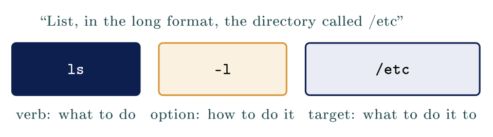

# Finding your way around Linux {#sec-11-finding-your-way-around-linux}

::: {.callout-note appearance="simple" icon="false"}
**Module.** Module 3: Linux for Security Operations\
**Accompanies.** Lecture L11. **Reading time.** About 45 minutes.\
**Primary reading.** Jøsang, *Cybersecurity: Technology and Governance* (Springer, 2025): Sect. 3.1, 3.4 (the IT stack, root and privilege), 2.1.6 (supply chain attacks), 3.3 (the vulnerability lifecycle), 1.10.2 (logging). The command-line facts follow Shotts, *The Linux Command Line* (3rd ed., 2026), chapters 1--6 and 14, and the Filesystem Hierarchy Standard 3.0.
:::

## The question this chapter answers {#the-question-this-chapter-answers .unnumbered}

L10 finished the network. Module 3 begins here, and its subject is a single machine on that network, reached through a black window with a prompt in it. One question runs through the first part: what does somebody mean when they say they run Linux? The rest is grammar, map and trust. Part 2 is the grammar of talking to the machine one line at a time. Part 3 is the map: four directories carry almost all of the security work. Part 4 is where software comes from and who decided. Part 5 types all of it, mistakes included.

The book's reason for spending three weeks here is on its first page about systems: the IT stack is "hardware layer at the bottom, operating systems in between and applications as the top layer", and "for a system to be secure, it is of course necessary that every layer is secure" [Jøsang, Chap. 3 intro, p. 43]{.src}. The middle layer is the one you administer, and on servers it is almost always Linux.

::: {.callout-tip}
## Nordvik's server runs Linux

Nordvik's one server in the cupboard runs a Linux distribution, and from today you administer machines like it from the terminal. Almost everything on it, its settings, its logs, its accounts, is an ordinary readable file you can open with the commands in Part 2 and find with the map in Part 3.

:::

[→ One question runs through Part 1. What does somebody mean when they say they run Linux?]{.bridge}

## One kernel, many distributions

### What Linux actually refers to

::: {.callout-note}
## Linux

Only the kernel. A distribution is that kernel plus everything around it: the commands, the package system, the defaults, the release pace. Which distribution matters little; what helps is that almost everything is a readable file.

:::

Separate the two words. The kernel is the book's "operating system" layer, the program that runs at privilege level 0 and stands between every other program and the hardware [Jøsang, Sect. 3.4, Fig. 3.4, p. 49]{.src}. A distribution wraps that kernel in several thousand packages and a set of choices. Every argument about Linux is really about the distribution.

### Two families of distributions

The table is a map, not a ranking. Ubuntu and Kali are both built from Debian, so they are siblings rather than steps in a chain. Choosing a distribution means choosing defaults and a release pace, not a different operating system.

                          **Debian family**              **Red Hat family**
  ----------------------- ------------------------------ ----------------------------------------
  The package file        `.deb`                         `.rpm`
  The install command     `apt`                          `dnf`
  Members you will meet   Debian, Ubuntu, Kali, Mint     Fedora, Red Hat Enterprise, Rocky
  In this course          Kali, which is Debian family   Not used here, and the same underneath

A command learned on one family transfers to the other with one word changed.

### Why Kali for this course

Kali is an ordinary Debian-family distribution. It arrives with several hundred security tools already installed, which saves an afternoon of installing them by hand. Kali is not more powerful than Ubuntu in any way, and a pre-installed tool is not a different tool. Every tool in it installs on Ubuntu with one command, which is worth knowing early, because your first employer will not run Kali.

```{=html}
<script type="application/json" class="qex">
{"type":"quiz","title":"Check yourself","q":"What is Kali, according to this chapter?","options":["An ordinary Debian-family distribution with security tools preinstalled","A more powerful Linux than Ubuntu","A member of the Red Hat family","A different operating system from Debian","A kernel of its own"],"correct":[0],
 "ok":"Right.","why":"Kali is Debian family, and a pre-installed tool is not a different tool: every tool in it installs on Ubuntu with one command."}
</script>
```

### Where Linux already runs

The home router from L05 is a small computer, and it runs a version of Linux. So do the school's servers, most machines that answer for a web page, and every Android phone. You have used Linux for years without a terminal, which is why the terminal feels new rather than the system. The book's list of systems, "computers, servers, hosts, nodes, smartphones, devices" [Jøsang, Chap. 3 intro, p. 43]{.src}, is mostly a list of Linux machines.

::: {.callout-important title="Key idea"}

Linux itself is just the kernel; a distribution is that kernel plus everything around it, and which one matters little. What makes Linux useful here is not that it is safer than Windows, but that almost everything, settings, logs, accounts, is an ordinary readable file you can inspect.

:::

::: {.callout-tip title="On Nordvik AS"}

Nobody at Nordvik knows which distribution the server runs, and it does not matter. What matters is that its settings are in `/etc`, its record of who logged in is in `/var/log`, and both can be read by anybody with an account and a terminal.

:::

[→ You know what the system is. Part 2 is the grammar of talking to it, one line at a time.]{.bridge}

## The command line

### Where am I, and what is here

Three commands answer the two questions you ask every time you open a terminal. The terminal shows you nothing until you ask, so asking is the first habit to build.

  **Type this**   **The name**              **What happens**
  --------------- ------------------------- -------------------------------------------------------------------------------
  `pwd`           print working directory   Prints the directory you are standing in, named in full from the slash
  `ls`            list                      Lists what is in that directory. Add `-l` and each name gets a line of detail
  `cd /var/log`   change directory          Moves you into another directory. Typed on its own it takes you home

Shotts writes `pwd` out as print working directory. Say it once and the three letters stop being arbitrary. A file manager answers both questions by drawing a window; the terminal answers them only when asked.

### Copying, moving and deleting

Three more commands do what a file manager does with drag and drop. None of the three asks you to confirm anything, and none of them has an undo.

  **Type this**                **Short for**   **What happens**
  ---------------------------- --------------- ---------------------------------------------------------------------------------
  `cp notat.txt /tmp`          copy            A second copy appears in `/tmp`. The original stays where it was
  `mv notat.txt rapport.txt`   move            The file gets a new name. Nothing is copied, and the old name is gone
  `mv notat.txt /tmp`          move            The same command with a directory as the target moves the file instead
  `rm gammel.txt`              remove          The file is deleted. There is no recycle bin and no undo
  `rm -r gammel-mappe`         remove          The option `-r` means go into directories as well, so this deletes a whole tree

### The prompt is asking a question

```{.bash}
student@kali:~$ 
```

Read it from left to right. Before the at sign is who you are. After it is which machine you are on. After the colon is where on that machine you are standing right now; the tilde is short for your own home directory. The dollar sign is where the typing goes. When the dollar sign becomes a hash, `#`, you are root, the book's "Unix root" at level 0 [Jøsang, Sect. 3.4, p. 49]{.src}, and every command runs with the whole machine's authority.

### Every command has the same shape

Nearly every command you meet is a verb, then how to do it, then what to do it to.

::: center
{fig-align="center"}
:::

Options almost always start with a dash, which is how you tell them from targets. These three parts mean the same thing every time a command is taken apart in this course.

### Reading a command you have not met

You do not know what `du` does, and you can still see a verb with one option and one target. Reading the shape is enough to guess what a command will do, before you run it.

  **The command**           **How to read it**
  ------------------------- --------------------------------------------
  `du -sh /var/log`         Verb `du`, option `-sh`, target `/var/log`
  `chmod +x oppsett.sh`     Verb, option, target. The same shape
  `ls /etc/*.conf`          The star matches anything in a name
  `head -n 5 /etc/passwd`   `-n 5` is an option that takes a value
  `rm -r gammel-mappe`      `-r` means go into folders as well
  `apt install tree`        Some verbs take a second word of their own

### Asking the command itself

Add `–help` to almost any command and it prints a short summary of itself. The command `man` opens the full manual page for a program, and `q` leaves it again. The command `apropos` searches those manuals by subject, for when you do not know the name.

```{.bash}
$ wc --help
Usage: wc [OPTION]... [FILE]...
Print newline, word, and byte counts for each FILE ...
```

```{=html}
<script type="application/json" class="qex">
{"type":"buckets","title":"Try it: does it change the machine?","instr":"Sort each command by what it does. Remember: none of the changing ones asks you to confirm, and none has an undo.",
 "buckets":["Only reads","Changes something"],
 "items":[["pwd",0],["ls -l",0],["rm gammel.txt",1],["mv notat.txt rapport.txt",1],["less /etc/hostname",0],["cp notat.txt /tmp",1]],
 "ok":"Sorted. The changing three never ask and never undo."}
</script>
```

[→ You can speak. Part 3 is the map: four directories carry almost all of the security work.]{.bridge}

## The filesystem

### One tree, growing from a single slash

Windows gives every disk a letter, and Linux has one tree growing from a single slash. The Filesystem Hierarchy Standard 3.0 fixes this layout, so the tree looks the same on every distribution. Learn this table once and it holds on Ubuntu, on Kali, on Fedora and on a server nobody has explained to you.

  **Directory**   **What is kept there**                **Who may write to it**
  --------------- ------------------------------------- -------------------------
  `/bin`          The commands themselves               root only
  `/etc`          Settings for everything               root only
  `/home`         One folder per person                 You, in your own
  `/tmp`          Scratch space, wiped at boot          Anybody at all
  `/usr`          Installed programs                    root only
  `/var`          Files that grow: logs, mail, queues   The services

The third column is the book's privilege principle from L02 written onto directories: a process "can access data and code defined with the same or lower privilege level" [Jøsang, Sect. 3.4, p. 49]{.src}, and the tree is arranged so that the parts that change the machine belong to root.

The command `tree` draws the shape of a directory, and the option `-L 1` stops it after one level. On a real machine the whole top of the tree fits on one screen. An arrow means the name points somewhere else: `/bin` is really `/usr/bin`, kept for programs that expect the old path.

### Reading a file without changing it

Four commands show you a file, and none of them can alter it. Which one you reach for depends on the size of the file and which end of it you want.

  **Type this**                   **The name**             **What happens**
  ------------------------------- ------------------------ -------------------------------------------------------------------------------------
  `cat /etc/hostname`             concatenate              The whole file goes to the screen at once. Fine for a short file, useless for a log
  `less /var/log/auth.log`        a play on less is more   One screen at a time. Space goes forward, `b` goes back, slash searches, `q` leaves
  `head -n 5 /etc/passwd`         the head of the file     The first five lines, and the first ten if you leave the number out
  `tail -n 5 /var/log/auth.log`   the tail of the file     The last five lines, which on a log is the newest thing that happened

Shotts heads the section "cat, Concatenate Files", because `cat` joins files together and printing one file is the simplest case of that. `less` was written as an improved replacement for an older pager called `more`, hence the name.

### Where the settings are

`/etc` holds the configuration of the whole system. Which services start, who may log in, and where software is fetched from are all decided there. Every one of those settings is an ordinary text file. There is no registry behind it and no hidden database anywhere on the system. A setting is a line in a file, and a person can read it without any special tool. The book's term for keeping those lines right is system integrity: "the correct configuration, correct software and updated patch status" [Jøsang, Sect. 1.9.3, p. 16]{.src}. On Linux, correct configuration is literally the content of `/etc`.

### Where the evidence is

`/var/log` is where the system writes down what happened, and at exactly what time. Who logged in, what started and what failed are all recorded there. The evidence gets written whether or not anybody ever reads it. This directory is the book's accountability principle made concrete: "Accountability is based on logging activities in systems and networks, and maps which user or other entity is behind each logged activity" [Jøsang, Sect. 1.10.2, p. 20]{.src}. Reading it is L12.

```{.bash}
student@kali:~$ cd /var/log
student@kali:/var/log$ ls
apt  auth.log  dpkg.log  kern.log  syslog  ...
```

Notice the prompt. The tilde became `/var/log`, because the prompt always shows where you are standing.

### The people, and the shared scratch space

`/home` holds one directory for each person with an account. Your own documents live inside yours and nowhere else, and root has its own directory, `/root`, outside `/home`. You may write inside your own directory and not inside anybody else's. `/tmp` is the opposite: anybody who can log in may write there, and it is wiped at boot. One is private by default, the other open to everybody.

```{=html}
<script type="application/json" class="qex">
{"type":"match","title":"Try it: read the map","instr":"Drag each directory onto what is kept there. Two directories are distractors and stay on the bench.",
 "zones":[{"label":"Settings for everything","answer":"/etc"},{"label":"Files that grow: logs, mail, queues","answer":"/var"},{"label":"One folder per person","answer":"/home"},{"label":"Scratch space, wiped at boot","answer":"/tmp"}],
 "extra":["/bin","/usr"],
 "ok":"That is the map: settings, evidence, people, scratch."}
</script>
```

[→ You can find things. Part 4 is about trust: where software comes from, and who decided.]{.bridge}

## Package management

### Not by downloading an installer

On Windows you find the program's website, download an installer, and click through it. You are trusting whoever put that installer there. On Linux you ask the system for the program by name, and it fetches it from approved sources that were configured before you ever arrived. A **dependency** is another package this one needs in order to run, and the system fetches those too.

### The commands you will use

Debian calls `apt` the command-line package manager, and every command below starts with it. Anything that changes the machine needs `sudo` in front; the `su` in that name is substitute user, and what it substitutes is root.

  **The command**                **What it does**
  ------------------------------ -----------------------------------------
  `sudo apt update`              Refresh the catalogue. Installs nothing
  `apt search wireshark`         Look for a package by name or subject
  `apt show wireshark`           What it is, and what it will drag in
  `sudo apt install wireshark`   Fetch it, check it, and install it
  `sudo apt upgrade`             Install newer versions of what is here
  `sudo apt remove wireshark`    Take it off the machine again

Only four of these six change the machine. Searching and showing are free, and you should use them before every install.

### Update is not upgrade

`update` fetches a fresh catalogue of what exists. It installs nothing at all; every `Hit` line is one repository saying its catalogue has not changed since last time. `upgrade` installs newer versions, and its output names the exact file it fetched and the server it came from. This pair is where the book's vulnerability lifecycle ends: after discovery, CVE registration and NVD guidance comes "prioritization and removal of vulnerabilities" in organisations [Jøsang, Sect. 3.3, Fig. 3.3, p. 46]{.src}, and on a Debian machine, removal is `apt upgrade`.

```{=html}
<script type="application/json" class="qex">
{"type":"quiz","title":"Check yourself","q":"A vulnerability has a fix waiting in the repositories. Which command actually removes it from this machine?","options":["sudo apt update","sudo apt upgrade","apt search","apt show","apt-cache policy"],"correct":[1],
 "ok":"Right.","why":"update only fetches a fresh catalogue and installs nothing; upgrade installs newer versions, which is where the book's vulnerability lifecycle ends."}
</script>
```

### Where this package would come from

The command `apt-cache policy` answers three questions about one package before anything is installed: whether it is already installed, which version would arrive, and which server it would arrive from. The number 500 beside a source is its priority. One file, `/etc/apt/sources.list` and the files beside it, lists the repositories this machine may install from. Whatever is not listed there does not get installed on this machine by `apt`. The exact filename differs between distributions, so open it live rather than copying a path.

### XZ Utils, CVE-2024-3094

In March 2024 malicious code was found in the release files of `xz`, a compression program present on almost every Linux machine. NVD published the entry on 29 March 2024 with a base score of 10.0, the maximum. The code aimed at the OpenSSH server, which is how most people reach a Linux machine, and it had been placed there over two years by a contributor who had earned maintainer trust. The build process extracted a prebuilt object file from a disguised test file in the source, and that object file modified functions in the library that SSH loads.

The book's name for this is a supply chain attack: "the threat actor first attacks and compromises products and services of a supplier, which then makes it possible to attack the supplier's customers. Hence, this is a two-stage attack" [Jøsang, Sect. 2.1.6, p. 30]{.src}. Its warning fits exactly: "A threat actor that successfully installs a backdoor in the software of a supplier could easily attack all the supplier's customers that buy the same software." The signed-repository system did not prevent it, because the poisoned release was itself signed. What limited it was the distributions' slow release pace: stable Debian and Ubuntu never shipped the bad version.

### Pasting a command from a website

::: {.callout-note}
## `curl sh`

Pasting an install command from a web page runs unchecked code as you. It skips every check that installing a signed package by name gives.

:::

The habit is common on project web pages, and it is the exact opposite of everything this part has described. The XZ backdoor hid in a dependency of SSH. A pasted script can install anything, from anywhere, with no signature and no record in the package database. The book's phrase for what you are trusting is the Partner dimension of the four P's: buying a product is a waste "if the vendor is not able to provide adequate support" [Jøsang, Sect. 1.6, p. 11]{.src}, and a web page is not a vendor.

::: {.callout-important title="Key idea"}

On Linux you install by asking the system for a package by name, and it fetches it from sources signed and trusted in advance, which removes the step where most unwanted software arrives. Pasting a command from a website skips every one of those checks and runs as you.

:::

::: {.callout-tip title="On Nordvik AS"}

If someone at Nordvik pastes an install line from a forum into the server's terminal with `sudo` in front, whatever that line fetches now runs as root on the machine that holds the drawings, with no package record and no signature. L13 is about what `sudo` actually grants.

:::

[→ Distribution, command, tree, source. Part 5 types all of it, mistakes included.]{.bridge}

## Practical work in the terminal

### Finding your way, and reading a file

The commands below walk the tree from Part 3 and read one file without changing it. The editor `nano` writes the file out with Ctrl-O and leaves with Ctrl-X; the key names sit along the bottom of its screen the whole time, so none of this has to be memorised.

  **Type this**          **What happens**
  ---------------------- --------------------------------------------------------------------------
  `pwd`                  Prints where you are standing, in full
  `ls -l`                Lists what is here, one line of detail for each name
  `cd /etc`              Moves you into the settings directory from Part 3
  `ls -l host*`          The star matches anything, so this finds `hostname` and `hosts` together
  `less /etc/hostname`   Reads the file one screen at a time. Press `q` to leave it
  `nano /etc/hosts`      Opens the same kind of file in an editor instead of a reader
  Ctrl-X, then `n`       Leaves `nano` without saving, so nothing on the machine changed

### Installing something

Watch the output rather than the progress bar. The lines about signatures are the point of Part 4.

  **Type this**             **What happens**
  ------------------------- ------------------------------------------
  `sudo apt update`         Fetch the catalogue, and read the output
  `apt show tree`           What it is, before installing anything
  `sudo apt install tree`   Watch the output for the signature check
  `tree -L 1 /`             The program is now on the machine
  `sudo apt remove tree`    And off it again, just as cleanly

### Worked example: a server with no space left

::: {.callout-tip}
## The case

A colleague messages you to say one of the municipality's servers is full, and nothing else. You have never logged in to it. You have an account, a terminal and no desktop.

:::

::: {.callout-warning}
## Two minutes

In what order do you look, and what do you type first? The ticket is deliberately vague, because real ones are exactly this vague.

:::

**Reasoning.** Run `pwd` and `ls` first, so that you know where the machine put you before changing anything. Then ask the tree where the space went: `du -sh /var /home /tmp` gives three numbers in one line. Most people guess `/home`. The answer is far more often `/var/log`, where a service has written the same error since Tuesday. Then `/tmp`, because anybody may write there, and then `/etc` for the settings of whichever service is misbehaving.

**Result.** `/var/log` holds twelve gigabytes of one log, and `tail -n 5` of it shows the same error every second. The fix is the service's setting in `/etc`, not deleting the log. Write the report as the exact commands and paths you used, because "I deleted the old files" cannot be checked and "`du -sh /var/log` returned 12G; `tail` showed ..." can. That is the book's documentation habit from incident handling, "every step ... documented with a timestamp" [Jøsang, Sect. 14.5.2, p. 311]{.src}, and the terminal is the door that can be written down and repeated exactly.

```{=html}
<script type="application/json" class="qex">
{"type":"order","title":"Try it: the full disk","instr":"A server is full and you have never logged in to it. Tap the steps in the order the worked example gives them.",
 "steps":["Run pwd and ls to see where you landed","du -sh /var /home /tmp: three numbers","tail the giant log in /var/log","Fix the service's setting in /etc"],
 "ok":"That is the order: know where you are, ask the tree, read the newest lines, fix the setting rather than deleting the log."}
</script>
```

## Common misconceptions {#common-misconceptions .unnumbered}

  **Belief**                                                           **Correction**
  -------------------------------------------------------------------- -------------------------------------------------------------------------------------------------------------
  The terminal is for experts and the desktop is for everybody else.   Both are front doors to one system. The terminal is the door that can be written down and repeated exactly.
  Kali is a more powerful Linux than Ubuntu.                           Kali is Debian with security tools preinstalled. Anything in it installs on Ubuntu with a single command.
  `apt update` installs the updates.                                   It downloads a fresh catalogue of what exists. `apt upgrade` is the command that changes any software.
  Downloading from the project's own website is the safest route.      The repository copy is signed and the signature is checked. A download from a website is checked by nobody.

## Summary: five points {#summary-five-points .unnumbered}

1.  Linux is a kernel, and a distribution is that kernel plus everything assembled around it; Kali is Debian with tools preinstalled.

2.  Every command is a verb, some options and a target, and any command will tell you what it does with `–help` or `man`.

3.  One tree grows from a single slash: settings in `/etc`, evidence in `/var/log`, people in `/home`, scratch in `/tmp`.

4.  Four commands read a file without changing it, and `tail` of a log is the newest thing that happened.

5.  Software arrives by name from signed sources; `update` refreshes the catalogue, `upgrade` changes the machine, and a pasted command skips every check.

## Self-check {#self-check .unnumbered}

1.  Linux is only a kernel. What does a distribution add, and why is Kali not a more powerful one? (Part 1)

2.  Read the command `du -sh /var/log` aloud in three parts. What would you type to ask `du` what it does? (Part 2)

3.  A server's disk is full. Name the three directories you check, in order, and say why `/home` is usually the wrong first guess. (Part 5)

4.  Which directory holds the settings, which holds the logs, and who may write to each? (Part 3)

5.  What is the difference between `apt update` and `apt upgrade`, and which one removes a vulnerability? (Part 4)

6.  Explain the XZ Utils case as a supply chain attack in the book's two-stage sense. (Part 4)

7.  Why is `curl …  sudo sh` the opposite of package management? (Part 4)

## Before L12 {#before-l12 .unnumbered}

On your exercise machine, run `tail -n 20 /var/log/auth.log` and write down what one line of it says, field by field, as far as you can. Then run `apt-cache policy openssh-server` and note the version and the source. In L12 that log becomes the subject: finding one line in a hundred thousand.

## Glossary {#glossary .unnumbered}

Kernel

:   The operating system proper; runs at privilege level 0. [Jøsang, Sect. 3.4]{.src}

Distribution

:   A kernel plus packages, defaults and a release pace: Debian, Ubuntu, Kali, Fedora.

root

:   The all-powerful account; the prompt shows `#`. [Jøsang, Sect. 3.4]{.src}

sudo

:   Run one command as root (substitute user).

Verb, option, target

:   The shape of every command.

`/etc`, `/var/log`, `/home`, `/tmp`

:   Settings, evidence, people, scratch.

FHS

:   The Filesystem Hierarchy Standard; why the tree looks the same everywhere.

Package / dependency / repository

:   A signed unit of software; another package it needs; a trusted source it comes from.

`apt update` / `apt upgrade`

:   Refresh the catalogue; install newer versions.

Supply chain attack

:   Compromise a supplier to reach its customers; a two-stage attack. [Jøsang, Sect. 2.1.6]{.src}

CVE / NVD

:   The registry of vulnerabilities and the database that scores them. [Jøsang, Sect. 3.3]{.src}

## Sources {#sources .unnumbered}

-   Jøsang, A. (2025). *Cybersecurity: Technology and governance*. Springer. <https://doi.org/10.1007/978-3-031-68483-8>. Sect. 1.6, 1.9.3, 1.10.2, 2.1.6, 3.1, 3.3, 3.4, 14.5.2.

-   Shotts, W. (2026). *The Linux command line: A complete introduction* (3rd ed.). No Starch Press.

-   Linux Foundation. (2015). *Filesystem Hierarchy Standard, version 3.0*.

-   Cybersecurity and Infrastructure Security Agency. (2024, March 29). *Reported supply chain compromise affecting XZ Utils data compression library, CVE-2024-3094*.

-   National Institute of Standards and Technology. (2024). *CVE-2024-3094*. National Vulnerability Database.

-   Nasjonal sikkerhetsmyndighet. (n.d.). *Fem effektive tiltak mot dataangrep*; *Grunnprinsipper for IKT-sikkerhet 2.1*.
