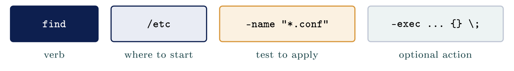

# Finding the needle in a log {#sec-12-finding-the-needle-in-a-log}

::: {.callout-note appearance="simple" icon="false"}
**Module.** Module 3: Linux for Security Operations\
**Accompanies.** Lecture L12. **Reading time.** About 45 minutes.\
**Primary reading.** Jøsang, *Cybersecurity: Technology and Governance* (Springer, 2025): Sect. 1.10.2 (accountability and logging), 14.5.2 (detection and analysis: precursors and indicators), 6.5.1 (signature-based detection), 3.3 (CVE and NVD). The tool facts follow Shotts, *The Linux Command Line* (3rd ed., 2026), and the GNU grep manual.
:::

## The question this chapter answers {#the-question-this-chapter-answers .unnumbered}

L11 was about moving around the tree. This chapter stops in one directory and opens the file that the SSH service wrote. The question is how you find one line in a hundred thousand, and the answer is that you never read a log: you put questions to it. Part 1 is three ways of looking at a file without opening it. Part 2 is one command and five characters, and it carries the year. Part 3 asks the other question, which files are there at all. Part 4 joins small tools together and decides where the answer lands. Part 5 puts three questions to one real log.

The book's reason for all of this is accountability. "Accountability is based on logging activities in systems and networks, and maps which user or other entity is behind each logged activity" [Jøsang, Sect. 1.10.2, p. 20]{.src}. The log is the raw material; today's tools are how a person reads it.

::: {.callout-tip}
## Reading Nordvik's logs

Nordvik's server writes logs constantly, and the wrong way to read them is to open them in an editor. Instead you put questions to the files: how big, the last lines, the lines that match a pattern, the files that contain a string. By the end of this chapter you can answer, for Nordvik, who failed to log in, who got in, and where the attempts came from.

:::

[→ One file, still being written. Part 1 is three ways of looking without opening it.]{.bridge}

## Reading a very large file

### Why you never open a log

::: {.callout-note}
## Never open a log

You put questions to it with `head`, `tail` and `wc`. The tools do not load the whole file; `tail` starts where the newest lines are. A running server may have no editor and no mouse. You ask, you do not browse.

:::

A log is written by a program and it keeps growing. Nobody opens one and reads it downwards from the first line. The book describes the volume problem from the analyst's side: "The volume of signs of potential incidents is typically very high, where most alerts are false alarms" [Jøsang, Sect. 14.5.2, p. 311]{.src}. A log is that volume, on disk.

### How big this file is

Ask how big a file is before you open it, and how many lines it holds. `wc -l` counts lines, and `du -h` prints a size a person can read. `ls -l` gives the same size in exact bytes, beside everything else in the directory.

```{.bash}
student@kali:~$ wc -l auth.log
69 auth.log
student@kali:~$ du -h auth.log
12K     auth.log
```

Sixty-nine lines is a teaching file. A real `auth.log` on a server that faces the internet grows by thousands of lines a day, most of them the same three attackers trying passwords.

### Three ways to look, without opening

The names say it. `head` is the head of the file, `tail` is the tail, and `less` shows one screen. A log is written downwards, so the newest line sits at the bottom and `tail` is where you start.

                 **`head`**                             **`tail`**                                      **`less`**
  -------------- -------------------------------------- ----------------------------------------------- -------------------------------------------------
  Shows          The first ten lines                    The last ten lines                              One screen at a time
  Tells you      How the file starts                    What has just happened                          Whatever you go looking for
  Reach for it   Meeting a format you have never seen   During an incident, which is most of the time   Reading a file you cannot guess your way around
  Give it        `head -n 20` for the first twenty      `tail -n 50` for the last fifty                 Space, `b`, slash, `n` and `q`

### How the file ends

```{.bash}
student@kali:~$ tail -n 3 auth.log
2026-08-08T14:47:38.938557+00:00 kali sshd[9569]: Accepted password for student from 127.0.0.1 port 44812 ssh2
2026-08-08T14:47:38.945102+00:00 kali sshd[9569]: pam_unix(sshd:session): session opened for user student
2026-08-08T14:47:41.120993+00:00 kali sshd[9569]: pam_unix(sshd:session): session closed for user student
```

The end of the file is the newest thing the machine wrote. Here it shows one SSH session ending. During an incident that is almost always the first place you look.

### The shape of a log line

One real line from the file, split into its five fields. Every one of those five fields is something you can filter on.

  **Field**       **From the line**                                              **What it tells you**
  --------------- -------------------------------------------------------------- -----------------------------------------
  When            `2026-08-08T14:47:12.159276+00:00`                             Date and time, with the offset from UTC
  Which machine   `kali`                                                         Which computer wrote the line
  Which service   `sshd`                                                         Which program wrote it
  Which process   `[9166]`                                                       Which copy of that program
  What happened   `Failed password for student from 127.0.0.1 port 47596 ssh2`   The message, in free text

Every line in this file has the same five fields. Learn the shape once and the rest of the file stops looking like noise. The first field matters more than it looks: the book's incident documentation rule is that every step be recorded "with a timestamp" [Jøsang, Sect. 14.5.2, p. 311]{.src}, and the log's timestamp is what your own notes get lined up against.

::: {.callout-important title="Key idea"}

You never open a log; you put questions to it. The tools do not load the whole file: `head`, `tail` and `wc` answer one question each, and `tail` starts where the newest lines are. Every log line has fields you can filter on.

:::

::: {.callout-tip title="On Nordvik AS"}

When something looks wrong on Nordvik's server, you do not open its log. You run `tail -n 50` to see what just happened, and `wc -l` to know how much there is before you go further.

:::

[→ You can sample the file. Part 2 is one command and five characters, and it carries the year.]{.bridge}

## Finding text with grep

### Only the lines that match

::: {.callout-note}
## grep

Prints only the matching lines, and never changes the file. One pattern pulls a single string out of everything you have. [Jøsang, Shotts, ch. 19]{.src}

:::

`grep` takes a pattern and a file and prints the matching lines. It says nothing at all about the lines it discarded. Shotts writes the name out as "global regular expression print", which is what the letters are. This is the book's signature-based detection, by hand: "the IDS can identify a known pattern of network traffic and system activity previously identified to be part of an attack. The specific attack pattern is called a 'signature' " [Jøsang, Sect. 6.5.1, p. 138]{.src}. `grep` with a pattern is a signature search over a log.

```{.bash}
student@kali:~$ grep "Failed password" auth.log
2026-08-08T14:47:12.159276+00:00 kali sshd[9166]: Failed password for student from 127.0.0.1 port 47596 ssh2
2026-08-08T14:47:14.802241+00:00 kali sshd[9166]: Failed password for student from 127.0.0.1 port 47596 ssh2
2026-08-08T14:47:17.011975+00:00 kali sshd[9170]: Failed password for student from 127.0.0.1 port 47612 ssh2
```

A pattern with a space in it goes in quotes, or the shell splits it in two. Three lines out of sixty-nine fit this one.

### The flags you will actually use

Four flags cover almost everything you will ask `grep` for this year.

  **Command**                            **What comes back**
  -------------------------------------- --------------------------------------------------
  `grep "Failed password" auth.log`      Every line containing that phrase, three of them
  `grep -i failed auth.log`              The same search, with capitals ignored as well
  `grep -c "Failed password" auth.log`   The count of the matches, instead of the lines
  `grep -v sshd auth.log`                Every line that does NOT contain `sshd`
  `grep -r sshd /etc`                    Every file under a directory, searched

### Five characters worth knowing

In `grep` the star means any number of the character before it. That is not what the star meant in a filename in L11.

  **Character**     **What it matches**               **In use**
  ----------------- --------------------------------- ----------------
  `^` caret         The start of a line               `^2026-08-08`
  `$` dollar        The end of a line                 `ssh2$`
  `.` dot           Any one character                 `sshd.`
  `*` star          Any number of the one before it   `sshd.*Failed`
  `[0-9]` a range   Any single digit                  `port [0-9]`

The caret and the dollar anchor a pattern, and the other three describe what sits between them. These five cover every example in this chapter.

### Building one pattern, step by step

Each step is the one before it plus one idea. Nobody writes the last line out of their head. You add one idea at a time and read the result, because a pattern you built one step at a time is a pattern you can repair.

  **Command**                            **What it asks for**
  -------------------------------------- ----------------------------------------------
  `grep sshd auth.log`                   Every line naming the ssh service
  `grep "Failed password" auth.log`      Only the refusals, three lines
  `grep -c "Failed password" auth.log`   The count on its own, which is 3
  `grep "^2026-08-08T14:47" auth.log`    The caret anchors it to one minute
  `grep -E "Invalid user" auth.log`      One line, for an account that does not exist

### Log4Shell: one string in every log

Log4j is a library that Java programs use to write their own log files. A message written to the log could contain a lookup, and Log4j contacted the server named in it and ran what came back. Anybody who could get a string into a log, through a username field, a chat message, a browser header, could run code on the server. NVD published CVE-2021-44228 on 10 December 2021 with a score of 10.0; the book describes NVD's role in exactly this step, importing the CVE and adding "guidelines for handling and removing the vulnerability" [Jøsang, Sect. 3.3, p. 46]{.src}. That weekend every defender in the world asked one question: were we hit? The answer was a `grep` for one string, `jndi:`, across every log they had, and it answered that same afternoon. The book's term for such a string is an **indicator**: "a sign that an incident may already have occurred or is currently occurring" [Jøsang, Sect. 14.5.2, p. 311]{.src}.

::: {.callout-important title="Key idea"}

`grep` prints only the lines that match and never touches the file, so one pattern can pull a single string out of everything you have. When Log4Shell broke, every defender asked one question, were we hit, and `grep` for one string answered it that afternoon.

:::

::: {.callout-tip title="On Nordvik AS"}

If the next Log4Shell broke, answering "were we hit" for Nordvik would be `grep -r` of one string across `/var/log` on the server and the Microsoft 365 audit log. Twenty minutes, if somebody knows the command.

:::

[→ grep reads inside files. Part 3 asks the other question: which files are there at all?]{.bridge}

## Finding files with find

### The parts of a find command

`grep` answered what is inside files. `find` asks which files are there at all. Every `find` command is a place to start, a test to apply, and optionally something to do. Leave the last part out and `find` simply prints every path that passed the test. Shotts heads his section "Find Files the Hard Way", and the hard way is the one that is always true right now, because it reads the disk.

::: center
{fig-align="center"}
:::

### find on your own home directory

```{.bash}
student@kali:~$ find /home/student -type f
/home/student/.bashrc
/home/student/.profile
/home/student/auth.log
```

The start is `/home/student` and the test is `-type f`, which keeps ordinary files and leaves the directories out. A name beginning with a dot is hidden from `ls`, and `find` lists it anyway. There is no action, so `find` prints each path it kept.

### Filling in the three parts

  **Command**                          **What it asks**
  ------------------------------------ ------------------------------------------------------------------------
  `find /etc -name "*.conf"`           Start at `/etc`, and test the name
  `find /home -type d`                 Directories only, not the files in them
  `find /var -type f -size +10M`       Files larger than ten megabytes; `-100k` would mean smaller
  `find /etc -name "*.conf" -type f`   Two tests, and both have to be true
  `find /etc -mtime -1`                Changed in the last twenty-four hours; `-mmin -60` means the last hour

The quotation marks keep the star for `find` to use, rather than letting the shell act on it first. Add an action and `find` runs a command on every file it found, written `-exec` with braces standing for each file. Run every `find` without an action first and read what it lists, because `-delete` does not ask twice.

The last row is the one an incident responder uses most. "What changed in the last hour" is the book's analysis step made into one command: gathering "available signs" to understand "what has happened and what should be done next" [Jøsang, Sect. 14.5.2, p. 311]{.src}.

### find in the settings directory

```{.bash}
student@kali:~$ find /etc -maxdepth 1 -name "*.conf"
/etc/resolv.conf
/etc/sysctl.conf
/etc/host.conf
```

The option `-maxdepth 1` stops `find` from going down into subdirectories. Without it the same command searches everything under `/etc` and returns a far longer list. In L11 you learned the settings are plain text. Being able to find every settings file that mentions a service is how you audit a machine nobody documented.

### The faster tool that can be wrong

Shotts calls `find` the hard way and `locate` the easy way. `locate` answers the same question far faster, and it never looks at the disk: it reads an index that was built earlier, usually overnight. A file created this morning is not in it, and a file deleted this morning still is. Fast and possibly wrong, or slow and always true. During an incident you want the second.

[→ The tools are small on purpose. Part 4 joins them, and decides where the answer lands.]{.bridge}

## Joining commands and redirecting output

### Why the tools are small

Every command in this chapter does one thing, and that is a decision rather than an oversight. **Standard output** is where a command's answer goes. **Standard input** is where the next command reads it, and the **pipe**, the vertical bar, joins the two. One small job joins to another. That is why every command prints its answer as plain text: text is what the next command can read.

### The small tools a pipeline is made of

  **Type this**               **The name**      **What it does**
  --------------------------- ----------------- ------------------------------------------------------------------------
  `cut -d: -f1 /etc/passwd`   cut out a piece   Cuts each line at a chosen character and keeps the field you name
  `sort`                      put into order    Puts the lines in order, which is what brings identical lines together
  `uniq -c`                   unique            Collapses identical neighbouring lines, and `-c` counts each group
  `wc -l`                     word count        Counts lines with `-l`, and counts words and bytes without it

The order matters. `uniq` only collapses lines that are already next to each other, which is why `sort` almost always comes first.

### One pipe, two commands

```{.bash}
student@kali:~$ cut -d: -f1 /etc/passwd | head -n 5
root
daemon
bin
sys
sync
```

`cut` splits each line on the colon and keeps field one, the account name. `head` never opened the file. It read what `cut` handed it, which is what a pipe means.

### Where the answer lands

One arrow overwrites without asking, and two arrows add to the end. That one character has cost people a day of work.

  **Command**                                        **What happens**
  -------------------------------------------------- -----------------------------------------------
  `grep "Failed password" auth.log`                  The matching lines go to the screen
  `grep "Failed password" auth.log > failures.txt`   The same lines go into a file instead
  `grep "Accepted" auth.log > failures.txt`          The same name again, and the file is replaced
  `grep "Accepted" auth.log >> failures.txt`         Two arrows add to the end instead
  `ls -l failures.txt`                               Checks that the file grew rather than shrank

### Where the errors went

A command has two output streams. Results travel on stream one, error messages travel on stream two, and the arrow only catches stream one. Read `2>&1` aloud: send stream two to wherever stream one is going. The name `/dev/null` is a file that throws away whatever is written to it.

  **Command**                           **What happens**
  ------------------------------------- -----------------------------------------------
  `ls /etc /finnesikke`                 One of the two works, and the other fails
  `ls /etc /finnesikke > ut.txt`        Only the working half lands in the file
  `ls /etc /finnesikke 2> feil.txt`     `2>` catches the error stream instead
  `ls /etc /finnesikke > ut.txt 2>&1`   Sends stream 2 wherever stream 1 goes
  `find / -type f 2>/dev/null`          The refusals go nowhere, and the results stay

[→ Sample, search, find, join. Part 5 puts three questions to one real log.]{.bridge}

## Three questions against one log

### Question one: who failed, and how often

```{.bash}
student@kali:~$ grep -c "Failed password" auth.log
3
student@kali:~$ grep -E "Invalid user" auth.log
2026-08-08T14:47:17.429256+00:00 kali sshd[9174]: Invalid user admin from 127.0.0.1 port 47628
```

The flag `-c` gives the count and leaves the matching lines out. A count is the answer that goes in a report, and the lines are what you read next. The second command asks a different question, about accounts this machine has never had. Somebody tried `admin`. That is a guess, not a mistake, and it is the book's **precursor**: "a sign that an incident may occur soon" [Jøsang, Sect. 14.5.2, p. 311]{.src}.

### Question two: who got in

```{.bash}
student@kali:~$ grep "Accepted" auth.log
2026-08-08T14:47:20.496868+00:00 kali sshd[9178]: Accepted password for student from 127.0.0.1 port 44490 ssh2
2026-08-08T14:47:38.638398+00:00 kali sshd[9553]: Accepted password for student from 127.0.0.1 port 44802 ssh2
2026-08-08T14:47:38.938557+00:00 kali sshd[9569]: Accepted password for student from 127.0.0.1 port 44812 ssh2
```

A list of failures never tells you whether anybody eventually got in. `Accepted` is the word the SSH server writes when a login worked. All three lines here name the same account and the same address, and the timestamps put them after the failures. The question "who got in" is the whole of the book's accountability principle applied to one file.

### Question three: where did the attempts come from

```{.bash}
student@kali:~$ grep "Failed password" auth.log | wc -l
3
student@kali:~$ grep -oE "from [0-9.]+" auth.log | sort | uniq -c | sort -rn
     22 from 127.0.0.1
```

Counting with `wc -l` after a pipe gives the same answer as `grep -c` did. The flag `-o` prints only the part that matched, so each line becomes one address. `sort` groups the identical lines, `uniq -c` counts each group, and `sort -rn` puts the biggest count first. On a real server this line is the one that shows three addresses responsible for ninety percent of the failures.

### Keeping the answer

```{.bash}
student@kali:~$ grep "Failed password" auth.log > failures.txt
student@kali:~$ wc -l failures.txt
3 failures.txt
student@kali:~$ ls -l failures.txt
-rw-r--r-- 1 student student 342 Aug  8 14:52 failures.txt
```

The first command printed nothing, because the answer went into the file instead of to the screen. That silence is not an error, and it is still worth checking: `wc -l` says how many lines landed, and `ls -l` says the file is not empty. The file is what goes in the report, and the report is what the book means by documentation that "can be used as evidence in a court of law" [Jøsang, Sect. 14.5.2, p. 311]{.src}.

::: {.callout-warning}
## Try it

On your exercise machine, run the three questions against your own `/var/log/auth.log`. Your numbers will differ. Then answer in one sentence each: who failed, who got in, from where.

:::

## Common misconceptions {#common-misconceptions .unnumbered}

  **Belief**                                                  **Correction**
  ----------------------------------------------------------- ----------------------------------------------------------------------------------------------------------
  `grep` and `find` do the same thing.                        `grep` reads what is inside files. `find` reads the names and the facts about them, and never opens one.
  A pipeline runs each command over the whole file in turn.   Each stage is handed only what the stage before it produced, which is usually far less than the file.
  The two redirection arrows are interchangeable.             One arrow replaces the file's contents without warning. Two arrows add to the end of what is there.
  If a command prints nothing, then nothing happened.         It may have found nothing, or it may have been asked the wrong question. Those are different answers.

## Summary: five points {#summary-five-points .unnumbered}

1.  You sample a log with `head` and `tail`, then search it with `grep`, rather than reading it. `tail` is where an incident starts.

2.  `grep` finds lines inside files, `find` finds the files themselves, and the two never overlap.

3.  Five characters of pattern, caret, dollar, dot, star and a range, cover this whole reader; build a pattern one idea at a time.

4.  Small tools joined by pipes answer questions no single tool can; `sort` before `uniq`; one arrow replaces, two add.

5.  Three questions against one log, who failed, who got in, from where, are the beginning of every investigation, and the answers go in a file.

## Self-check {#self-check .unnumbered}

1.  A log file is two million lines. Give two reasons not to open it in an editor, and name the commands instead. (Part 1)

2.  Which `grep` flag counts the matches, which one inverts the match, and which one ignores case? (Part 2)

3.  Write the `find` command for settings files under `/etc` changed in the last hour. (Part 3)

4.  Why does `uniq -c` need `sort` in front of it? (Part 4)

5.  What is the difference between `>` and `>>`, and what does `2>&1` mean? (Part 4)

6.  Name the book's two kinds of sign of an incident and give one example of each from `auth.log`. (Parts 2, 5)

7.  Why was `grep` for one string enough to answer "were we hit" during Log4Shell? (Part 2)

## Before L13 {#before-l13 .unnumbered}

Run `grep -oE "from [0-9.]+" /var/log/auth.log sort uniq -c sort -rn` on your exercise machine and write down the top three addresses. Then run `cut -d: -f1 /etc/passwd wc -l` and note how many accounts the machine has. In L13 those accounts are the subject: who they are, what they may touch, and what `sudo` actually grants.

## Glossary {#glossary .unnumbered}

Log

:   A file a program appends to, newest line last; the raw material of accountability. [Jøsang, Sect. 1.10.2]{.src}

`head` / `tail` / `less` / `wc`

:   First lines; last lines; one screen; counts.

`grep`

:   Prints matching lines; never changes the file; a signature search over text. [Jøsang, Sect. 6.5.1]{.src}

Regular expression

:   A pattern: `^` start, `$` end, `.` any one, `*` any number, `[0-9]` a range.

`find`

:   Start, test, optional action; reads the disk, always true now.

`locate`

:   Reads an overnight index; fast, possibly wrong.

Pipe

:   Hands one command's standard output to the next command's standard input.

`cut` / `sort` / `uniq`

:   Keep a field; order lines; collapse neighbours and count.

`>` / `>>` / `2>` / `2>&1`

:   Replace a file; append; catch errors; send errors where results go.

Precursor / indicator

:   A sign an incident may occur; a sign it may have occurred. [Jøsang, Sect. 14.5.2]{.src}

## Sources {#sources .unnumbered}

-   Jøsang, A. (2025). *Cybersecurity: Technology and governance*. Springer. <https://doi.org/10.1007/978-3-031-68483-8>. Sect. 1.10.2, 3.3, 6.5.1, 14.5.2.

-   Shotts, W. (2026). *The Linux command line: A complete introduction* (3rd ed.). No Starch Press.

-   Free Software Foundation. (n.d.). *GNU grep manual*; *Bash reference manual*.

-   Ward, B. (2021). *How Linux works: What every superuser should know* (3rd ed.). No Starch Press.

-   Cybersecurity and Infrastructure Security Agency. (n.d.). *Apache Log4j vulnerability guidance*.

-   National Institute of Standards and Technology. (2021). *CVE-2021-44228*. National Vulnerability Database.
