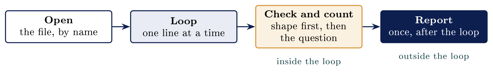

# Deciding and repeating {#sec-16-deciding-and-repeating}

::: {.callout-note appearance="simple" icon="false"}
**Module.** Module 4: Scripting and Automation\
**Accompanies.** Lecture L16. **Reading time.** About 45 minutes.\
**Primary reading.** Horstmann & Necaise, *Python for Everyone* (3rd ed.): Chapter 3 (decisions: if, elif, else, relational and Boolean operators, validating input), Chapter 4 (loops: while, for, range, counting matches), Sect. 7.2 (iterating over the lines of a file). Jøsang (2025) Sect. 1.4, 9.3 for allow-lists and what a shape check does not establish.
:::

## The question this chapter answers {#the-question-this-chapter-answers .unnumbered}

The L15 script read every line the same way. This chapter gives it a choice to make, and then makes that choice once per item, per line, per file. The driving question is the difference between a demonstration and a tool: a script somebody trusts is one that says what it skipped as well as what it counted.

Part 1 is the decision, and why indentation is the structure. Part 2 is repetition: over a list, over a file, a fixed number of times, or while something is true. Part 3 decides what the script will accept. Part 4 is the four boxes every log script is built from. Part 5 writes a script worth keeping.

The book's two chapters for this chapter open with the same two words. Chapter 3: "One of the essential features of computer programs is their ability to make decisions." Chapter 4: "In a loop, a part of a program is repeated over and over, until a specific goal is reached" [Python for Everyone, Chap. 3--4 introductions]{.src}.

::: {.callout-tip}
## A script that decides, for Nordvik

A single count of Nordvik's failed logins is not enough. You want the script to react when the count passes ten, and to repeat over many lines and many files. That needs two things: a decision, written with `if`, and repetition, written with `for`. And it needs to say honestly which lines it could not read.

:::

[→ The L15 script read every line the same way. Part 1 gives it a choice to make.]{.bridge}

## Conditions and branching

### A question with two answers

```{.python}
antall = 3
if antall == 0:
    print('Nothing to look at')
elif antall < 10:
    print('A few refusals, probably a typo')
else:
    print('Too many refusals, go and look')
```

```{.code-out}
A few refusals, probably a typo
```

The word `if` takes a question that comes back `True` or `False`. The line ends in a colon, and the indented lines below it run only when the answer was `True`. The word `else` covers every case the questions above it did not. Read the chain from the top: Python asks each question in turn and stops as soon as one is true. The book's syntax box gives the shape, "if condition: statements else: statements", and adds that "the statements in the body must be indented" [Python for Everyone, Sect. 3.1]{.src}.

### Comparing and combining

Six comparisons, and you already know all of them from mathematics. The book calls them relational operators [Python for Everyone, Sect. 3.2]{.src}. Two equals signs asks a question. One equals sign gives a name to a value.

  **You write**   **It asks**            **With `antall = 3`**
  --------------- ---------------------- ----------------------------
  `antall == 3`   Is it the same?        True
  `antall != 3`   Is it different?       False
  `antall > 10`   Is it larger?          False
  `antall >= 3`   Is it at least this?   True
  `a and b`       Are both true?         True for `0 < antall < 10`
  `not a`         Turn the answer over   True for `not antall > 10`

The single most common beginner mistake in this table is writing one equals sign where two were meant. The book gives it a common-error box of its own [Python for Everyone, Sect. 3.2, CE]{.src}, and Python's message, "invalid syntax", points at the line. The two Boolean operators are the book's: "Python has two Boolean operators that combine conditions: and and or", with `not` to invert [Python for Everyone, Sect. 3.7]{.src}.

### Indentation is the structure

```{.python}
for linje in open("auth.log"):
    if "Failed password" in linje:
        antall = antall + 1
print(antall)          # once, after the loop
```

```{.python}
for linje in open("auth.log"):
    if "Failed password" in linje:
        antall = antall + 1
        print(antall)  # once per matching line
```

The four spaces are not decoration. They say which lines belong to the `if`. Move the last line four spaces right and it runs once per matching line instead of once. The same four lines, indented two ways, are two different programs. Walk down the left edge with a finger: each step right is a block opening, and each step left is a block closing. The book's term is **compound statement**: a header ending in a colon, and a body "that is indented relative to the header" [Python for Everyone, Sect. 3.1]{.src}.

### When the indentation is wrong

```{.python}
  File "/home/student/sjekk.py", line 3
    print('too many')
    ^
IndentationError: expected an indented block after 'if' statement on line 2
```

Python stops before running anything, and names the file and the line. The message says what it expected, which is an indented block after the `if`. Nothing partly ran, so nothing was half done. That is a good failure to have.

### Set the editor once

Tell your editor to insert four spaces when you press tab, and never think about it again. A tab character and four spaces look identical on screen and are different to Python. In Kali, `nano` takes `set tabsize 4` and `set tabstospaces` in `~/.nanorc`. Two minutes now saves an hour of invisible errors later.

::: {.callout-important title="Key idea"}

An `if` runs its indented block only when a question comes back True, and the indentation is the structure, not decoration: the same lines indented two ways are two different programs. Set your editor to four spaces once and stop thinking about it.

:::

::: {.callout-tip}
## On Nordvik AS

A check on Nordvik's count, `if antall > 10`, is the whole difference between a script that reports and one that warns. Where the `print` sits decides whether Nordvik gets one warning or one per line.

:::

[→ One decision, made once. Part 2 makes it once per item, per line, per pass.]{.bridge}

## Loops

### Once for each thing

```{.python}
kontoer = ['student', 'admin', 'root']
for konto in kontoer:
    print('checking', konto)
print('done')
```

```{.code-out}
checking student
checking admin
checking root
done
```

A `for` loop takes a sequence and runs its indented block once for each item. The name after `for` is yours, and it holds one item at a time. `konto` is a name you chose; Python does not know what an account is. The square brackets make a list, which is L17's subject; today it is three things in a row. The book: "the for loop is used to iterate over the elements of a container" [Python for Everyone, Sect. 4.6]{.src}.

### Once for each line in a file

```{.python}
for linje in open("auth.log"):
    print(linje.strip())
```

An open file behaves like a sequence of lines, so a `for` loop walks it the same way. One line of Python walks a file of any size, one line at a time. The book: "you can iterate over the lines of a file" with `for line in infile`, and each line "ends with a newline character" which `rstrip` or `strip` removes [Python for Everyone, Sect. 7.2]{.src}. Without `.strip()` the output is double-spaced, because the file's newline and `print`'s newline both appear.

### Counting while you go

```{.python}
antall = 0
for linje in open("auth.log"):
    if "Failed password" in linje:
        antall = antall + 1
print(antall)
```

A tally has to exist before the loop starts, or every pass would begin again at zero. Line 1 creates it, line 4 adds to it, and line 5 reads it once the loop has finished. That is the whole pattern, and nearly every counting script is it. The book lists it among its common loop algorithms as "Counting Matches": "you have to increment the counter every time you find a match" [Python for Everyone, Sect. 4.5]{.src}. Ask where line 1 would have to go for the script to be wrong: inside the loop, and then it always prints one.

### A fixed number of times

```{.python}
for i in range(3):
    print("attempt", i)
```

```{.code-out}
attempt 0
attempt 1
attempt 2
```

`range()` hands back a run of whole numbers to loop over. It starts at zero and stops before the number you gave it, exactly as slicing did in L15. Reach for it when you want a count of repetitions rather than a list of things. The book's syntax box is "for Statement with range Function" [Python for Everyone, Sect. 4.6]{.src}, and it warns about the off-by-one this invites [Python for Everyone, Sect. 4.1, CE 3]{.src}.

### while, continue and break

```{.python}
i = 0
while i < 6:
    i = i + 1
    if i == 3:
        continue        # skip the rest of this pass
    if i == 5:
        break           # leave the loop entirely
    print(i)
```

```{.code-out}
1
2
4
```

A `while` loop takes a condition instead of a sequence and repeats while it stays `True`. Something inside the loop has to change the condition, or it never ends. `continue` skips the rest of this pass, and `break` leaves the loop completely. Walk the missing 3 and the missing 5: one was skipped, the other ended the loop before printing. The book: "the while loop executes a block of code repeatedly while a condition remains true" [Python for Everyone, Sect. 4.1]{.src}, and its advice on choosing is that `for` is for "count-controlled" loops and `while` for "event-controlled" ones [Python for Everyone, Sect. 4.6]{.src}.

### The one that never stops

`while True` never becomes `False`, so nothing inside the loop can end it except `break`. Press Ctrl and C together to stop a running program at the prompt; Python then prints the line it was on when you interrupted it. The book's common-error box is called "Infinite Loops" [Python for Everyone, Sect. 4.1, CE 1]{.src}.

[→ Real data arrives with odd lines in it. Part 3 decides what the script will accept.]{.bridge}

## Validating input

### Given things it did not ask for

::: {.callout-note}
## Real data

Always brings the odd line: a blank, a header, a truncated row. A script that assumes well-formed data stops on the first line that is not. Check the shape before you use it, and count what you skipped.

:::

The point is not that data is dirty. It is that the script has to say what it will accept. The book's chapter on decisions ends with exactly this application, "Input Validation": "If the user provides an input that is not in the expected range, print an error message and don't process the input" [Python for Everyone, Sect. 3.9]{.src}.

### What happens with no check

```{.python}
for linje in open("auth_kuttet.log"):
    print(linje.split()[6])
```

```{.code-out}
connect
Traceback (most recent call last):
  File "/home/student/felt.py", line 2, in <module>
    print(linje.split()[6])
IndexError: list index out of range
```

The script takes field six of every line, which works until a line does not have six fields. One short line stops the whole run, and everything after it never happens. The word `connect` above the traceback is real output; the script was working until it was not.

### Checking before using

```{.python}
brukt = 0
hoppet = 0
for linje in open("auth_kuttet.log"):
    deler = linje.split()
    if len(deler) < 12:
        hoppet = hoppet + 1
        continue
    brukt = brukt + 1
print(f"{brukt} lines used, {hoppet} skipped")
```

```{.code-out}
37 lines used, 33 skipped
```

Ask about the shape first, then use it. Two lines is the whole difference. `continue` moves to the next line without running the rest of this pass. The script counts what it skipped, so the report says what the answer applies to. The 33 skipped are not damaged; they are lines of another shape, and the script now says how many it left out.

### Deny-lists and allow-lists

                           **Deny-list**            **Allow-list**
  ------------------------ ------------------------ -------------------------------
  What it lists            The things you refuse    The things you accept
  Anything not listed      Goes through             Is refused
  Getting it started       Easy, list the obvious   Hard, you must know your data
  When you forget one      Something bad gets in    Something ordinary is refused
  Which failure you want   Silent and unnoticed     Loud and reported

The last row is the argument. Both approaches fail, and only one of them tells you. This is Jøsang's default-deny from L05 applied to data: "any type of traffic is rejected unless otherwise specified" [Jøsang, Jøsang, Sect. 6.4, p. 135]{.src}, and the same principle sits under access control, where users "can only access resources to which they have been authorized beforehand" [Jøsang, Jøsang, Sect. 9.3, p. 206]{.src}.

### An allow-list in three lines

```{.python}
tillatt = ['student', 'anneli', 'timo']
for konto in ['student', 'admin', 'timo']:
    if konto in tillatt:
        print(konto, 'is on the list')
    else:
        print(konto, 'is not on the list')
```

```{.code-out}
student is on the list
admin is not on the list
timo is on the list
```

The word `in` asks whether an item appears in a list, and comes back `True` or `False`. Anything not on the list is refused, including things nobody thought to forbid. Nothing in the code mentions `admin`; that is the point of an allow-list. Decide about letters outside a to z before somebody with one in their name arrives.

### Checking the shape is not the same as safe

A check on the shape stops a script from breaking on rubbish. That is all it does. A line can have twelve fields, look perfectly ordinary, and still be a record of an attack. A pattern that accepts four numbers with dots would accept `999.999.999.999`. Beginners over-trust a validation step. In the book's terms, a shape check removes one vulnerability, the script's own crash on bad input; it says nothing about the threat the line records [Jøsang, Jøsang, Sect. 1.4, pp. 5--6]{.src}.

::: {.callout-important title="Key idea"}

Real data always brings the odd line, a blank, a header, a truncated row, so check the shape before you use it rather than assuming. An allow-list refuses loudly what it does not know, but a well-formed line can still be a record of an attack: a shape check means the script can read it, and nothing more.

:::

[→ You have the pieces. Part 4 is the four boxes every log script is built from.]{.bridge}

## Reading a whole log file

### Four steps, in this order

::: center
{fig-align="center"}
:::

Every log-reading script this term is these four steps in this order. Draw the four boxes before you type anything, on paper if it helps. A script you cannot describe in four boxes is one you will not be able to debug. The report box is where the `print` goes; putting it inside the loop is the most common structural error. The book's "How To: Processing Text Files" walks the same shape: open, read line by line, process, then output [Python for Everyone, Sect. 7.3, HT 1]{.src}.

### The file that is not there

```{.code-out}
Traceback (most recent call last):
  File "<string>", line 2, in <module>
FileNotFoundError: [Errno 2] No such file or directory: 'finnesikke.log'
```

The name in quotation marks is exactly what the script asked for. Most of the time this error means a typing mistake or the wrong working directory. Check `pwd` first. L20 turns this into something the script handles instead of dying on.

### The same answer as L12

```{.bash}
student@kali:~$ grep -c "Failed password" auth.log
3
student@kali:~$ python3 tellfeil.py
3 refusals in auth.log
```

The pipeline and the script are asked the same question about the same file. Both say three, out of 69 lines, which is the point of running them side by side. If they had disagreed, one of them would have been wrong and worth finding. Checking a new script against a tool you already trust is a habit worth building now; the book calls it working out examples by hand before trusting the program [Python for Everyone, Sect. 2.3]{.src}.

### When to use which

Neither one replaces the other, and this course keeps using both. The question is how many times the answer is needed and by whom.

  **The situation**                        **Reach for**
  ---------------------------------------- -------------------------------------------
  One answer, right now, for yourself      A pipeline at the prompt
  The same answer every morning            A script with a name
  Something has to be decided per line     A script, because a pipeline cannot
  Somebody else has to read how it works   A script, with names and lines
  It must say what it skipped              A script, because a pipeline says nothing

### Write the check while you can see the data

The moment you know what normal looks like is while you are staring at the file. Two weeks later nobody remembers which lines were skipped, or whether any were. So write the counter and the message now, not after somebody questions the number. Honesty about coverage is a professional habit, and it is the same habit Jøsang asks of incident handlers: "every step in the process should be documented" [Jøsang, Sect. 14.5.2, p. 311]{.src}, including the steps that did not apply.

[→ A script that counts is useful. Part 5 writes one that also says what it skipped.]{.bridge}

## A script worth keeping

### The task

Read `auth.log`, count the refused password attempts, and skip lines of another shape. Report both numbers at the end, in a sentence somebody else could read. Everything needed is behind us: a tally, a loop, an `if`, a `continue` and an f-string. Describe the four boxes first, then write it one line at a time and run it after each.

### The finished script

```{.python}
antall = 0
hoppet = 0
with open("auth_kuttet.log") as fil:
    for linje in fil:
        deler = linje.split()
        if len(deler) < 12:
            hoppet = hoppet + 1
            continue
        if "Failed password" in linje:
            antall = antall + 1
print(f"{antall} refusals counted, {hoppet} lines skipped")
```

Nine lines of work, and every one of them uses something from this chapter or from L15. Line 6 is the check, line 8 skips, and line 11 reports once the loop has finished. The two tallies exist before the loop, which is why they survive from pass to pass. Walk the indentation again: lines 4 to 10 are inside the loop, and lines 7 and 8 are inside the first `if`.

### A condition that meant something else

On 1 August 2012 Knight Capital deployed new trading code to eight servers. A technician did not copy it to one of them, and the old code stayed on that server. A flag that once switched on a discontinued function had been given a new meaning in the new code; the old code on the eighth server read the same flag with the old meaning. In forty-five minutes the firm sent millions of unintended orders and lost about 440 million dollars. Nothing here was a syntax error. The condition was written correctly and evaluated correctly.

What that case teaches here is small and exact. A condition is not a statement about the world. It reads a value that somebody else sets. So the question is never only "is this true", but "true according to what, and where". In a small script that means naming the flag well and printing what the script read before it acts on it. The book's advice on hand-tracing is the habit that catches this: follow the values through the code before you trust it [Python for Everyone, Sect. 4.2]{.src}.

::: {.callout-warning}
## Try it

Run the finished script on your own `/var/log/auth.log`. Then deliberately break one line in a copy of the file and confirm the skipped count rises by one. A script whose skip counter you have never seen move is a counter you have not tested.

:::

## Common misconceptions {#common-misconceptions .unnumbered}

  **Belief**                                **Correction**
  ----------------------------------------- -------------------------------------------------------------
  Indentation makes code look tidy.         It decides what runs, so two indentations are two programs.
  An `elif` chain checks every condition.   It stops at the first true one and never asks the rest.
  A loop that ends early has failed.        `break` and `continue` are ordinary tools, not errors.
  A shape check means the data is safe.     It means the script can read it, and nothing more.

## Summary: five points {#summary-five-points .unnumbered}

1.  An `if` chooses between paths, and a chain stops at the first true condition; two equals signs ask, one assigns.

2.  Indentation is the structure. The same lines indented two ways are two programs.

3.  A `for` loop walks a list or a file; a tally made before it produces a count after it; `range` counts repetitions; `while` repeats until something inside changes the condition.

4.  Check the shape before using a line, count what you skipped, and prefer an allow-list, which fails loudly.

5.  Every log script is open, loop, check and count, report; the report goes after the loop; and a script that says what it skipped is one somebody can trust.

## Self-check {#self-check .unnumbered}

1.  Why does moving one `print` four spaces to the right change what a program does? (Part 1)

2.  When do you reach for a `while` loop rather than a `for` loop, and what must happen inside it? (Part 2)

3.  A script reports 37 used and 33 skipped. Why is that sentence worth more than the number 37 alone? (Part 3)

4.  What does an allow-list do with a value nobody thought to forbid, and what does a deny-list do? (Part 3)

5.  Draw the four boxes of a log script and say which box the `print` belongs in. (Part 4)

6.  What did the Knight Capital condition get wrong, given that it was written and evaluated correctly? (Part 5)

## Before L17 {#before-l17 .unnumbered}

Read Chapters 3 and 4 of *Python for Everyone*. Extend the finished script so that it counts `Accepted` lines as well, and reports all three numbers. In L17 the single tally becomes many: lists, dictionaries and counters, so that one pass over the log answers three questions at once.

## Glossary {#glossary .unnumbered}

`if` / `elif` / `else`

:   Choose a path; stop at the first true condition; cover the rest. [Python for Everyone, Sect. 3.1, 3.4]{.src}

Relational operators

:   `==`, `!=`, `<`, `<=`, `>`, `>=`; questions that return True or False. [Python for Everyone, Sect. 3.2]{.src}

Boolean operators

:   `and`, `or`, `not`. [Python for Everyone, Sect. 3.7]{.src}

Compound statement / block

:   A header with a colon and an indented body. [Python for Everyone, Sect. 3.1]{.src}

`for` / `while`

:   Once per item in a sequence; while a condition stays true. [Python for Everyone, Sect. 4.1, 4.6]{.src}

`range`

:   A run of integers from 0 up to, not including, the number given. [Python for Everyone, Sect. 4.6]{.src}

`break` / `continue`

:   Leave the loop; skip to the next pass.

Tally

:   A counter created before the loop, incremented inside, read after. [Python for Everyone, Sect. 4.5]{.src}

Input validation

:   Check the shape before using it; refuse and report what does not fit. [Python for Everyone, Sect. 3.9]{.src}

Allow-list / deny-list

:   What is permitted, everything else refused; what is forbidden, everything else allowed.

Four boxes

:   Open, loop, check and count, report.

## Sources {#sources .unnumbered}

-   Horstmann, C., & Necaise, R. (2019). *Python for everyone* (3rd ed.). Wiley. Chapters 3--4; Sect. 7.2--7.3.

-   Jøsang, A. (2025). *Cybersecurity: Technology and governance*. Springer. Sect. 1.4, 6.4, 9.3, 14.5.2.

-   Python Software Foundation. (n.d.). *Compound statements*. Python 3.11 documentation.

-   U.S. Securities and Exchange Commission. (2013, October 16). *In the matter of Knight Capital Americas LLC* (File No. 3-15570).

-   van Rossum, G., Warsaw, B., & Coghlan, N. (2001). *PEP 8: Style guide for Python code*.
