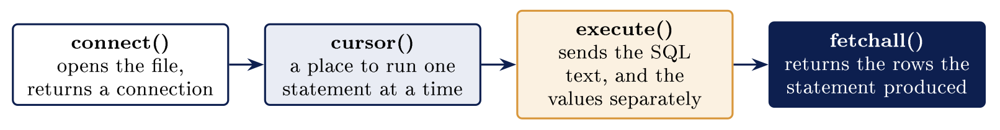

# Databases in programming: SQLite {#sec-22-databases-in-programming-sqlite}

::: {.callout-note appearance="simple" icon="false"}
**Module.** Module 4: Scripting and Automation\
**Accompanies.** Lecture L22. **Reading time.** About 45 minutes.\
**Primary reading.** Jøsang, *Cybersecurity: Technology and Governance* (Springer, 2025): Sect. 11.7.1 (SQL injection, and the prepare--compile--execute pattern that prevents it), pp. 261--263; Sect. 9.3 (least access), 2.2.2 (tested backups). *Python for Everyone* Sect. 2.2 (modules), 6.4 ST 5 (tuples), 7.5 (`with`). The `sqlite3` module follows the Python standard library documentation.
:::

## The question this chapter answers {#the-question-this-chapter-answers .unnumbered}

In L21 you typed SQL at the `sqlite3` prompt, one statement at a time. This chapter has a Python script open the same file and send the same SQL, and it asks the one question that decides whether that script is safe: how does a value from outside the program reach the query? Part 1 is the four steps from Python to a row. Part 2 is the placeholder, and the demonstration of what happens without one. Part 3 writes, and meets transactions. Part 4 is the discipline: test on a copy, count before you change, take only the access you need, restore the backup once. Part 5 is a scheduled program that deleted 213,000 police records before anybody counted.

The book's account of the attack and its fix is on two pages, and this chapter is those two pages made to run [Jøsang, Sect. 11.7.1, pp. 261--263]{.src}.

::: {.callout-tip}
## Nordvik's database, driven by a script

In L21 you typed SQL at the prompt; today a Python script opens Nordvik's database file and sends the same SQL. A value from outside the program, a username, a search term, reaches the query as a parameter, never as part of the text. That one habit is the difference between a reporting script and a way in.

:::

[→ A file instead of a server. Part 1 is four steps from Python to a row.]{.bridge}

## Python and SQLite

### A file instead of a server

  **A server database**                                             **SQLite**
  ----------------------------------------------------------------- ------------------------------------------------------------------------------
  A separate program runs all the time and listens on a port        The whole database is one file on disk
  Clients connect over the network with a username and a password   The program opens the file directly, as it would any file
  Somebody has to install it, start it and keep it patched          Nothing to install, start or patch separately; the library ships with Python
  L07's listening port, L13's accounts                              L13's file permissions decide who may read and write

SQLite parses the same SQL and enforces the same rules on the data. It is not a toy because it has no server; it is the database inside every phone and most browsers.

### Four steps from Python to a row

::: center
{fig-align="center"}
:::

The `sqlite3` module comes with Python, so it is one `import` line, the book's standard-library habit from L17 [Python for Everyone, Sect. 2.2]{.src}.

### The query that asks about admin

```{.python}
import sqlite3

def feilede_for(sti, bruker):
    """Return the failed-login rows for one user."""
    with sqlite3.connect(sti) as kobling:
        rader = kobling.execute(
            "SELECT tid, bruker, resultat FROM hendelser "
            "WHERE bruker = ? AND resultat = 'mislykket'",
            (bruker,)
        ).fetchall()
    return rader

for rad in feilede_for("sikkerhet.db", "admin"):
    print(rad)
```

```{.code-out}
('Jan 14 09:11:44', 'admin', 'mislykket')
('Jan 14 09:11:52', 'admin', 'mislykket')
('Jan 14 09:12:01', 'admin', 'mislykket')
```

The function opens the database, runs one query and returns the rows. The SQL text sits in the Python file as an ordinary string; two quoted lines written next to each other join into one string. The question mark holds a place for a value that arrives separately, and Part 2 is about it. The database returns a list, and each row arrives as a tuple, the unchangeable list from L17 [Python for Everyone, Sect. 6.4, ST 5]{.src}. The account called `admin` failed three times, which matches the `GROUP BY` result from L21.

### The trap: the rows are handed over once

Calling `fetchall()` a second time returns an empty list. It hands over every row and leaves the cursor empty. `fetchone()` hands over one row at a time until nothing is left. Store the result in a name if you need it twice. The `with` block ends the transaction but leaves the connection open, which is different from `with open()` on a text file; close it with `kobling.close()` when the script is done.

::: {.callout-warning title="Checkpoint"}

Name the two steps between connecting and reading a row. What does `fetchall()` give back when the query matched nothing? Why does a second call return an empty list? What does `with` do here that it does not do for a text file?

:::

```{=html}
<script type="application/json" class="qex">
{"type":"buckets","title":"Try it: server database or SQLite?","instr":"Sort each fact into the kind of database it describes.","buckets":["A server database","SQLite"],"items":[["Runs all the time and listens on a port",0],["The whole database is one file on disk",1],["Clients connect with username and password",0],["The program opens the file directly",1],["Must be installed, started and patched",0],["File permissions decide who reads and writes",1]],"ok":"Sorted. Same SQL, same rules on the data - just no server.","why":"The server database listens on a port and needs accounts; SQLite is one file, opened directly, guarded by file permissions.","ref":"Part 1 of this chapter"}
</script>
```

[→ A placeholder keeps the value outside the query. Part 2 shows what happens when it is inside.]{.bridge}

## The placeholder

### What a placeholder does

The SQL text never changes, whatever the user types. A placeholder is a question mark written where a value belongs. Python hands the value to the database as a separate parameter, and the database treats that value as data and nothing else.

This is the book's three-step pattern exactly. *Prepare*: "the application builds a template for the SQL command ... Certain parameters are still unspecified (marked '?')". *Compile*: "the DBMS compiles the command template without executing the command. The structure of the command is thus fixed and cannot be manipulated by injection." *Execute*: "the application binds values for the parameters in the template and allows DBMS to execute the SQL command" [Jøsang, Sect. 11.7.1, p. 263]{.src}.

```{=html}
<script type="application/json" class="qex">
{"type":"order","title":"Try it: prepare, compile, execute","instr":"Tap the book's three steps in the order they happen (tap a step, then a slot - or just tap steps in order).","steps":["Prepare: a template with ? for values","Compile: the structure is fixed","Execute: bind the values and run"],"ok":"That is why injection cannot change the command.","why":"The structure is fixed at compile time, so a value bound afterwards can never change the command.","ref":"Part 2; Jøsang, Sect. 11.7.1, p. 263"}
</script>
```

### The placeholder in code

```{.python}
import sqlite3, sys
bruker = sys.argv[1]
with sqlite3.connect("sikkerhet.db") as kobling:
    rader = kobling.execute(
        "SELECT tid, bruker, resultat FROM hendelser "
        "WHERE bruker = ? AND resultat = 'mislykket'",
        (bruker,)
    ).fetchall()
print("Rader:", len(rader))
```

The query text holds a question mark instead of the username. The tuple after the SQL supplies the value for that question mark, and the comma inside the parentheses is what makes it a tuple of one. The username came from L20's `sys.argv`, which means it came from outside the program.

### The same query without a placeholder

```{.python}
import sqlite3, sys

def bygg_sporring(bruker):
    """Build the query by pasting the input straight into the text."""
    return (
        "SELECT tid, bruker, resultat FROM hendelser "
        f"WHERE bruker = '{bruker}' AND resultat = 'mislykket'"
    )

sporring = bygg_sporring(sys.argv[1])
print("SQL:", sporring)
with sqlite3.connect("sikkerhet.db") as kobling:
    rader = kobling.execute(sporring).fetchall()
print("Rader:", len(rader))
```

An f-string puts the username between two single quotes. This version builds the SQL text by pasting the input into it. The database receives one finished string and cannot tell the parts apart. The book: "The attack is possible if SQL commands take parameters directly from user input" [Jøsang, Sect. 11.7.1, p. 261]{.src}. The script prints the SQL first, so you can see what the database was given.

### The demo, four runs of one question

```{.code-out}
student@kali:~/logganalyse$ python3 usikker.py admin
SQL: SELECT tid, bruker, resultat FROM hendelser WHERE bruker = 'admin' AND resultat = 'mislykket'
Rader: 3
student@kali:~/logganalyse$ python3 usikker.py "admin' OR '1'='1"
SQL: SELECT tid, bruker, resultat FROM hendelser WHERE bruker = 'admin' OR '1'='1' AND resultat = 'mislykket'
Rader: 10
student@kali:~/logganalyse$ python3 trygg.py "admin' OR '1'='1"
Rader: 0
student@kali:~/logganalyse$ python3 trygg.py admin
Rader: 3
```

The first run asks about `admin` and finds three failed attempts. The second passes a username that carries a quote and an `OR`. The printed SQL shows a condition that no programmer wrote. The last two runs send the same two inputs to the placeholder version: the injected string matches no user called `admin’ OR ’1’=’1`, so zero rows, and the honest one still gives three.

The book's example is the same shape with a login instead of a report: the input `’ OR 1=1–` turns a password check into a condition that "will yield TRUE for every single user ID in the database", and "The first user ID in the database is often the admin user, so the attacker is typically logged in as an administrator" [Jøsang, Sect. 11.7.1, p. 262]{.src}.

### Why ten rows and not nine

Nine of the table's rows record a failed login. The injected condition is `bruker = ’admin’ OR ’1’=’1’ AND resultat = ’mislykket’`. `AND` is evaluated before `OR`, so it reads as: admin rows, or any row that failed. Nine failures plus one `admin` row that was not a failure gives ten. Two words decided the number, and neither of them was typed by the programmer.

::: {.callout-warning title="Checkpoint"}

What does the question mark stand for inside an SQL string? Why does the tuple need a comma when it holds one value? Which two words decide the order in the injected condition? Why did the placeholder version return zero rows for the injected input?

:::

::: {.callout-important title="Key idea"}

Every value from outside the program goes into a query as a placeholder, without exception; a placeholder keeps the value out of the SQL text entirely, which escaping quotes by hand does not. An injected `SELECT` can return rows the query was never meant to show, and the same door lets an injected `DELETE` in.

:::

```{=html}
<script type="application/json" class="qex">
{"type":"quiz","title":"Check yourself","q":"The injected query returned ten rows, and only nine rows record a failed login. Where did the tenth come from?","options":["AND runs before OR, so one admin row that was not a failure also matched","OR runs before AND, so every row in the table matched","fetchall() counted one row twice","The placeholder added a row for the injected user"],"correct":[0],"ok":"Right.","why":"The condition reads as: admin rows, or any row that failed. Nine failures plus one admin row that was not a failure gives ten.","ref":"Part 2 of this chapter"}
</script>
```

[→ Reading leaves the file as it was. Part 3 writes, and nothing is permanent until it is committed.]{.bridge}

## Writing from a program

### Writing is different from reading

A `SELECT` leaves the file exactly as it was. `INSERT`, `UPDATE` and `DELETE` change what is stored on disk. A statement affects every row that its `WHERE` clause matches. Nothing is permanent until the change has been committed. A placeholder is used for the values in a write exactly as in a read.

### Inserting rows from a program

```{.python}
import sqlite3
nye = [("Jan 15 08:01:10", "student", "vellykket", "10.0.4.7"),
       ("Jan 15 08:04:33", "admin",   "mislykket", "10.0.4.9")]
with sqlite3.connect("sikkerhet.db") as kobling:
    kobling.executemany(
        "INSERT INTO hendelser VALUES (?, ?, ?, ?)", nye)
    kobling.commit()
```

`execute()` writes one row, and its values arrive as a tuple. `executemany()` runs the same statement once for every row in a list. The question marks stay in the SQL, and only the values change. `commit()` is the line that makes the new rows survive the program.

### What a transaction is

A **transaction** groups several statements into one unit of work. Either every statement in the group takes effect, or none does. `commit()` ends the transaction and writes the changes to the file. `rollback()` throws the changes away, and an exception inside the `with` block does that for you. This is what makes a script that crashes halfway through an import leave the table as it was, rather than half-filled, which is the L19 half-written file solved at the database layer.

### The trap: a DELETE with no WHERE, from a program

```{.code-out}
student@kali:~/logganalyse$ sqlite3 -header -column kopi.db "SELECT COUNT(*) AS for_sletting FROM hendelser;"
for_sletting
------------
21
student@kali:~/logganalyse$ sqlite3 kopi.db "DELETE FROM hendelser WHERE resultat = 'avbrutt';" "SELECT changes();"
3
student@kali:~/logganalyse$ sqlite3 kopi.db "DELETE FROM hendelser;" "SELECT changes();"
18
```

The same demonstration as L21, and the point today is who ran it. A program issuing `execute("DELETE FROM hendelser")` deletes eighteen rows exactly as the prompt did, does not print the count unless you asked it to, and commits if the block ends cleanly. The second number was 18 and not 21 because three had already gone.

::: {.callout-warning title="Checkpoint"}

What does `commit()` do that `execute()` does not? When would you reach for `executemany()`? How many rows does a `DELETE` without `WHERE` remove? What does an exception inside the `with` block do to uncommitted changes?

:::

```{=html}
<script type="application/json" class="qex">
{"type":"buckets","title":"Try it: kept or thrown away?","instr":"A transaction is all or nothing. Sort each situation by what happens to the changes.","buckets":["Kept","Thrown away"],"items":[["commit() has run",0],["The with block ends cleanly",0],["An exception before commit()",1],["rollback() was called",1]],"ok":"Either every statement takes effect, or none does.","why":"commit() makes changes permanent; rollback() or an exception inside the with block throws uncommitted changes away.","ref":"Part 3 of this chapter"}
</script>
```

[→ Four habits make a writing script one you can defend. Part 4 is the four.]{.bridge}

## Working safely

### Test against a copy

A copy of an SQLite database is one file copy away: `cp sikkerhet.db kopi.db`. A statement that surprises you on a copy has cost nothing. The real file is where a statement goes after it behaves. A copy also gives you the row counts to compare afterwards.

### Count before you change

```{.python}
antall = kobling.execute(
    "SELECT COUNT(*) FROM hendelser WHERE bruker = ?", (bruker,)
).fetchone()[0]
print(f"{antall} rows would be deleted")
```

The same `WHERE` clause works in a `SELECT COUNT` and in a `DELETE`. A count of zero means the clause matched nothing, and a count near the table total means the clause is wrong. Running the count first tells you how many rows are about to go, and printing it is the L16 habit of a script that says what it is about to do.

### Only the access the program needs

A reporting script needs to read the table and nothing else. A read-only connection, `sqlite3.connect("file:sikkerhet.db?mode=ro", uri=True)`, cannot delete a row by accident. The account a program runs as decides what the program can reach, and SQLite has no user accounts, so L13's file permissions are the whole of it: a script that runs as an account with read permission only cannot write, whatever its SQL says. The book's principle: users, and processes, "can only access resources to which they have been authorized beforehand" [Jøsang, Sect. 9.3, p. 206]{.src}.

### A backup you have restored

  **A backup nobody has opened**                                         **A backup you have restored**
  ---------------------------------------------------------------------- ------------------------------------------------------------------
  The file exists and nobody has looked inside it since it was made      The file was copied to another machine and opened with `sqlite3`
  Nothing has checked that the copy holds the rows you would need        `SELECT COUNT(*)` on the copy matched the original
  You find out during the incident, which is the worst possible moment   You found out on a Tuesday afternoon, with nothing at stake

The book asks for exactly this: recovery routines "must be tested regularly" [Jøsang, Sect. 2.2.2, p. 37]{.src}. For an SQLite file the test is one copy and one count.

::: {.callout-warning title="Checkpoint"}

What is the cheapest way to learn what a `DELETE` will touch? Which file did the delete demonstration run against? What controls who may read and write an SQLite database? What makes a backup more than a belief?

:::

```{=html}
<script type="application/json" class="qex">
{"type":"match","title":"Try it: the four habits","instr":"Drag each habit onto its description. Two chips are distractors and stay on the bench.","zones":[{"label":"A surprise here has cost nothing","answer":"Test on a copy"},{"label":"Same WHERE, run as SELECT COUNT first","answer":"Count before you change"},{"label":"Connect with mode=ro when only reading","answer":"Least access"},{"label":"Copied elsewhere, opened, counted","answer":"Tested backup"}],"extra":["Blocklist","commit()"],"ok":"Those are the four habits of a script you can defend.","why":"Test on a copy, count with the same WHERE first, connect read-only, and restore the backup once before you need it.","ref":"Part 4; Jøsang, Sect. 9.3 and 2.2.2"}
</script>
```

[→ A program that deletes never asks a second time. Part 5 is the case.]{.bridge}

## The Police National Computer, January 2021

### The case

The Police National Computer in England and Wales runs a weekly automated process that deletes records the police may not legally keep. A software update introduced on 23 November 2020 contained a coding defect in that process. From then until it was noticed on 10 January 2021, the process deleted about 213,000 records it should have kept, including fingerprint, DNA and arrest records, and also failed to delete some it should have removed. The Home Office told Parliament on 18 January 2021.

### The reasoning, including the wrong turn

The tempting reading is that somebody typed a delete by hand. A scheduled program issued the statements, and no person typed them. The faulty version ran for seven weekly cycles before anybody looked at what it had matched. The same code also failed to remove some records it should have, so it was wrong in both directions, and neither direction produced an error. A count of the rows about to be deleted, compared with the count the week before, would have shown a number ten times too large on the first run. That is Part 4's count-before-you-change, at national scale, and the incident-handling failure the book names: an incident whose only sign is a number nobody looked at [Jøsang, Sect. 14.5.2, p. 311]{.src}.

::: {.callout-important title="Key idea"}

A `DELETE` issued by a program runs on every row it matches and never asks a second time, so counting the matching rows first is the check that turns a statement into a decision you can defend. The Police National Computer deleted 213,000 records over seven weeks before anybody compared a count.

:::

::: {.callout-tip}
## On Nordvik AS

Nordvik's report script opens `sikkerhet.db` read-only and passes every username as a placeholder. The one script that writes prints the count of what it is about to change and runs first on `kopi.db`. Both take an afternoon to set up, and both are what the auditor will ask about.

:::

```{=html}
<script type="application/json" class="qex">
{"type":"quiz","title":"Check yourself","q":"What one number, checked weekly, would have caught the Police National Computer defect on its first run?","options":["The count of rows about to be deleted, compared with the week before","The number of servers the process ran on","The size of the database file","The number of users logged in that week"],"correct":[0],"ok":"Right.","why":"The count would have been ten times too large on the first run. Instead the process ran for seven weekly cycles before anybody looked at what it had matched.","ref":"Part 5; Jøsang, Sect. 14.5.2, p. 311"}
</script>
```

## Common misconceptions {#common-misconceptions .unnumbered}

  **Belief**                                                  **Correction**
  ----------------------------------------------------------- --------------------------------------------------------------------------------------------------------------------------------------------------------------------------
  SQLite is a toy because it has no server.                   It parses the same SQL and enforces the same rules on the data; nothing has to be installed or started.
  Escaping the quotes yourself is as good as a placeholder.   A placeholder keeps the value out of the SQL text entirely. Replacing one quote character looks like it covers the case; it does not [Jøsang, Sect. 11.7.1]{.src}.
  A `SELECT` cannot do any harm.                              The injected `SELECT` returned rows the query was never meant to show. Nothing was written, and data still left.
  The `with` block closes the connection for you.             It commits or rolls back the transaction and leaves the connection open. `with open()` really does close a text file; this is different.

## Summary: five points {#summary-five-points .unnumbered}

1.  A database in one file, and Python opens it directly: connect, execute, fetch, and close when done.

2.  Every outside value is a placeholder, without exception; the book's prepare--compile--execute is why it works.

3.  `AND` is evaluated before `OR`, and that decided the number ten; an injected condition is one nobody wrote.

4.  Writes are permanent only after `commit()`; a transaction is all or nothing; a `DELETE` with no `WHERE` removes every row.

5.  Test on a copy, count before you change, open read-only when reading, and restore the backup once before you need it.

## Self-check {#self-check .unnumbered}

1.  Which of today's queries would you be willing to run against the real file, and which only against `kopi.db`? (Parts 3--4)

2.  What would a placeholder look like in a query with three conditions? (Part 2)

3.  How would you prove that your backup of `sikkerhet.db` can actually be restored? (Part 4)

4.  Walk through the book's three steps, prepare, compile, execute, and say at which step the injected `OR` loses its meaning. (Part 2)

5.  Why did the Police National Computer defect run for seven weeks, and what one number would have stopped it after one? (Part 5)

6.  What does an exception inside a `with sqlite3.connect()` block do to the rows inserted before it? (Part 3)

## Before L23 {#before-l23 .unnumbered}

Run one parameterised `SELECT` against the exercise database and note the row count, then ask the `sqlite3` shell the same question. Two tools, one number. In L23 the shell itself becomes the scripting language: the commands from Module 3, wrapped in files that check their own arguments and exit codes, the way your Python does.

## Glossary {#glossary .unnumbered}

SQLite

:   A DBMS that keeps a whole database in one file; no server, no accounts.

`sqlite3`

:   The Python module; `connect`, `execute`, `executemany`, `fetchall`, `fetchone`, `commit`, `rollback`, `close`.

Connection / cursor

:   The open file; a place to run one statement and collect its rows.

Placeholder

:   `?` in the SQL text; the value arrives separately as a parameter. [Jøsang, Sect. 11.7.1]{.src}

Parameterised command

:   Prepare a template, compile it, then bind values; the structure cannot be changed by input. [Jøsang, Sect. 11.7.1]{.src}

SQL injection

:   Input that becomes part of the command; `’ OR 1=1–`. [Jøsang, Sect. 11.7.1]{.src}

Transaction / commit / rollback

:   All or nothing; make it permanent; throw it away.

Read-only connection

:   `mode=ro`; a script that cannot write, whatever its SQL says.

Count before change

:   `SELECT COUNT(*)` with the same `WHERE`, printed, before the `DELETE`.

Tested backup

:   Copied elsewhere, opened, counted. [Jøsang, Sect. 2.2.2]{.src}

## Sources {#sources .unnumbered}

-   Jøsang, A. (2025). *Cybersecurity: Technology and governance*. Springer. <https://doi.org/10.1007/978-3-031-68483-8>. Sect. 2.2.2, 9.3, 11.7.1, 14.5.2.

-   Horstmann, C., & Necaise, R. (2019). *Python for everyone* (3rd ed.). Wiley. Sect. 2.2, 6.4 ST 5, 7.5 ST 4.

-   Python Software Foundation. (2026). *sqlite3: DB-API 2.0 interface for SQLite databases*. The Python standard library.

-   OWASP. (n.d.). *SQL injection prevention cheat sheet*. OWASP Cheat Sheet Series.

-   House of Commons. (2021, January 18). *Police National Computer* \[Hansard debate\].
